# 靶机描述
- 这是一台标榜难度为简单的靶机。作者要求我们拿下目标的 root 权限，并且读取 root 目录下面的key.txt文件。
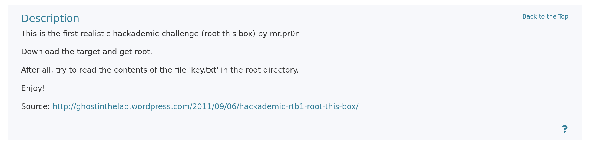

# 信息收集

## nmap 扫描

1. 主机发现
	 目标主机ip地址是192.168.2.42

2. 端口扫描(TCP,UDP)
```text
 # Nmap 7.98 scan initiated Thu Jul 23 08:38:03 2026 as: /usr/lib/nmap/nmap --min-rate=10000 -sT -p- -oA nmapscan/TCPS 192.168.2.42
Nmap scan report for 192.168.2.42
Host is up (0.0055s latency).
Not shown: 65514 filtered tcp ports (no-response), 19 filtered tcp ports (host-unreach)
PORT   STATE  SERVICE
22/tcp closed ssh
80/tcp open   http
MAC Address: 00:0C:29:20:9D:9D (VMware)

# Nmap done at Thu Jul 23 08:38:17 2026 -- 1 IP address (1 host up) scanned in 14.17 seconds

# Nmap 7.98 scan initiated Thu Jul 23 08:38:55 2026 as: /usr/lib/nmap/nmap --min-rate=10000 -sU --top-ports 20 -oA nmapscan/UDPS 192.168.2.42
Nmap scan report for 192.168.2.42
Host is up (0.00069s latency).

PORT      STATE         SERVICE
53/udp    open|filtered domain
67/udp    open|filtered dhcps
68/udp    open|filtered dhcpc
69/udp    open|filtered tftp
123/udp   open|filtered ntp
135/udp   open|filtered msrpc
137/udp   open|filtered netbios-ns
138/udp   open|filtered netbios-dgm
139/udp   filtered      netbios-ssn
161/udp   filtered      snmp
162/udp   filtered      snmptrap
445/udp   open|filtered microsoft-ds
500/udp   open|filtered isakmp
514/udp   open|filtered syslog
520/udp   filtered      route
631/udp   open|filtered ipp
1434/udp  open|filtered ms-sql-m
1900/udp  filtered      upnp
4500/udp  open|filtered nat-t-ike
49152/udp open|filtered unknown
MAC Address: 00:0C:29:20:9D:9D (VMware)

# Nmap done at Thu Jul 23 08:38:56 2026 -- 1 IP address (1 host up) scanned in 1.07 seconds
``` 

3. 详细扫描
```text
# Nmap 7.98 scan initiated Thu Jul 23 08:39:46 2026 as: /usr/lib/nmap/nmap -sT -sV -O -sC -p80,22 -oA nmapscan/details 192.168.2.42
Nmap scan report for 192.168.2.42
Host is up (0.00097s latency).

PORT   STATE  SERVICE VERSION
22/tcp closed ssh
80/tcp open   http    Apache httpd 2.2.15 ((Fedora))
|_http-title: Hackademic.RTB1  
| http-methods: 
|_  Potentially risky methods: TRACE
|_http-server-header: Apache/2.2.15 (Fedora)
MAC Address: 00:0C:29:20:9D:9D (VMware)
Device type: general purpose|media device|webcam|router|WAP
Running (JUST GUESSING): Linux 2.6.X|3.X|5.X (98%), LG embedded (94%), Tandberg embedded (93%), MikroTik RouterOS 7.X (91%), Infomir embedded (91%)
OS CPE: cpe:/o:linux:linux_kernel:2.6 cpe:/o:linux:linux_kernel:3 cpe:/o:linux:linux_kernel:5.10 cpe:/o:mikrotik:routeros:7 cpe:/o:linux:linux_kernel:5.6.3 cpe:/h:infomir:mag-250 cpe:/o:linux:linux_kernel:2.6.32
Aggressive OS guesses: Linux 2.6.22 - 2.6.36 (98%), LG Bp430 Blu-ray Player (94%), Linux 2.6.23 - 2.6.38 (94%), Linux 2.6.31 - 2.6.35 (94%), Linux 2.6.32 - 2.6.39 (93%), Tandberg Video Conference System (93%), Linux 2.6.20 (93%), Linux 2.6.22 (93%), Linux 2.6.32 (92%), Linux 2.6.34 (92%)
No exact OS matches for host (test conditions non-ideal).
Network Distance: 1 hop

OS and Service detection performed. Please report any incorrect results at https://nmap.org/submit/ .
# Nmap done at Thu Jul 23 08:40:02 2026 -- 1 IP address (1 host up) scanned in 15.82 seconds
```

4. 漏洞脚本扫描
```text
# Nmap 7.98 scan initiated Thu Jul 23 08:41:57 2026 as: /usr/lib/nmap/nmap --script=vuln -p80 -oA nmapscan/vulns 192.168.2.42
Nmap scan report for 192.168.2.42
Host is up (0.00026s latency).

PORT   STATE SERVICE
80/tcp open  http
|_http-csrf: Couldn't find any CSRF vulnerabilities.
|_http-stored-xss: Couldn't find any stored XSS vulnerabilities.
| http-slowloris-check: 
|   VULNERABLE:
|   Slowloris DOS attack
|     State: LIKELY VULNERABLE
|     IDs:  CVE:CVE-2007-6750
|       Slowloris tries to keep many connections to the target web server open and hold
|       them open as long as possible.  It accomplishes this by opening connections to
|       the target web server and sending a partial request. By doing so, it starves
|       the http server's resources causing Denial Of Service.
|       
|     Disclosure date: 2009-09-17
|     References:
|       https://cve.mitre.org/cgi-bin/cvename.cgi?name=CVE-2007-6750
|_      http://ha.ckers.org/slowloris/
|_http-dombased-xss: Couldn't find any DOM based XSS.
| http-vuln-cve2011-3192: 
|   VULNERABLE:
|   Apache byterange filter DoS
|     State: VULNERABLE
|     IDs:  BID:49303  CVE:CVE-2011-3192
|       The Apache web server is vulnerable to a denial of service attack when numerous
|       overlapping byte ranges are requested.
|     Disclosure date: 2011-08-19
|     References:
|       https://cve.mitre.org/cgi-bin/cvename.cgi?name=CVE-2011-3192
|       https://www.tenable.com/plugins/nessus/55976
|       https://seclists.org/fulldisclosure/2011/Aug/175
|_      https://www.securityfocus.com/bid/49303
|_http-trace: TRACE is enabled
| http-enum: 
|_  /icons/: Potentially interesting folder w/ directory listing
MAC Address: 00:0C:29:20:9D:9D (VMware)

# Nmap done at Thu Jul 23 08:44:23 2026 -- 1 IP address (1 host up) scanned in 146.31 seconds
```

5. 总结
	目标开放了 80 端口，22 端口关闭。目标是一台版本为 Fedora 的 Linux 主机。内核版本是2.6.x。通过漏洞脚本扫描，发现 80 端口暴露了一些 DOS 攻击的漏洞。基于获取目标 root权限的思路，我们需要进一步评判 WEB 所暴露出的攻击面。

## WEB页面信息探索

- 网页信息评估
  进入 WEB 界面后，通过点击页面 target 链接。我们得到了一个 /Hackademic_RTB1的目录。

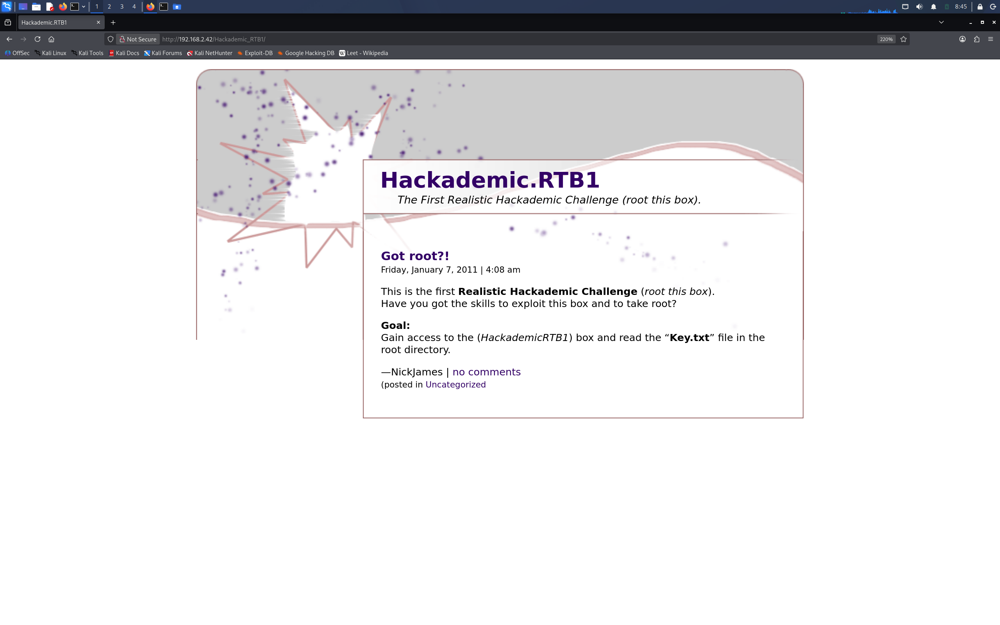

点击 no comments 链接。跳转到新页面

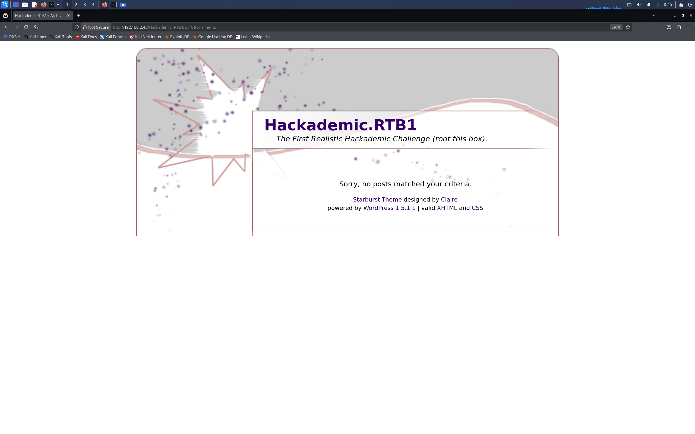
点击 Uncategorized 链接 。跳转页面

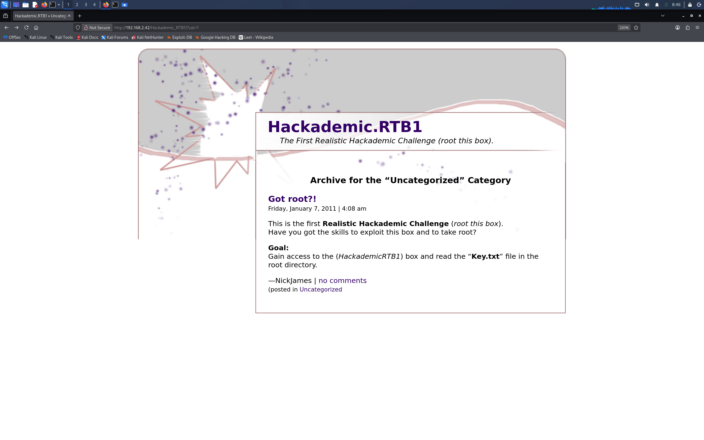

## WEB 路径爆破

- gobuster 扫描网站路径

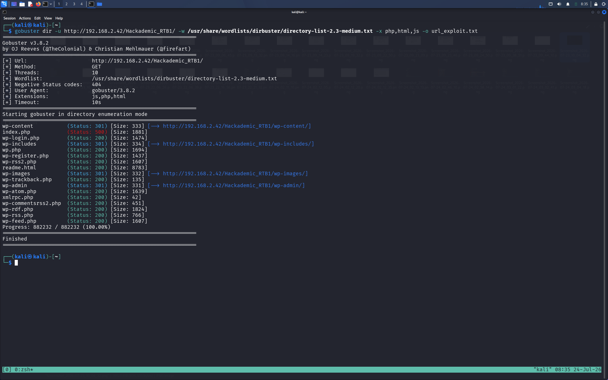

通过查看 readme.html 这个网站文件，可以看出这是一个 WordPress 站点。版本为 1.5.1。这个挺多漏洞的。

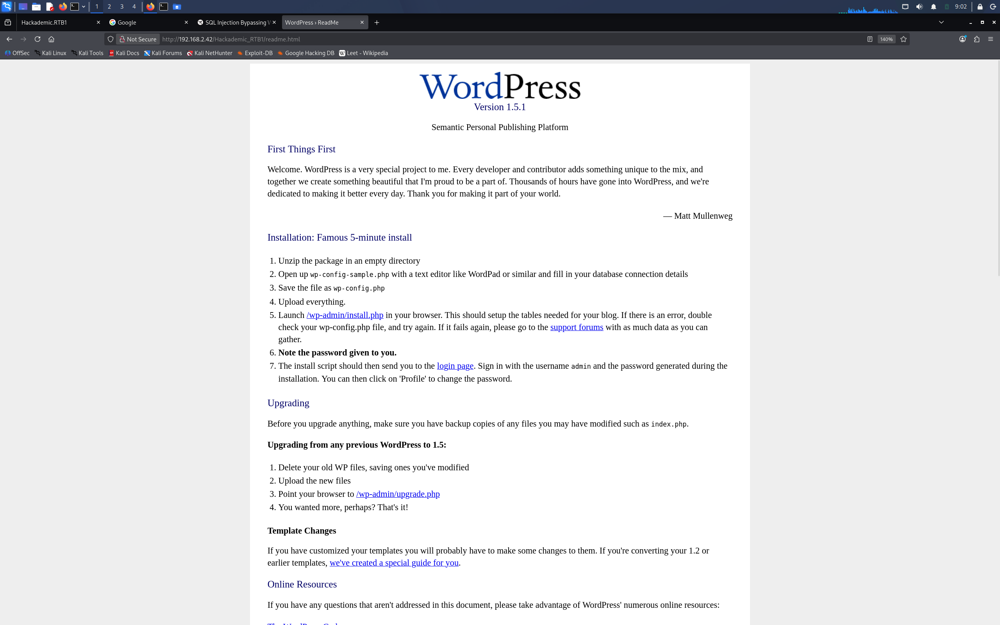

# WEB 渗透

## SQL 注入手工

1. 确认注入点
	  Uncategorized 链接处存在漏洞参数 cat。
	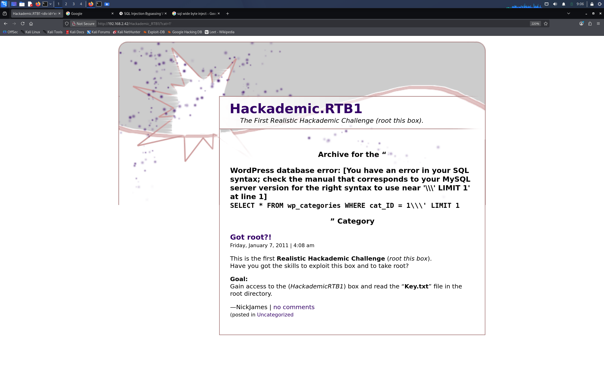
	我首先要知道这个网页产生 SQL 注入,报错信息回显点在哪？因为语句执行正确，只会返回网页标准内容。而当我们的拼接 SQL 注入语句成功执行。如果不知道回显点，我们就没法知道我们想要信息结果。注意这里使用 _LIMIT 1_ 来限制 SQL 语句每次只返回一行的信息。这是最简单的 SQL 报错注入，我们可以使用联合查询来获取相关信息。

2. 判断列数

	由于使用联合查询必须知道数据表的列数。因此我们使用 _“order by”_ 这个 payload。拼接后的语句表示从 wp_categories 按 ” cat = 2 “ 这个条件查找，并将查找后的结果按第二列进行排序。如果存在第二列语句就能执行成功。如果不存在就会返回报错结果。
	
	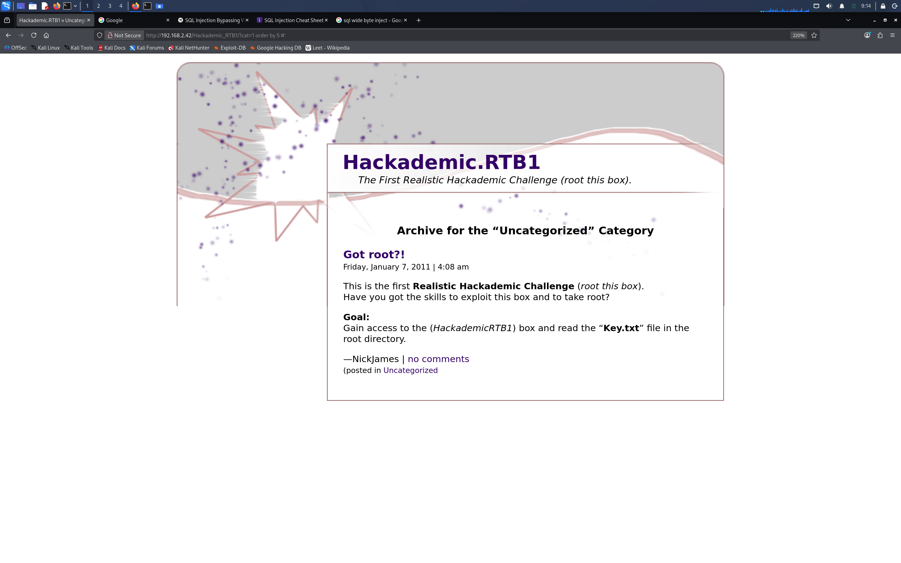
	
	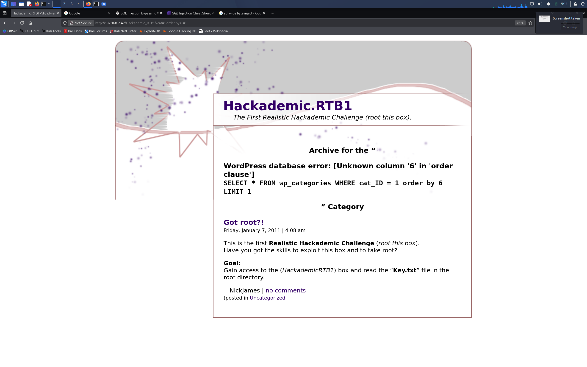
可以看到输入第 6 列的时候，就报错了。所以这个表有 5 列。

3. 确认回显点
	由于代码限制只能读取一行。所以我们必须让系统标准输出内容不显示，只显示我们指定部分的结果。
	
	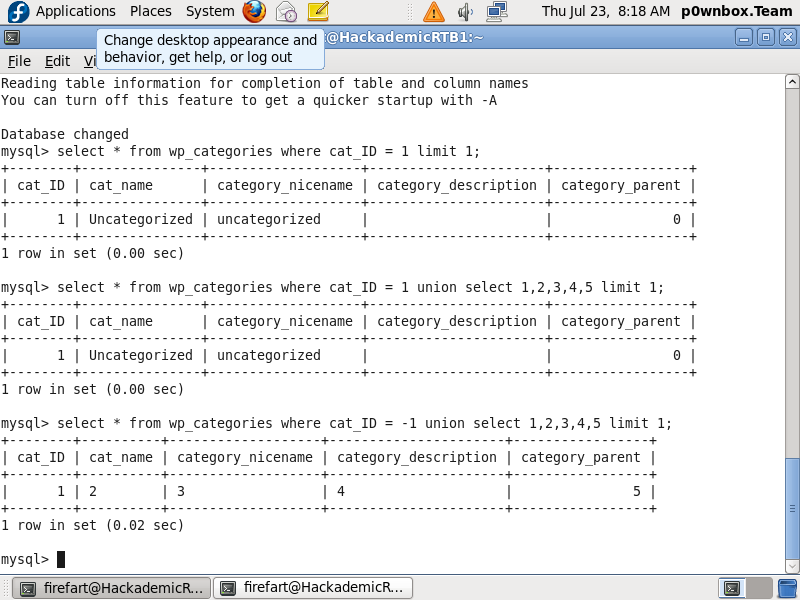
	
	正如这张图片所示，看第二行命令执行的结果。如果仅是简单的语句拼接，我们构造的联合查询内容会因为行数限制而不展示出来。所以必须让第一条查询语句失效。比如让 cat_ID 指向一个负值。这里的我经过前期的信息搜集，发现 cat_ID 等于 2 时，返回内容为空。因此，我采用 cat_ID = 2来逃逸行数限制。
	
	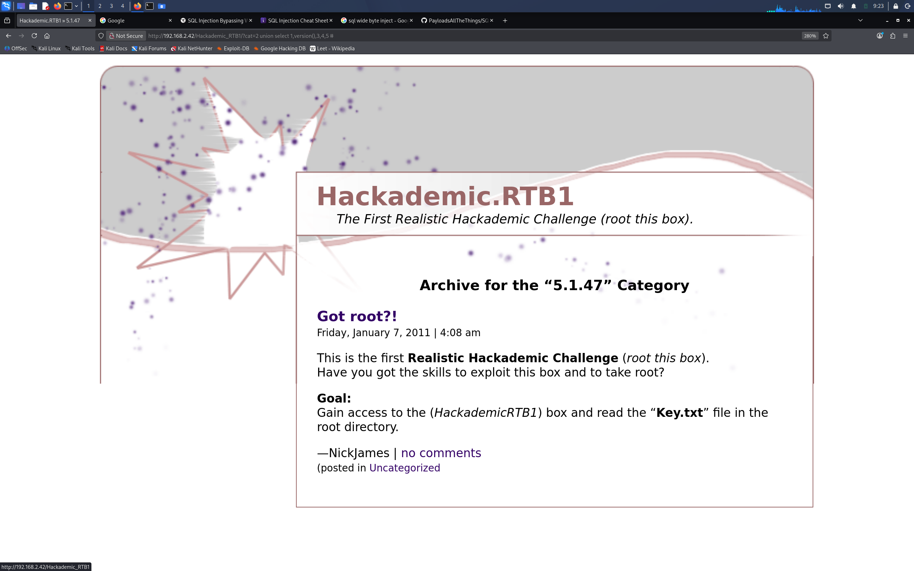

	我们成功获得当时数据库的版本是 5.1.47。_(这里补充一下不一定数据库版本就是MySQL。如果在执行命令的过程中，发现报错，说" 某某参数无法识别 "，那么，我们就要考虑是否是其他数据库，比如Oracle)_

4. 知道库名爆破表名
	查找到当前库名是 wordpress
	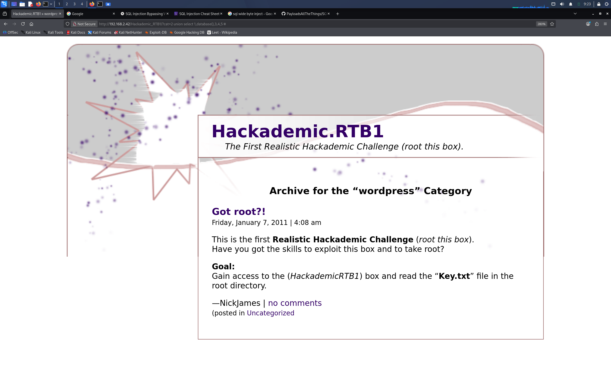
	
	我们通过库名知道了当前库中有哪些数据表，其中我们最关系数据表 wp_users
	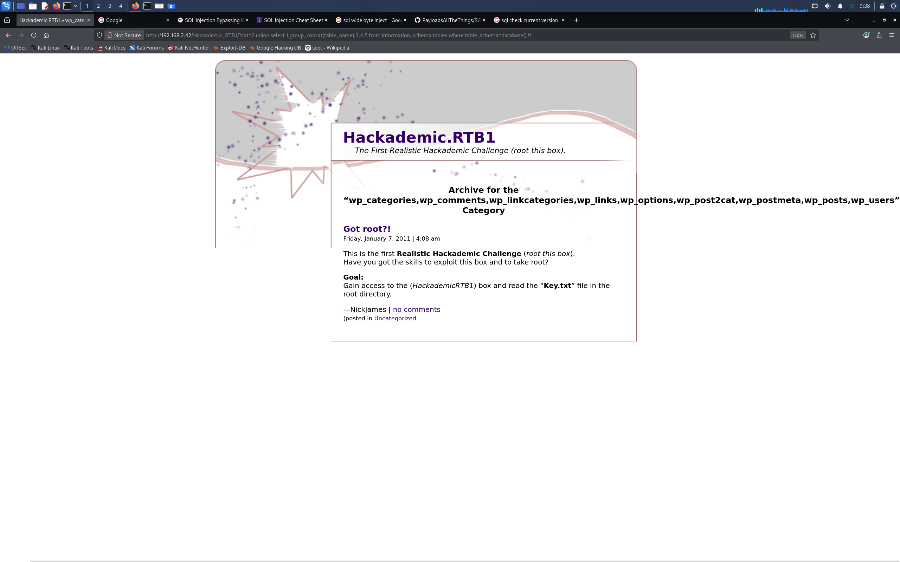
	
	如果是第一次渗透 wordpress 站点，不知道表名的重要性。我们可以使用 Google 搜索 WordPress 有哪些表。如果开源 CMS 搜不到，那么就下载它的源码。通过代码审计，查找目标数据表。

5. 探索 wp_users 数据表字段值
	这一步，笔者借助搜索引擎来实现。原因是语句中，站点对于 _'_ 进行转义过滤成 _///'_ 。笔者没有想到具体的解决思路。但是 wordpress 这样知名的站点，它的数据表字段还是很好获取的。
	 
	 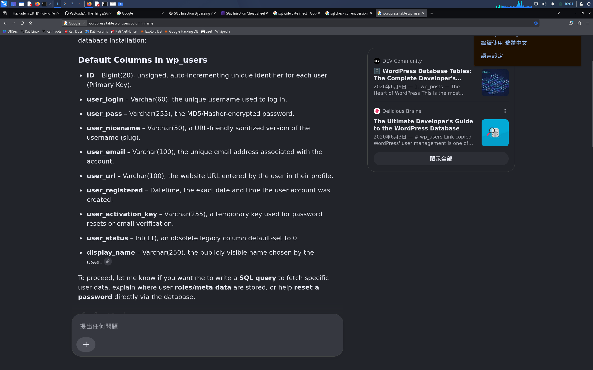
	
	 最终获得字段名。

5. 获取登录用户和口令哈希

```sql

http://192.168.2.42/Hackademic_RTB1/cat=2%20union%20select%201,group_concat(user_login,0x2d,user_pass),3,4,5%20from%20wp_users

```

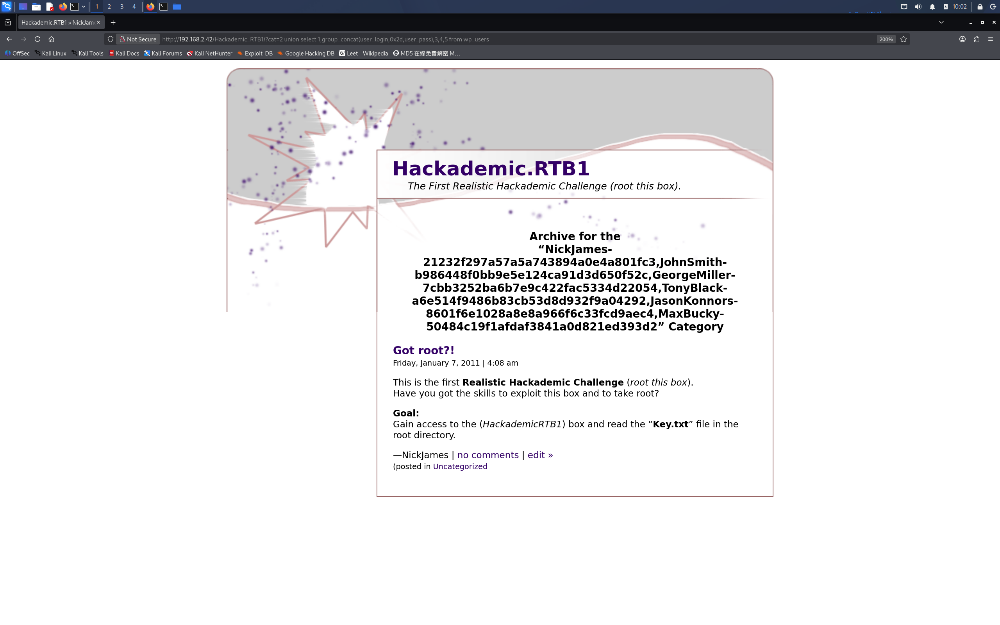

破解后的密码口令

```text

NickJames:21232f297a57a5a743894a0e4a801fc3(admin)
JohnSmith:b986448f0bb9e5e124ca91d3d650f52c(PUPPIES)
GeorgeMiller:7cbb3252ba6b7e9c422fac5334d22054(q1w2e3)
TonyBlack:a6e514f9486b83cb53d8d932f9a04292(napoleon)
JasonKonnors:8601f6e1028a8e8a966f6c33fcd9aec4(maxwell)
MaxBucky:50484c19f1afdaf3841a0d821ed393d2(kernel)

```


## WordPress 渗透
