### DNS 隧道

最近学习了 OSCP 教程中的深度包检测和隧道的篇章。特此搭建实验环境，来巩固一下知识点。

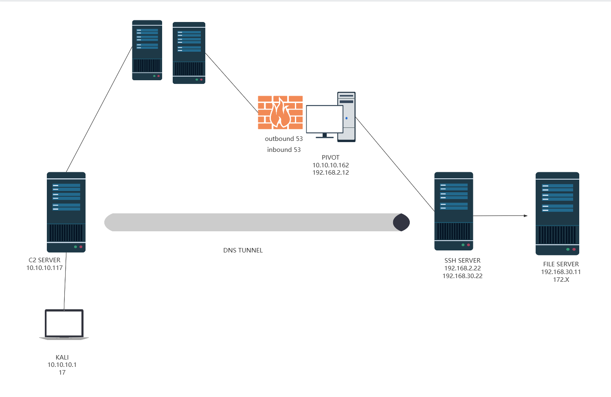


为了简便，这边我默认我的本地 KALI 就是 linsen.work 这个域名解析后的地址。而 192.168.2.22 则是内网中的 DNS 服务器。如果给出的域名不是 dns 服务器中所记录的，那么 PIVOT 就会向权威服务器发请求，来解析我们给出的域名 IP。在实战环境中，我们要保证注册的恶意域名是唯一能够解析到的。保证各个权威机构解析出来的域名都是相同的 IP。

### DNS 隧道传输数据原理


#### 使用 dnscat2 工具来构建隧道

我这里通过获得的 ssh 凭据，和另一台受限的内网主机 192.168.2.12。 构建端口转发，将 SSH SERVER 的 22 端口转发到 192.168.2.12 的 2222 端口上。并且控制防火墙放行 2222 端口的流量。

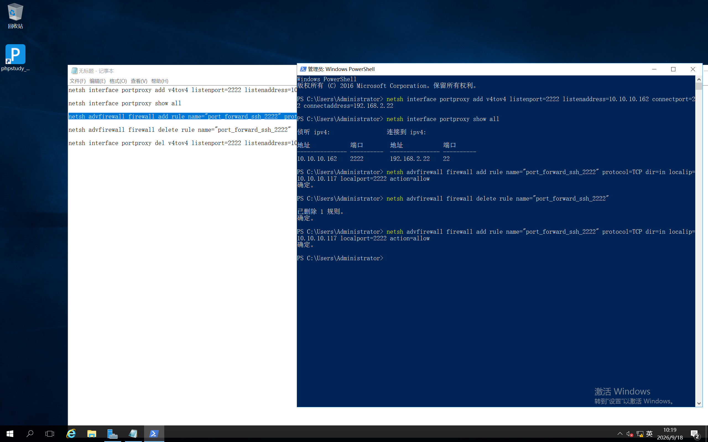

```powershell

netsh interface portproxy add v4tov4 listenport=2222 listenaddress=192.168.2.11 connectport=22 connectaddress=192.168.2.22
// 设置 2222 端口转发

netsh interface portproxy show all
// 展示一下配置好的端口转发设置

netsh advfirewall firewall add rule name="port_forward_ssh_2222" protocol=TCP dir=in localip=192.168.2.11 localport=2222 action=allow
// 配置防火墙放行 2222 端口

netsh advfirewall firewall delete rule name="port_forward_ssh_2222"
// 任务结束后，关闭这个 2222 端口。


netsh interface portproxy del v4tov4 listenport=2222 listenaddress=192.168.2.11
// 删除 端口转发规则
```

这样我的跳板机就构建好了。通过 scp 命令将 dnscat2 客户端上传到 ssh 服务器上。注意建议上传打包后的源码，在目标系统直接安装运行即可。

我们启动 dnscat-server 在我们的 KALI 上面

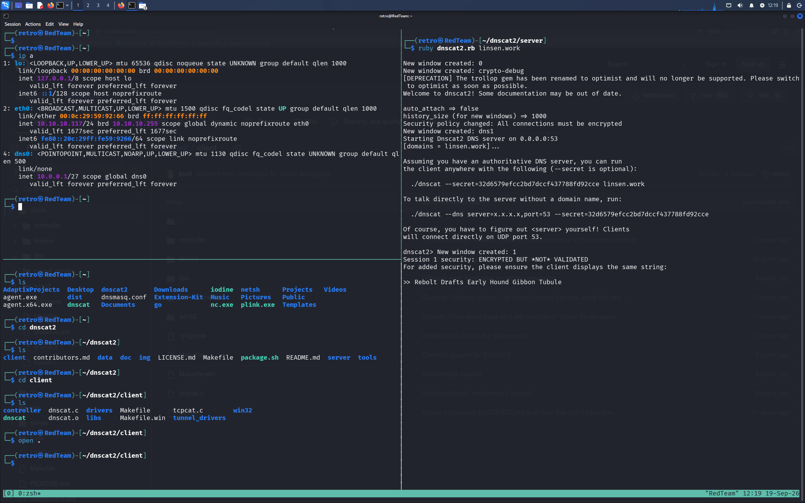

192.168.2.22 主机执行客户端
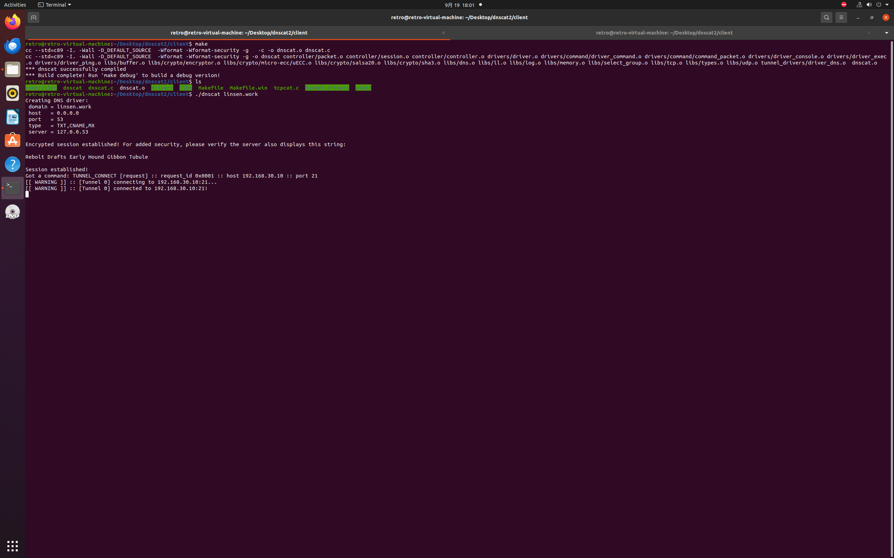

看到 "Session established" , 说明隧道已经成功建立了。我们知道内网深处还有一台 FILE SERVER , IP 是 192.168.30.11。我们可以在 DNS 隧道中配置端口转发。将 192.168.30.11:21 转发到 KALI 的 8888 端口上。这里可以理解为将流量转发到我们的 C2 服务器上，因为是 C2 与 SSH SERVER 建立隧道。同时，我们使用 tcpdump 抓取我们本地 KALI 的 53 端口的流量。
我们仔细观察 dnscat2 的工作原理。

我们先进入 KALI 的 dnscat-server 服务端，进行手动操控。配置端口转发。

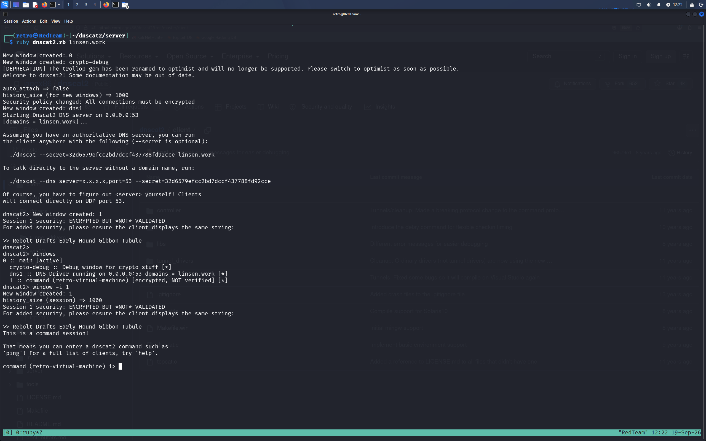

我们成功访问到了 FILE SERVER 服务器。

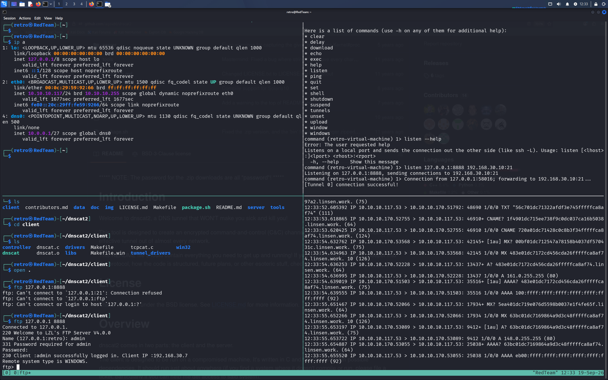

我们的 dnscat2 使用 CNAME, TXT 和 MX 询问和响应。
正如 OSCP 教程说的那样 DNS 隧道传输大量的加密流量，特征十分明显。

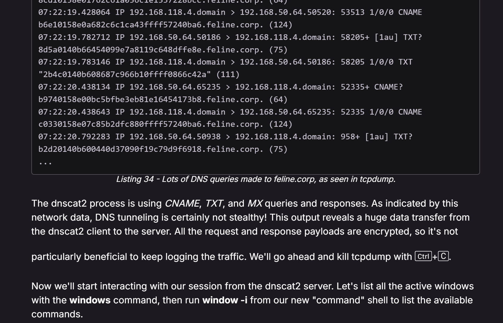


#### 使用 iodine 进行 dns隧道

在搜索 dnscat2 资料的同时，注意到 GitHub 上一个星高达 8K 的项目。iodine 项目专注于 DNS 隧道部分。这个项目具有极高的可塑性。

同样的网络拓扑图，我使用 iodine 搭建隧道。
我们现在下载下来拿到客户端 ( 也就是 SSH SERVER ) 去编译。

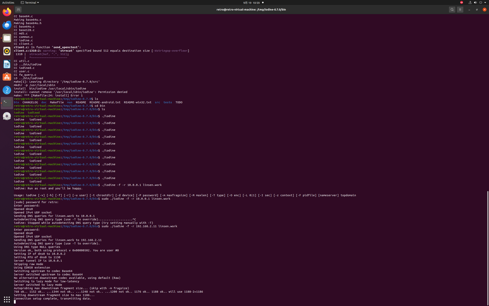

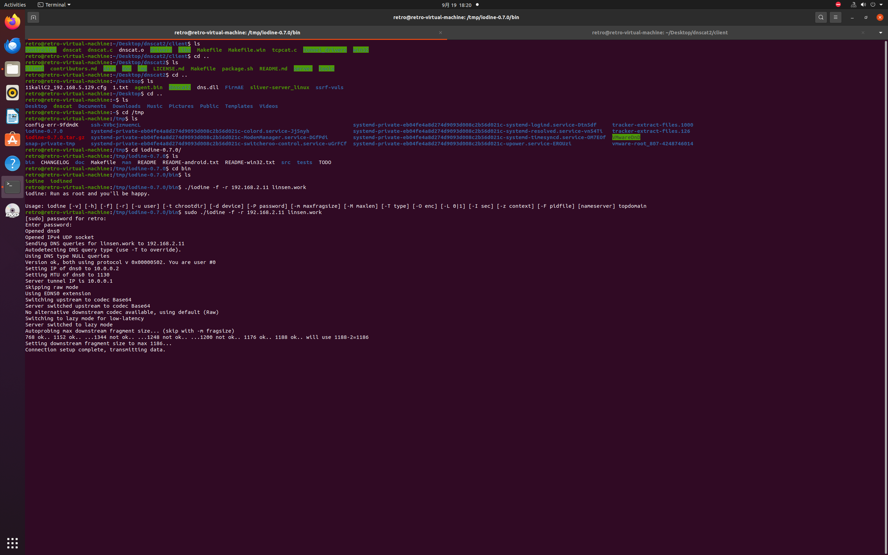

在这步之前，我们已经打开 KALI 运行客户端。

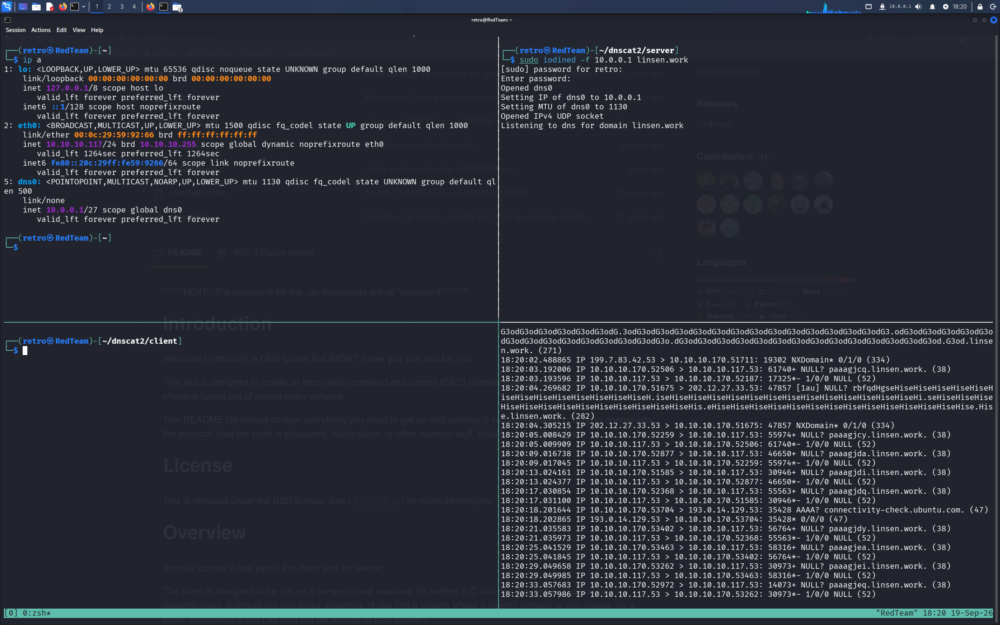

这里可以看到 “Connection setup complete, transmitting data.” 这时说明隧道已经建立成功了。
我们可以看到多了一块 dns0 网卡。而 SSH SERVER 获得的 IP 则是 10.0.0.2。

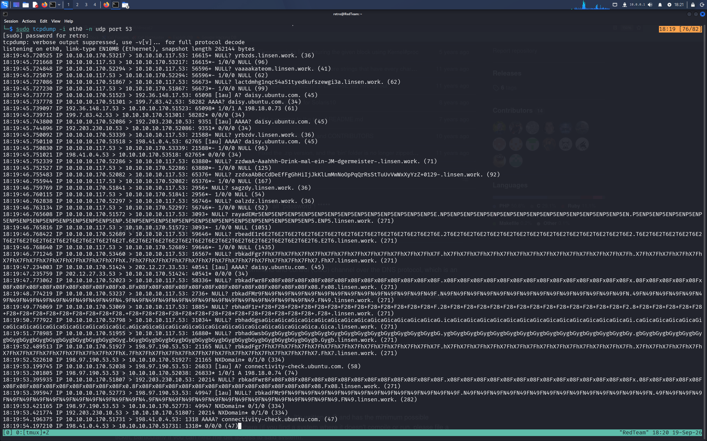

根据 GitHub 上面的文档说，单纯的 DNS 隧道是以一种不安全的加密方法进行传输，官方建议我们采取双层隧道，也就是在 DNS 隧道上在套一层 VPN 或是 SSH。这里我采用 SSH ，并且就是 SSH 的动态端口转发功能，监听本地的 9999 端口。通过 socks5 协议访问内网 FILE SERVER 主机。

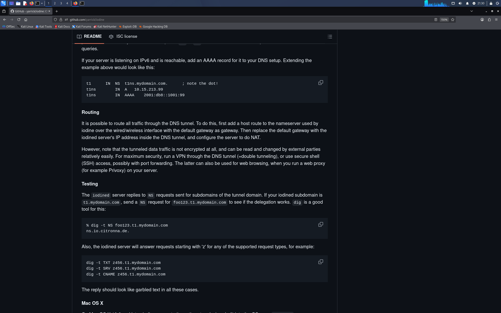

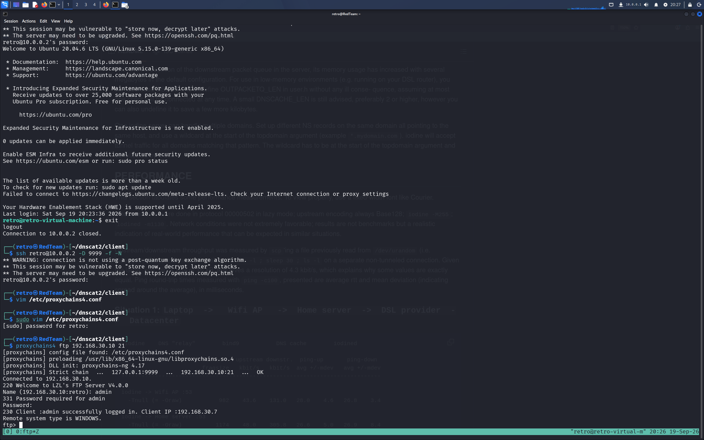

#### 总结

这个 iodine 工具很适合本地资源操作。因为，它会新建一个网卡，所以，需要 root 权限进行操作。这对于实际环境，操作还是很敏感的。很适合绕过校园网认证的业务需求。