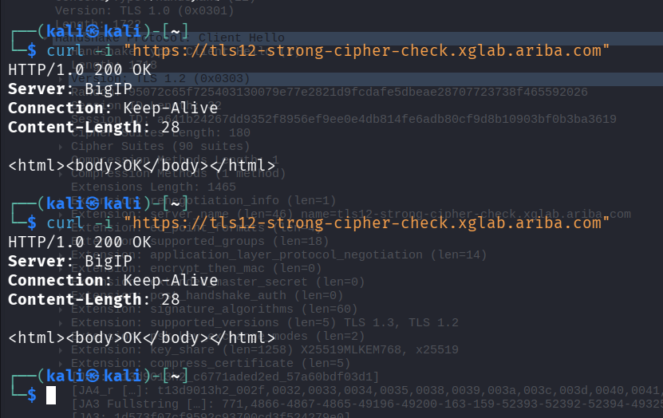
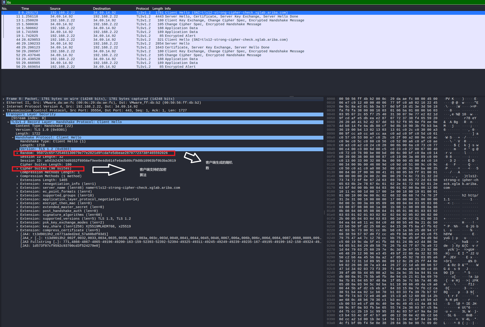

_在最近学习过程中，老是碰到TLS这个名词，为了加深印象，本人决定亲自“拆拆”这个协议。_

## 测试环境
一台默认安装wireshark的kali机子。
打开监听后使用
```
curl -i "https://tls12-strong-cipher-check.xglab.ariba.com"
```
命令访问。获取TLS1.2协议的过程Handshake包。


## 原理简记
TLS/SSL协议的设计实现是为了防止http协议明文泄露的安全问题，防止Cracker中间人监听通信数据包。_(由于TLS为当前的主流，因此选取TLS为实践对象)_ TLS采用对称加密和非对称加密两种类型的加密方式。TLS协议使用非对称加密中”公钥加密，私钥解密“和”私钥加密，公钥解密“的模式解决对称加密中”密钥泄露“的缺陷。因此在TLS协议Handshake阶段，需要使用非对称加密传递客户端的预主密钥。在数据传输阶段中，C/S端各自通过获得的客户端随机数，服务端随机数，预主密钥生成会话密钥，并且将会话密钥对称加密通信数据。


## wireshark抓包结果分析
### _"协商"阶段_
首先客户段发生client hello流量包，告诉服务器自己的随机数和支持加密算法。_(这个加密算法包括非对称和对称加密，是后续通信的标准。)_


