# 靶场描述

这是一台标榜难度为简单的开源靶机，但是整个渗透过程并不顺利。目标虽然暴露许多信息，但是我们没法一下子构造攻击链。这台靶机需要渗透人员一点耐心和信息规整能力。

``` download
https://download.vulnhub.com/myfileserver/My_file_server_1.ova
```

# 信息收集

1. 主机发现
目前 kali 的 IP 是 192.168.2.47。目标的 ip 是 192.168.2.49。

2. 端口扫描

 ```
 # Nmap 7.99 scan initiated Fri Aug  7 18:57:25 2026 as: /usr/lib/nmap/nmap -sT --min-rate 10000 -p- -oA nmapscan/TCPS 192.168.2.49
Nmap scan report for 192.168.2.49
Host is up (0.00051s latency).
Not shown: 64504 filtered tcp ports (no-response), 19 filtered tcp ports (host-unreach), 1004 closed tcp ports (conn-refused)
PORT      STATE SERVICE
21/tcp    open  ftp
22/tcp    open  ssh
80/tcp    open  http
111/tcp   open  rpcbind
445/tcp   open  microsoft-ds
2049/tcp  open  nfs
2121/tcp  open  ccproxy-ftp
20048/tcp open  mountd
MAC Address: 00:0C:29:1B:42:2B (VMware)

# Nmap done at Fri Aug  7 18:57:39 2026 -- 1 IP address (1 host up) scanned in 13.79 seconds
 ```

详细信息，服务版本探测结果
```
PORT      STATE SERVICE     VERSION
21/tcp    open  ftp         vsftpd 3.0.2
| ftp-anon: Anonymous FTP login allowed (FTP code 230)
|_drwxrwxrwx    3 0        0              16 Feb 19  2020 pub [NSE: writeable]
| ftp-syst: 
|   STAT: 
| FTP server status:
|      Connected to ::ffff:192.168.2.47
|      Logged in as ftp
|      TYPE: ASCII
|      No session bandwidth limit
|      Session timeout in seconds is 300
|      Control connection is plain text
|      Data connections will be plain text
|      At session startup, client count was 1
|      vsFTPd 3.0.2 - secure, fast, stable
|_End of status
22/tcp    open  ssh         OpenSSH 7.4 (protocol 2.0)
| ssh-hostkey: 
|   2048 75:fa:37:d1:62:4a:15:87:7e:21:83:b9:2f:ff:04:93 (RSA)
|   256 b8:db:2c:ca:e2:70:c3:eb:9a:a8:cc:0e:a2:1c:68:6b (ECDSA)
|_  256 66:a3:1b:55:ca:c2:51:84:41:21:7f:77:40:45:d4:9f (ED25519)
80/tcp    open  http        Apache httpd 2.4.6 ((CentOS))
|_http-server-header: Apache/2.4.6 (CentOS)
|_http-title: My File Server
| http-methods: 
|_  Potentially risky methods: TRACE
111/tcp   open  rpcbind     2-4 (RPC #100000)
| rpcinfo: 
|   program version    port/proto  service
|   100000  2,3,4        111/tcp   rpcbind
|   100000  2,3,4        111/udp   rpcbind
|   100000  3,4          111/tcp6  rpcbind
|   100000  3,4          111/udp6  rpcbind
|   100003  3,4         2049/tcp   nfs
|   100003  3,4         2049/tcp6  nfs
|   100003  3,4         2049/udp   nfs
|   100003  3,4         2049/udp6  nfs
|   100005  1,2,3      20048/tcp   mountd
|   100005  1,2,3      20048/tcp6  mountd
|   100005  1,2,3      20048/udp   mountd
|   100005  1,2,3      20048/udp6  mountd
|   100021  1,3,4      52567/udp   nlockmgr
|   100021  1,3,4      53390/tcp   nlockmgr
|   100021  1,3,4      55445/tcp6  nlockmgr
|   100021  1,3,4      55610/udp6  nlockmgr
|   100024  1          34414/udp6  status
|   100024  1          38353/tcp   status
|   100024  1          49892/tcp6  status
|   100024  1          53877/udp   status
|   100227  3           2049/tcp   nfs_acl
|   100227  3           2049/tcp6  nfs_acl
|   100227  3           2049/udp   nfs_acl
|_  100227  3           2049/udp6  nfs_acl
445/tcp   open  netbios-ssn Samba smbd 4.9.1 (workgroup: SAMBA)
2049/tcp  open  nfs_acl     3 (RPC #100227)
2121/tcp  open  ftp         ProFTPD 1.3.5
| ftp-anon: Anonymous FTP login allowed (FTP code 230)
|_Can't get directory listing: ERROR
20048/tcp open  mountd      1-3 (RPC #100005)
MAC Address: 00:0C:29:1B:42:2B (VMware)
Warning: OSScan results may be unreliable because we could not find at least 1 open and 1 closed port
Aggressive OS guesses: Linux 2.6.32 - 3.13 (97%), Linux 3.4 - 3.10 (97%), Linux 2.6.32 - 3.10 (97%), Linux 2.6.39 (97%), Linux 3.10 (97%), Synology DiskStation Manager 5.2-5644 (95%), Linux 2.6.32 (94%), Linux 2.6.32 - 3.5 (92%), Linux 3.2 - 3.10 (91%), Linux 3.2 - 3.16 (91%)
No exact OS matches for host (test conditions non-ideal).
Network Distance: 1 hop
Service Info: Host: FILESERVER; OS: Unix

Host script results:
| smb2-time: 
|   date: 2026-08-07T19:07:16
|_  start_date: N/A
| smb2-security-mode: 
|   3.1.1: 
|_    Message signing enabled but not required
| smb-security-mode: 
|   account_used: guest
|   authentication_level: user
|   challenge_response: supported
|_  message_signing: disabled (dangerous, but default)
| smb-os-discovery: 
|   OS: Windows 6.1 (Samba 4.9.1)
|   Computer name: localhost
|   NetBIOS computer name: FILESERVER\x00
|   Domain name: \x00
|   FQDN: localhost
|_  System time: 2026-08-08T00:37:17+05:30
|_clock-skew: mean: 6h09m59s, deviation: 3h10m29s, median: 7h59m58s
```

得到信息，目标开放了 21 和 2121 端口。这是 ftp 服务，并且支持匿名用户登录，这可能会泄露一些敏感信息，比如账号密码，配置文件之类的。我们应该优先测试这个服务端口。445 和 111 开放了 Samba 共享文件服务。也是很有可能泄露敏感数据。2049 和 20048 开放了 nfs 服务，如果这个服务配置错误，我们可以挂载这块服务，直接提权。剩下的是 80 端口网页服务，还有 22 端口 ssh 服务。

3. 漏洞脚本扫描
```
PORT      STATE SERVICE
21/tcp    open  ftp
22/tcp    open  ssh
80/tcp    open  http
|_http-stored-xss: Couldn't find any stored XSS vulnerabilities.
|_http-trace: TRACE is enabled
| http-enum: 
|_  /icons/: Potentially interesting folder w/ directory listing
|_http-csrf: Couldn't find any CSRF vulnerabilities.
|_http-dombased-xss: Couldn't find any DOM based XSS.
111/tcp   open  rpcbind
445/tcp   open  microsoft-ds
2049/tcp  open  nfs
2121/tcp  open  ccproxy-ftp
20048/tcp open  mountd
MAC Address: 00:0C:29:1B:42:2B (VMware)

Host script results:
|_smb-vuln-ms10-061: false
| smb-vuln-regsvc-dos: 
|   VULNERABLE:
|   Service regsvc in Microsoft Windows systems vulnerable to denial of service
|     State: VULNERABLE
|       The service regsvc in Microsoft Windows 2000 systems is vulnerable to denial of service caused by a null deference
|       pointer. This script will crash the service if it is vulnerable. This vulnerability was discovered by Ron Bowes
|       while working on smb-enum-sessions.
|_          
|_smb-vuln-ms10-054: false
```

# SMB 服务渗透

使用 smbmap 工具进行共享目录信息枚举
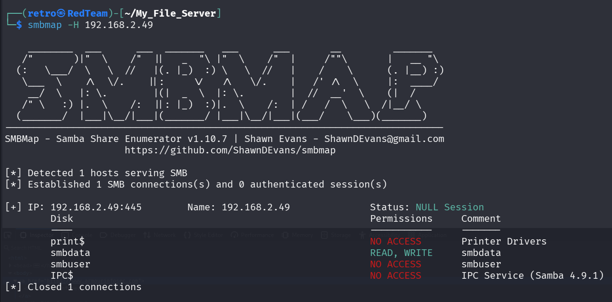

发现 smbdata 目录是可以进行读写的。使用 smbclient 工具进行访问。

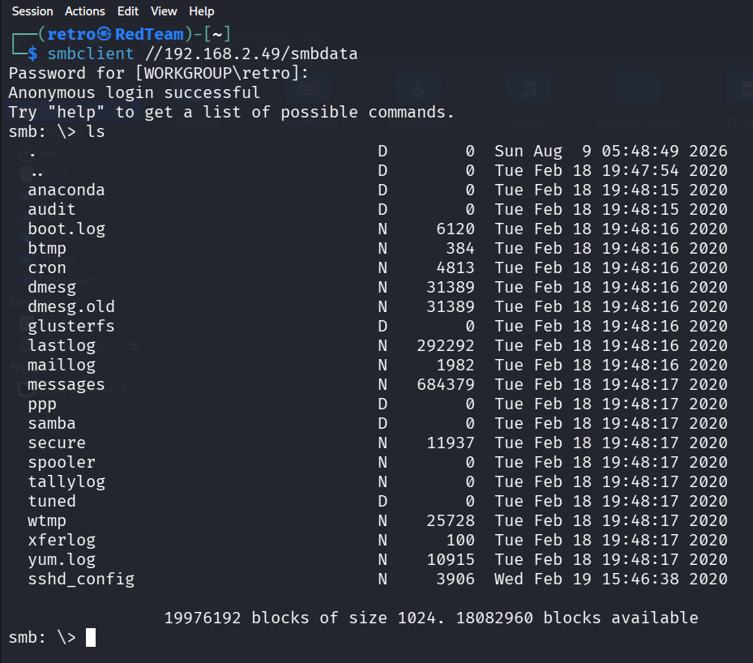

经过下载浏览，其中 sshd_config 这个文件最让我们感兴趣。这份 sshd 的配置文件告诉我们，ssh
只能通过密钥匹配登录，不支持密码口令登录。因此没法使用暴力匹配口令的方式进行登录。这个文件还告诉我们 sshd 服务器默认会用本地的 .ssh/authorized_keys 进行匹配。

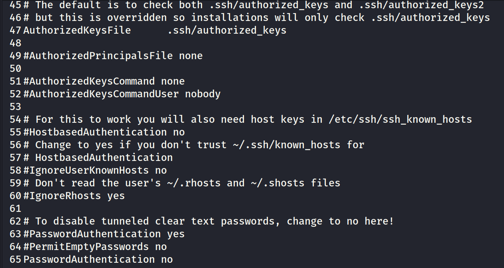

其他文件更多的是运行系统服务内存的信息。对于当前获取立足点这个目标，没有太大的帮助。

# NFS 挂载渗透

通过搜索引擎，发现如果能够挂载 Samba 这个共享文件。那么就可以读写文件，查看一些敏感信息。甚至可以提权。
比如这篇 blog 所描述的，

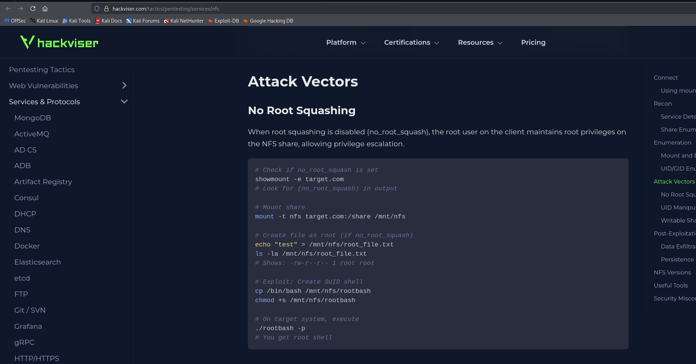

但是这里没法挂载，因为我是 192.168.2.0 网络。

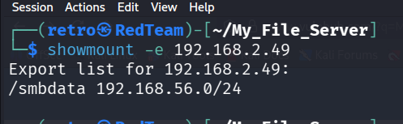

这条路行不通。

# FTP 服务匿名登录

21 和 2121 端口都开放了 ftp 服务。但是暴露出来的信息和 samba 的信息有雷同。

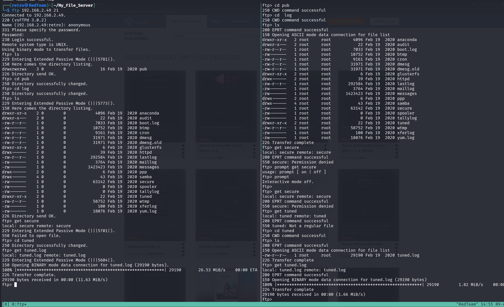

为一个 httpd 的文件夹，我们还没有权限读取。我们先考虑 80 的 web 端口。

# WEB 渗透

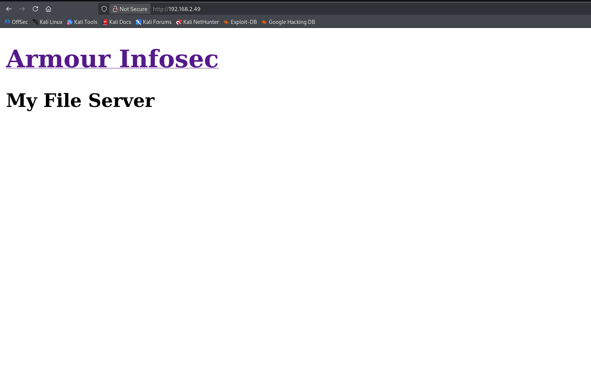

web 界面展示了一个链接，这个 Armour Infosec 是靶场培训的广告。我们看一下路径爆破有哪些结果。

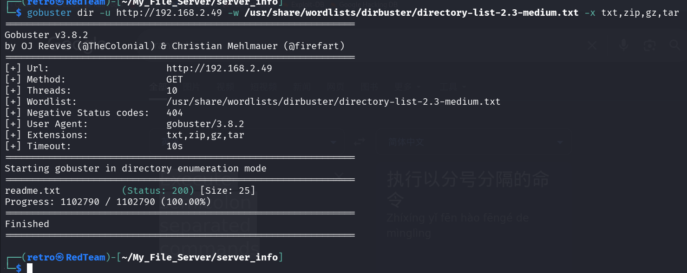

结果显示了 readme.txt 文件。查看这个文件。

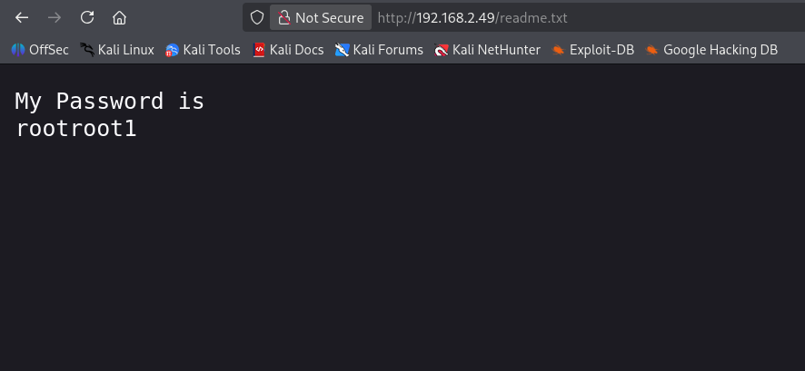

给了我们密码，我们需要确定这是哪一个用户。通过前面泄露文件中的 secure 文件。我们知道了这个用户名是 smbuser 。

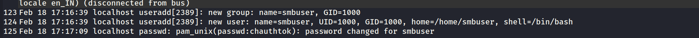

# 获得立足点

ssh 端口只能通过密钥登录。这组凭据肯定不能登录 ssh 的。那么要么是 ftp 服务的凭据，要么是 Samba 服务的凭据。
登录 FTP 服务器，首先现在服务器上创建一个 .ssh 文件夹。然后上传我们本地的公钥到服务器上。重名为 authorized_keys。

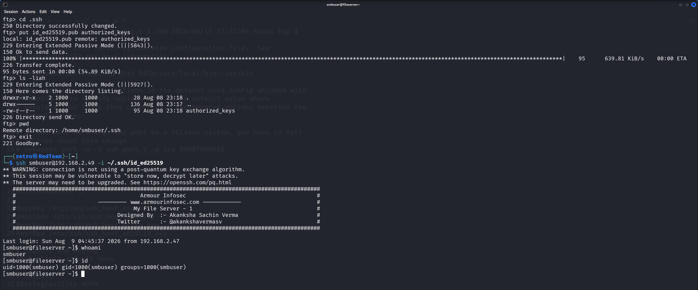

# 权限提升

使用 linpeas 脚本枚举漏洞点。
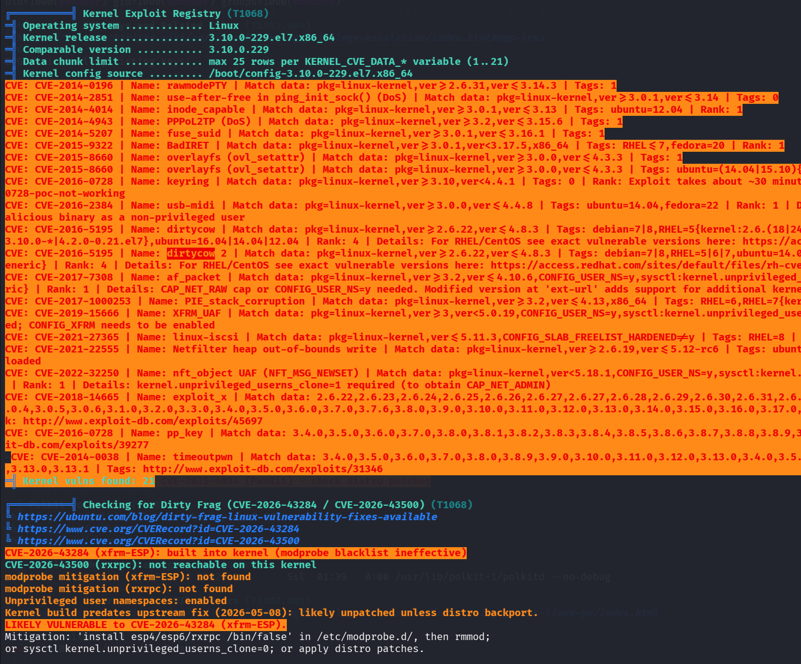

使用脏牛漏洞提权。

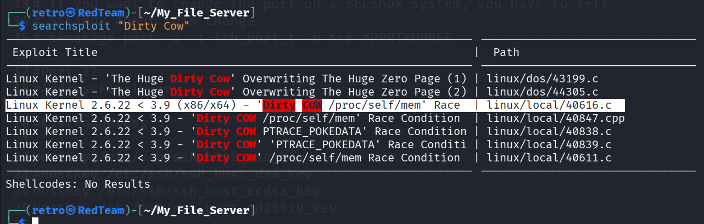

这个漏洞提权不怎么稳定。第一次失败很正常，但是会断开 ssh 链接并且重启。属于动静比较大的。
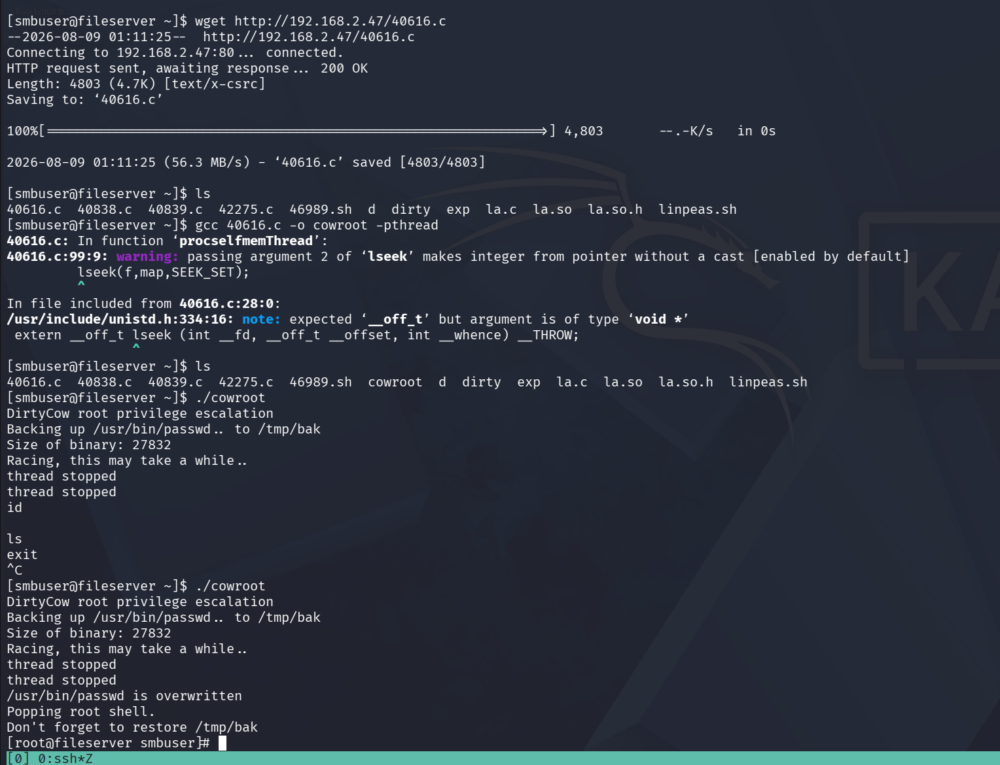

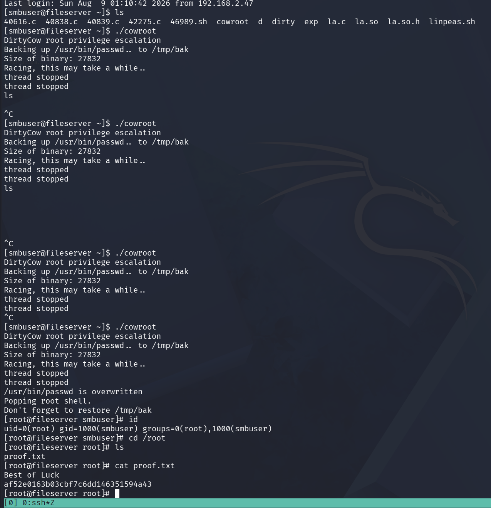

我通过查看 40616.c 官方的技术文档。发现提权到 root 后，要开启这个功能，系统才会稳定。

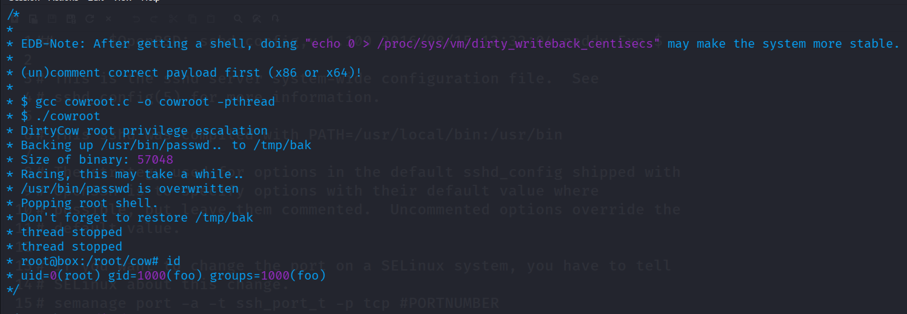

# 总结

目标开放了 80，21，22，2121等端口。给了我们许多信息。告诉我们 ssh端口只能通过密钥登录。通过网站路径爆破得到了一个 smbuser 的密码。登录 ftp服务器，上传我们的公钥。从而登录ssh 服务器。最后通过脏牛漏洞提权获得 root 会话。