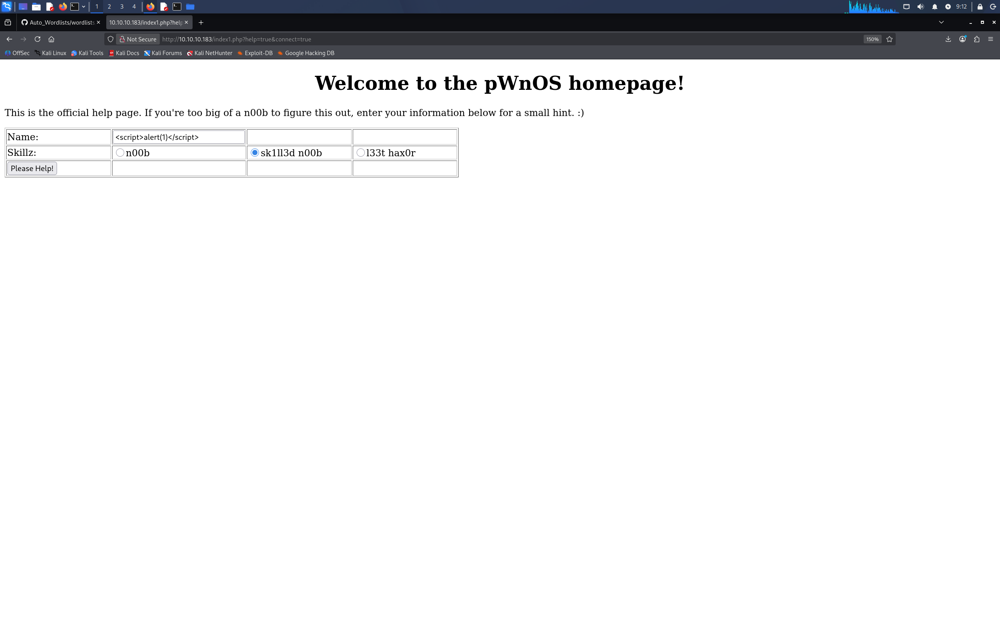
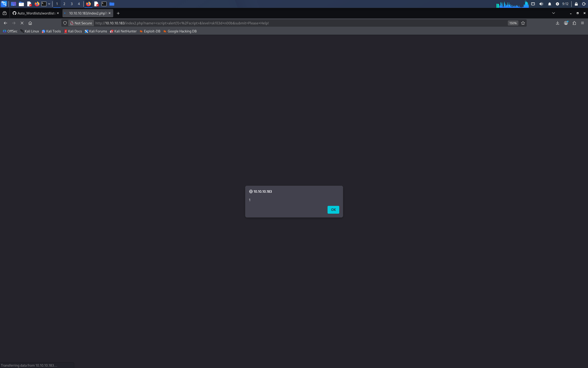
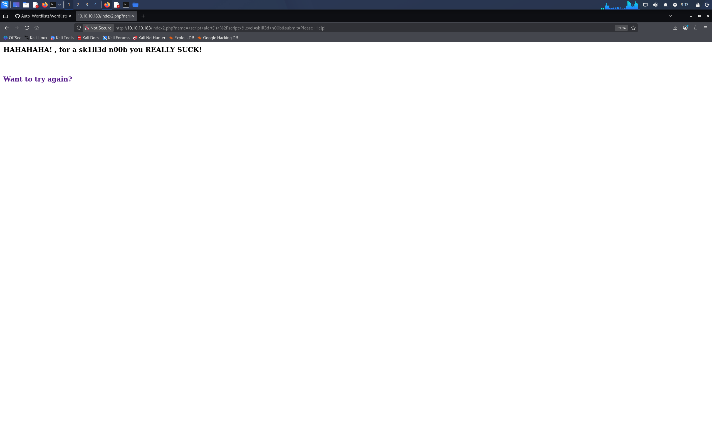
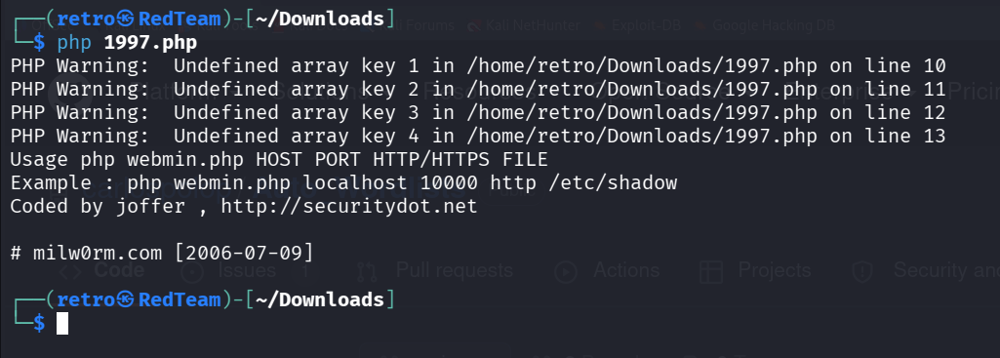

## 1.靶机描述

_这是一台标榜难度为简单的开源靶机。获得立足点并不困难，但是获得完整的 root 权限，则需要一些小巧思。_


_注意：下载完靶机后，使用VMware虚拟机打开时，页面弹出提醒，一定要选择“我已移动虚拟机”。否则靶机分配不到 ip。_


## 2.信息收集

1. 端口扫描

我们先对目标进行全端口扫描。我们指定 nmap 每秒发包不低于 10000。这个参数能够在保证正常通信的情况下，对目标网络的威胁最小。

```text
# Nmap 7.99 scan initiated Mon Oct  5 17:43:59 2026 as: /usr/lib/nmap/nmap --min-rate 10000 -p- -oA nmapscan/TCPS 10.10.10.183
Nmap scan report for 10.10.10.183
Host is up (0.0031s latency).
Not shown: 65530 closed tcp ports (reset)
PORT      STATE SERVICE
22/tcp    open  ssh
80/tcp    open  http
139/tcp   open  netbios-ssn
445/tcp   open  microsoft-ds
10000/tcp open  snet-sensor-mgmt
MAC Address: 00:0C:29:5E:18:C9 (VMware)

# Nmap done at Mon Oct  5 17:44:06 2026 -- 1 IP address (1 host up) scanned in 6.74 seconds
```


2. 详细信息扫描

为了知道服务的具体版本信息，我们使用 nmap 的 -sV 参数来探测服务的版本信息；为了后续的权限提升，我们使用 -O 来探测服务器的操作系统版本；最后，我们指定 nmap 参数 -sC 表示选用默认脚本扫描。

```text
# Nmap 7.99 scan initiated Mon Oct  5 17:46:14 2026 as: /usr/lib/nmap/nmap -sV -sC -sV -O -p22,80,139,445,10000 -oA nmapscan/details 10.10.10.183
Nmap scan report for 10.10.10.183
Host is up (0.00084s latency).

PORT      STATE SERVICE     VERSION
22/tcp    open  ssh         OpenSSH 4.6p1 Debian 5build1 (protocol 2.0)
| ssh-hostkey: 
|   1024 e4:46:40:bf:e6:29:ac:c6:00:e2:b2:a3:e1:50:90:3c (DSA)
|_  2048 10:cc:35:45:8e:f2:7a:a1:cc:db:a0:e8:bf:c7:73:3d (RSA)
80/tcp    open  http        Apache httpd 2.2.4 ((Ubuntu) PHP/5.2.3-1ubuntu6)
|_http-server-header: Apache/2.2.4 (Ubuntu) PHP/5.2.3-1ubuntu6
|_http-title: Site doesn't have a title (text/html).
139/tcp   open  netbios-ssn Samba smbd 3.X - 4.X (workgroup: MSHOME)
445/tcp   open  netbios-ssn Samba smbd 3.0.26a (workgroup: MSHOME)
10000/tcp open  http        MiniServ 0.01 (Webmin httpd)
|_http-title: Site doesn't have a title (text/html; Charset=iso-8859-1).
MAC Address: 00:0C:29:5E:18:C9 (VMware)
Warning: OSScan results may be unreliable because we could not find at least 1 open and 1 closed port
Device type: general purpose
Running: Linux 2.6.X
OS CPE: cpe:/o:linux:linux_kernel:2.6.22
OS details: Linux 2.6.22, Linux 2.6.22 - 2.6.23
Network Distance: 1 hop
Service Info: OS: Linux; CPE: cpe:/o:linux:linux_kernel

Host script results:
|_clock-skew: mean: 2h30m00s, deviation: 3h32m09s, median: 0s
| smb-os-discovery: 
|   OS: Unix (Samba 3.0.26a)
|   Computer name: ubuntuvm
|   NetBIOS computer name: 
|   Domain name: nsdlab
|   FQDN: ubuntuvm.NSDLAB
|_  System time: 2026-10-05T04:46:29-05:00
|_nbstat: NetBIOS name: UBUNTUVM, NetBIOS user: <unknown>, NetBIOS MAC: <unknown> (unknown)
| smb-security-mode: 
|   account_used: guest
|   authentication_level: user
|   challenge_response: supported
|_  message_signing: disabled (dangerous, but default)
|_smb2-time: Protocol negotiation failed (SMB2)

OS and Service detection performed. Please report any incorrect results at https://nmap.org/submit/ .
# Nmap done at Mon Oct  5 17:46:58 2026 -- 1 IP address (1 host up) scanned in 43.46 seconds
```

我们已经知道了目标服务器运行 ssh，http，smb服务。根据目前掌握的信息，我们的渗透优先级如下:
- 139/445   smb   探查敏感信息泄露
- 80/10000  http-web   常见的 web 渗透手段
- 22   ssh  暴力破解登录凭据

3. 漏洞脚本扫描

在开始具体的服务渗透前，我们借助 nmap 漏洞脚本扫描的功能，查看是否目标服务器存在"已知漏洞库" 中存在的漏洞。就是常说的“低摘的果子”。漏洞脚本扫描常常能够获得意外的收获。

```text
# Nmap 7.99 scan initiated Mon Oct  5 17:47:41 2026 as: /usr/lib/nmap/nmap --script=vuln -p22,80,139,445,10000 -oA nmapscan/vulns 10.10.10.183
Nmap scan report for 10.10.10.183
Host is up (0.00089s latency).

PORT      STATE SERVICE
22/tcp    open  ssh
80/tcp    open  http
|_http-stored-xss: Couldn't find any stored XSS vulnerabilities.
|_http-trace: TRACE is enabled
|_http-csrf: Couldn't find any CSRF vulnerabilities.
|_http-dombased-xss: Couldn't find any DOM based XSS.
| http-enum: 
|   /icons/: Potentially interesting directory w/ listing on 'apache/2.2.4 (ubuntu) php/5.2.3-1ubuntu6'
|   /index/: Potentially interesting folder
|_  /php/: Potentially interesting directory w/ listing on 'apache/2.2.4 (ubuntu) php/5.2.3-1ubuntu6'
|_http-vuln-cve2017-1001000: ERROR: Script execution failed (use -d to debug)
139/tcp   open  netbios-ssn
445/tcp   open  microsoft-ds
10000/tcp open  snet-sensor-mgmt
| http-vuln-cve2006-3392: 
|   VULNERABLE:
|   Webmin File Disclosure
|     State: VULNERABLE (Exploitable)
|     IDs:  CVE:CVE-2006-3392
|       Webmin before 1.290 and Usermin before 1.220 calls the simplify_path function before decoding HTML.
|       This allows arbitrary files to be read, without requiring authentication, using "..%01" sequences
|       to bypass the removal of "../" directory traversal sequences.
|       
|     Disclosure date: 2006-06-29
|     References:
|       http://www.exploit-db.com/exploits/1997/
|       https://cve.mitre.org/cgi-bin/cvename.cgi?name=CVE-2006-3392
|_      http://www.rapid7.com/db/modules/auxiliary/admin/webmin/file_disclosure
MAC Address: 00:0C:29:5E:18:C9 (VMware)

Host script results:
|_smb-vuln-ms10-061: false
|_smb-vuln-ms10-054: false
|_smb-vuln-regsvc-dos: ERROR: Script execution failed (use -d to debug)

# Nmap done at Mon Oct  5 17:53:03 2026 -- 1 IP address (1 host up) scanned in 321.97 seconds
```

漏洞脚本扫描结果中，发现 webmin 服务暴露出了一个 WEB 文件泄露的漏洞。这是一个我们很感兴趣的点。因为文件泄露可能会泄露出一些凭据密码，又或者是功能性源码。通过密码凭据我们可以很快获得立足点。

## 3.WEB 渗透

对于 139/445 端口的信息枚举，我们没有获得有价值的信息。根据渗透优先级，我们开始聚焦于 WEB 方面的渗透测试。

1. WEB 80 端口存在反射型 XSS 漏洞

我点击 next 按钮跳转到了 index1.php 界面。发现当前界面的 Name 输入框存在 XSS 注入。







XSS 漏洞配合一些其他漏洞，能够发挥不小的威力。但是目前我们还是没法构造攻击链。


2.  WebMin 文件泄露漏洞

文件泄露漏洞，我们常枚举服务器的文件资源信息来获取敏感信息文件。无论是 Linux 还是 Windows 服务器，高价值的资源路径，我们很难仅靠人脑记全。 GitHub 上有个[Auto_Wordlists](https://github.com/carlospolop/Auto_Wordlists)总结了常见的资源路径。

我们这里使用了 nmap 枚举结果的 [exploit-db](http://www.exploit-db.com/exploits/1997/) 链接。查看脚本提示，我们按照例子构造命令。成功获得服务器的 shadow 文件。




shadow 文件以加密的形式存储服务器用户的登录信息。可以使用 hash-identifier 查看这个加密字符串的加密算法。结果是 MD5 格式的加密。

```text
┌──(retro㉿RedTeam)-[~/Downloads]
└─$ hash-identifier                                 
   #########################################################################
   #     __  __                     __           ______    _____           #
   #    /\ \/\ \                   /\ \         /\__  _\  /\  _ `\         #
   #    \ \ \_\ \     __      ____ \ \ \___     \/_/\ \/  \ \ \/\ \        #
   #     \ \  _  \  /'__`\   / ,__\ \ \  _ `\      \ \ \   \ \ \ \ \       #
   #      \ \ \ \ \/\ \_\ \_/\__, `\ \ \ \ \ \      \_\ \__ \ \ \_\ \      #
   #       \ \_\ \_\ \___ \_\/\____/  \ \_\ \_\     /\_____\ \ \____/      #
   #        \/_/\/_/\/__/\/_/\/___/    \/_/\/_/     \/_____/  \/___/  v1.2 #
   #                                                             By Zion3R #
   #                                                    www.Blackploit.com #
   #                                                   Root@Blackploit.com #
   #########################################################################
--------------------------------------------------
 HASH: $1$7nwi9F/D$AkdCcO2UfsCOM0IC8BYBb/

Possible Hashs:
[+] MD5(Unix)
--------------------------------------------------
 HASH: 

```


我们使用 john 命令尝试碰撞明文口令信息。先将泄露信息新存为 creds.txt 文件(这里 root 的凭据是重复的)。 经过半小时的尝试，最终获得了 vmware 的登录口令。


## 4.ssh 获得立足点

我们使用 vmware 的主机登录口令获得 ssh 登录的凭据。


## 5.权限提升

1. 找到切入点

我们通过立足点进行权限枚举。发现 webmin 程序是以 root 权限运行的。通常情况下，/etc/shadow 文件没法直接被用户所读取。所以当前 webmin 程序的权限是个很好的切入点。
为啥说 webmin 是很好的切入点？因为 webmin 服务程序存在一个文件包含漏洞。我们能够通过该漏洞访问服务器的敏感信息，也可以通过文件包含执行服务器上的文件。


这个思路，我们是通过查看 1997.php 的脚本源码想到的。如下图所示，脚本其实访问了服务器的 /unauthenticated 资源路径。并且使用 /..%01 来绕过当前目标的限制。


整个思路是，我现在立足点出构造一个我恶意脚本，功能是构造一个反弹 shell 到我们的服务器上。然后通过 webmin 的文件泄露漏洞来包含我们的恶意脚本，执行我们的反弹 shell 命令。因为 WebMin 是以 root 权限运行的，当这个程序包含我们的恶意脚本时，产生反弹shell 的新进程也是 root 权限的。最终我们会获得一个靶机的以 root 权限运行 shell 。

2. 构造提权 shell

webmin 服务器是有 perl 写的。要想让 webmin 程序解析脚本，必须使用 cgi 后缀。
我们使用 kali 的 webshells 工具中的 perl-reverse-shell.pl 来构建一个反弹 shell。


成功获得 root 的 shell。

## 6.第二种思路

#### prng 漏洞获得私钥


通过前面文件泄露的脚本工具，我们成功发现当前 obama 用户 ssh 公钥文件。但是只有公钥文件，我们还没法登录 obama 的立足点。我们必须获得 obama 用户的私钥文件。通过前面信息收集，我们发现目标靶机的 ssh 服务版本比较低。可能会有 prng 漏洞。prng (pseudo random number genertor) 这个生成器生成的随机数并不随机，我们很容易凭借公钥找到私钥。


#### prng 伪随机数数据库匹配私钥

通过 searchsploit 工具，我们查到了 伪随机数的数据文件。[prng](https://gitlab.com/exploit-database/exploitdb-bin-sploits/-/raw/main/bin-sploits/5622.tar.bz2)
我们截取泄露公钥的前几十位。在解压后的文件中进行匹配查找。

```shell
grep -lr "AAAAB3NzaC1yc2EAAAABIwAAAQEAxRuWHhMPelB60JctxC6BDxjqQXggf0ptx"
```

其中 -l 参数表示只打印出存在匹配行的文件名。-r 参数表示在文件夹下进行递归搜索。


最终，我们获得了其私钥文件。


#### ssh 私钥免密登录调试

在使用获得的私钥文件登录 ssh 时，我们发现还是需要登录口令。我们推测可能有两种情况，一种是 “ 服务器采用了免密登录，但是 ssh 协议的验证过程出了一些问题。”，还有一种是 ” 服务器采用了口令+私钥的登录方式。“第二种情况，我们就要另辟蹊径了。
我们使用 -v 参数查看 ssh 客户端与服务端交互的整个过程。


根据 ssh 客户端的调试信息，我们发现当我们发送私钥时，客户端提示我们没有共同的签名算法。由于我们当前的 ssh 客户端版本太新了。所以和老版本的 ssh 服务器软件算法不兼容。我们给 Goolge 几个关键词 "ssh no mutual signature algorithm"。在论坛里，也有小伙伴遇到了同样的问题。


论坛上确实解决问题了，但是并没有说明问题的原因是什么？问题的核心是啥？我选择了一篇比较标准的博客文章。这篇文章给出了核心的操作过程。核心原因就是高版本的 ssh 默认不选用旧版本那些不安全的算法。但是高版本还是能兼容低版本的。所以最终这个问题还是解决了。


我们重新指定参数，我们成功获得立足点。


#### shellshock 获得 root shell

我们登录立足点后，发现当前 bash 版本低于 4.3。bash 环境可能存在 shellshock 漏洞。


为了方便验证出 shellshock 漏洞是否存在，我们使用 tmux 开启了两个终端界面。我发现我的验证字段 Bash is vulnerable 藏在环境变量里面，被 bash 成功的打印出来。说明，shellshock 这个攻击可以尝试。


为了方便的进行shellshock 攻击，我们使用 curl 工具进行操作。我们首先要把脚本的攻击思路提取出来，我们定位到 1997.php 脚本的第 23 行。文件包含漏洞点是产生在 /unauthenticated 这个资源路径下。


根据脚本的思路，我们成功构造出利用 payload。


我们回到 vmware 界面发现，我们成功拥有完整的 sudo 权限。


我们成功获得  root 权限。


## 7.总结

首先通过端口扫描，我们发现了目标开放了 ssh，http，smb 等服务。经过信息枚举后，发现 smb 服务没有暴露出攻击面。而 web-http 暴露出存在文件泄露漏洞。通过文件泄露漏洞，我们成功拿到了服务器的敏感文件信息。登录口令或者是私钥文件。我们获得 obama 用户和 vmware 用户的立足点。在立足点凭借权限枚举，发现 webmin 程序是以 root 权限运行，这个给了我们提权的切入点。通过 shellshock 或者是反弹 shell。我们成功获得了 root 的反弹 shell。至此拿下这台靶机。


## 8.学习到的点

1. prng 伪随机数碰撞
2. 文件泄露 -> auto_wordlist
3. shellshock bash 提权

