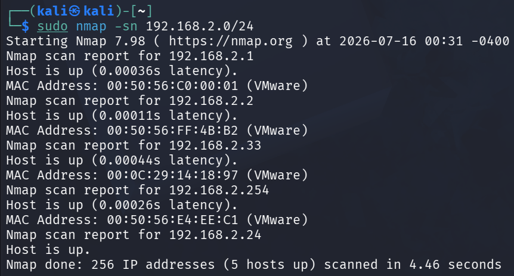
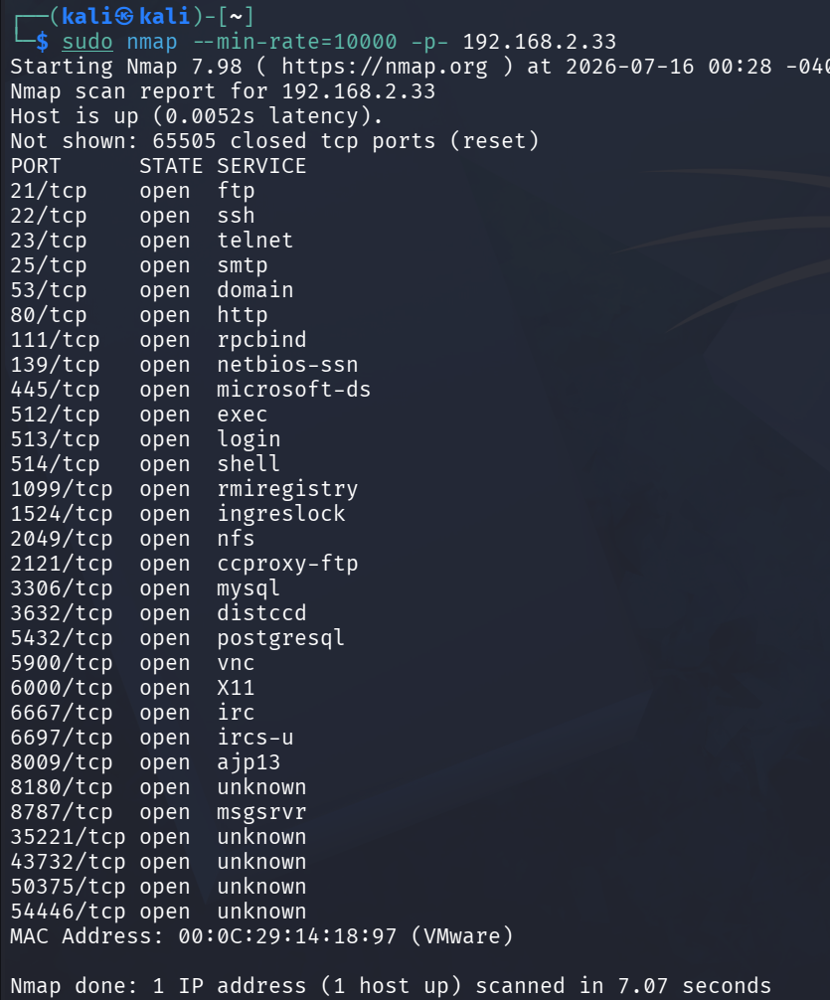
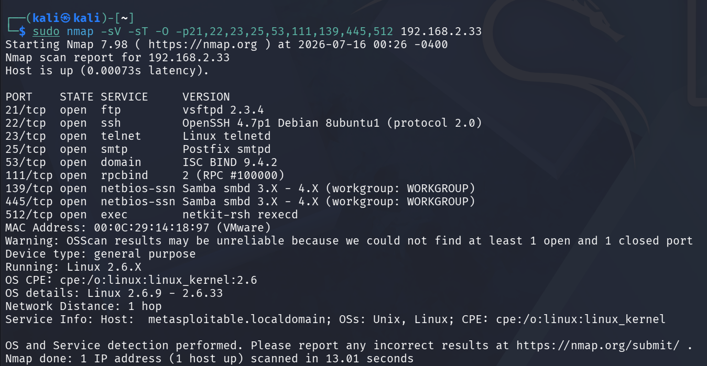
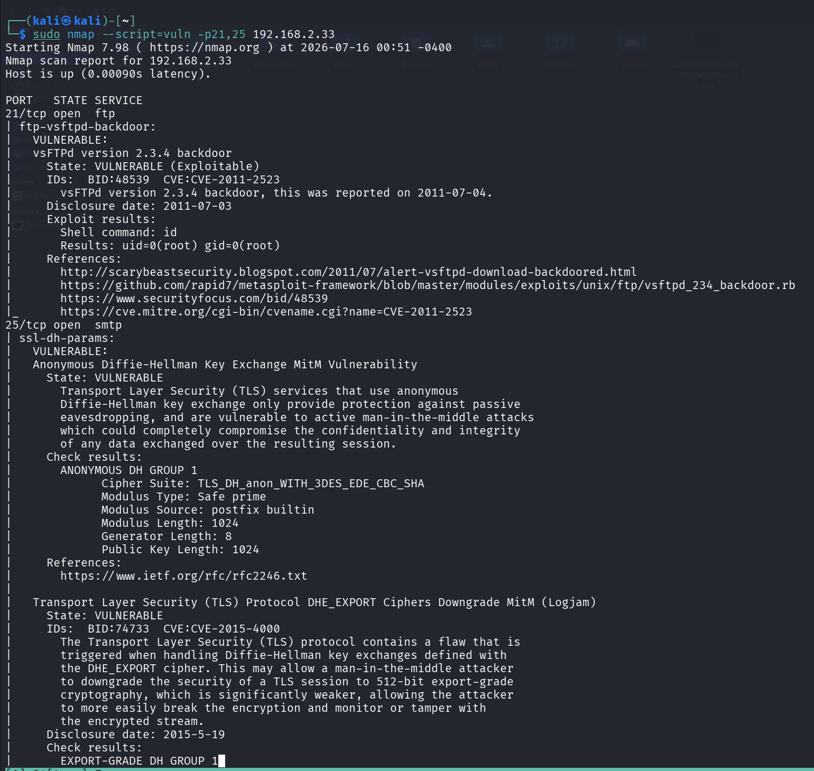
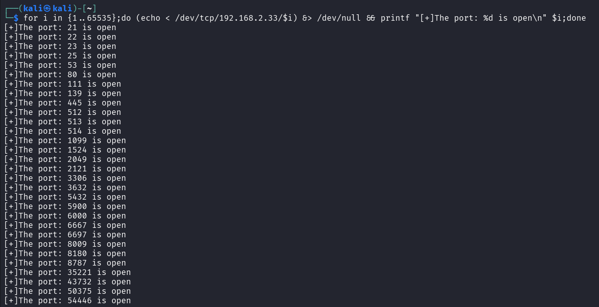

 
#### _用nmap的情况_
###### 主机发现
```
nmap -sn 192.168.2.0/24
```

###### TCP端口扫描
```
sudo nmap --min-rate=10000 -p- 192.168.2.33
```


###### UDP扫描
```
sudo nmap -sU --min-rate=10000 -p- 192.168.2.33
```


###### 脚本扫描
```
sudo nmap --script=vuln -p22,111,139,445 192.168.2.33
```

##### 不用nmap的情况
###### 主机发现
```
for i in {1..254};do ping -c 1 -W 1 192.168.2.$i 2>&1 | grep "from";done
```


###### 端口扫描
```
for i in {1..65535};do (echo < /dev/tcp/192.168.2.33/$i) &> /dev/null && printf "[+]The port: %d is open\n" $i;done

```

